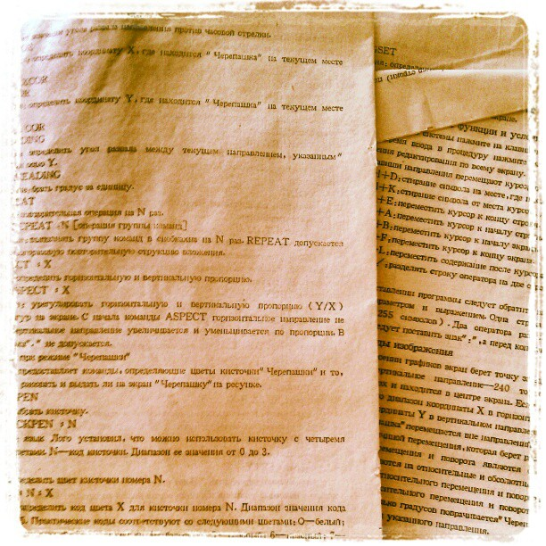

# 1998

I was born in the city of Vladivostok (Russia). In 1998 I was 14-15 years old.
These were difficult times for Russia.

In those years, Chinese markets flourished in our city, where the Chinese sold many inexpensive things for every taste and color.

I had an 8-bit game console and a 16-bit Sega Mega Drive II console.
I was fascinated by the games and actually taken away from the street, where I led a near-criminal lifestyle.

Every time I went through the next game, I was surprised at how imperfect the games were.
I wanted to change them and make them better.

The Chinese, in addition to classic game consoles, sold eight-bit keyboards.
I decided that this is what it takes to start making games!

I worked as a laborer for a while and ended up buying myself an eight-bit keyboard.

It was cool. In addition to the usual eight-bit cartridges, three-inch floppy disks could be inserted into the keyboard,
and there was also an LPT for connecting a printer!

Of course, I wanted to have a personal computer. But in those days, computers were expensive.

At my disposal were two Chinese implementations of the Basic language: Q-Basic and G-Basic,
and an instruction of a couple of dozen pages with a crooked description of commands in Russian.

This was the beginning of my journey into the world of programming.

---
Aleksey Nemiro  
2023-09-05
