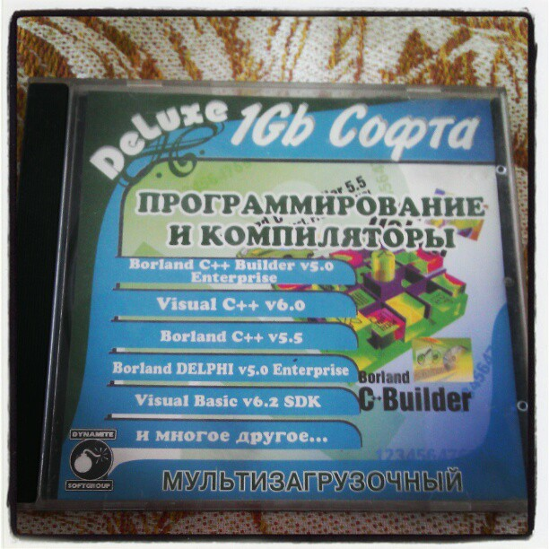

# 2000

In 2000, I started building my first personal computer.
At that time, I did not know exactly what a computer consists of.
I had only a superficial understanding of it.

I went shopping where they sold old parts and gradually found out what I needed.
In the end, I managed to assemble a system unit based on an Intel Pentium 133 processor with a 200 MB hard drive.

It was cool. But here's the problem, I didn't have a monitor!

As time went. I had a system unit that I could not use.
Gradually, I upgrade the system to an Intel Celeron 700 mHz and got hold of an incredible 10 GB hard drive from Seagate.

I bought a video card from a school friend with the ability to connect to a TV.

The video card cost me $50. I don't know why I remember this fact.

Finally, I was able to enjoy the work of my first personal computer!

The picture on the TV was incredibly blurry, but that didn't bother me in the slightest.
I spent many hours learning about Windows. I played Starcraft and Quake.
I spent many hours in the wrong static posture.
I can't imagine how negatively working with TV affected my vision.

In the end, my father bought me a normal 15-inch monitor.
I was blown away by the incredible image quality!

It is worth noting that my parents did not approve of my hobby for computers
and in every possible way slowed down this process. I would probably do the same now.

My Windows crashed almost every day. I didn't know how to install Windows myself.
I had to call a friend who lived half an hour away from me. Sometimes he came to see me several times a day.
I ended up learning how to install Windows myself. And, began to break it more often.

In the market, I bought a CD with various programming languages.
The disc contained Quick Basic and Visual Basic 6.0.

And although these languages were very different from the Chinese cut-down
versions of Q-Basic and G-Basic, the basic set of commands was the same.

I quickly got to grips with Quick Basic and realized that the features of this language were not enough for my purposes.

I began to learn visual programming using Visual Basic 6.0.

There were several video tutorials on the disc.
My first programs were stupid jokes, like popping up a Windows uninstall dialog and stuff like that.

I did not have internet connection. Now it sounds unbelievable, but it's a fact.
The first time I learned Visual Basic was by trial and error.

A little later, I bought a small book on the basics of Visual Basic, which served me for many years.

_Aleksey Nemiro  
2023-09-05_

---
[< 1999](/1999) &nbsp; **2000** &nbsp; [2001 >](/2001)
