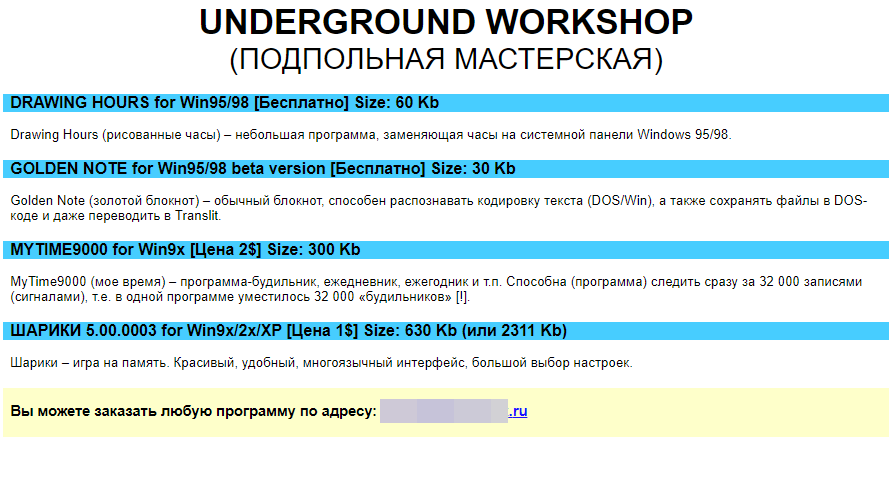

# 2002

2002 was the year of my first public releases and my first step in web mastering.

## Web

It was the time of the beginning of the active development of the Runet, the time of the active emergence of Russian-language Internet resources.

I needed a website to publish my developments. To achieve this goal, I began to study web technologies: protocols, hypertext markup language, and specialized software.

My first web page was made in MS Word. It was terrible, simply because MS Word generated a lot of incomprehensible code.

On July 7, 2002, I created an account on the website [www.vbnet.ru](http://vbnet.ru/).

VBNet.RU has become a useful source of information about Visual Basic for me.

It was also one of the active communities of Visual Basic programmers, where, among other things, I could present my products and get feedback.

## Releases

During the year I released several of my Visual Basic 6.0 programs:

:star: [Drawing Hours](assets/drawing_hours.md) - skins for the standard clock on the Windows taskbar  
:star: [MyTime](assets/mytime.md) - alarm clocks  
:star: [Golden Notepad](assets/notepad.md) - just notepad

Also, I did not forget [why I decided to become a programmer](../1998) and actively worked on the development of casual games, also in Visual Basic 6.0:

:star: [Balls](assets/balls.md) - memory, matching pairs  
:star: [Flies](assets/flies.md) - 2D fly shooter using mouse cursor

But there were a couple more projects: [Jager 3](assets/jager3) and [W.I.D](assets/wid).

_Aleksey Nemiro  
2023-09-07_

---
[< 2001](/2001) &nbsp; **2002** &nbsp; [2003 >](/2003)
