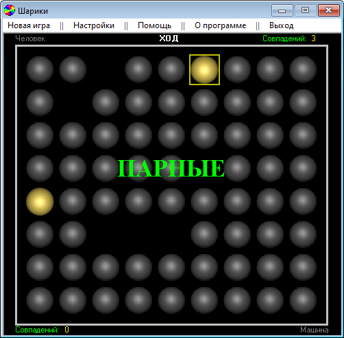
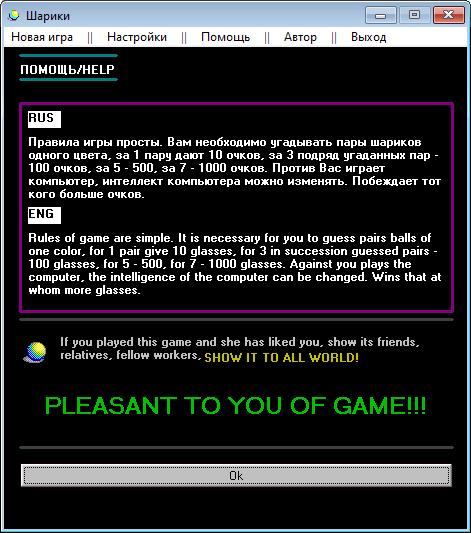

# Balls

Balls is one of my favorite games of those times. I released as many as five major versions!

This is a simple game in which the user has to search for balls of the same color.

I was seriously involved in translating the program interface into different languages. And I made a huge number of mistakes.
For example, the words "score" and "glasses" are written the same in Russian, but their meaning is completely different.

The v5 of the game was shareware, but it was not in great demand. In the end, I posted the key for free registration of the program.

> [!WARNING]
> Author does NOT guarantee the functionality of the presented binary files.
> Author is NOT responsible for any damage that may occur when running or using the presented binary files.

:floppy_disk: [Download Balls v1.0](balls_10.zip)
:floppy_disk: [Download Balls v4.0](balls_40.zip)
:floppy_disk: [Download Balls v5.0](balls_5000004.exe) - doesn't work for me
