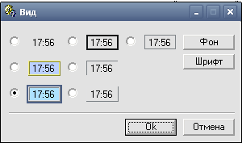
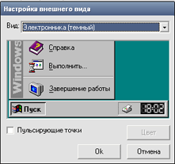

# Drawing Hrous

In 2002, two major versions of the program were released Drawing Hours v1.0 and v2.0.

The program allows to overlay skins on the standard Windows 95/98 taskbar clock.

I was just starting to learn English, so I made a funny mistake, calling the program that.  
In Russian, the words "hours" and "clock" are spelled the same, but the meaning depends on the context.

Perhaps this is one of my most popular developments of those times.

> [!WARNING]
> Author does NOT guarantee the functionality of the presented binary files.
> Author is NOT responsible for any damage that may occur when running or using the presented binary files.

:floppy_disk: [Download Drawing Hours v1.0](drawing_hours_1x.exe)  
:floppy_disk: [Download Drawing Hours v2.0](drawing_hours_2x.exe)

