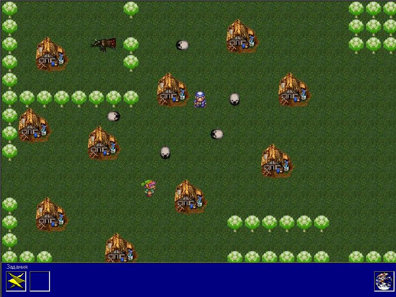
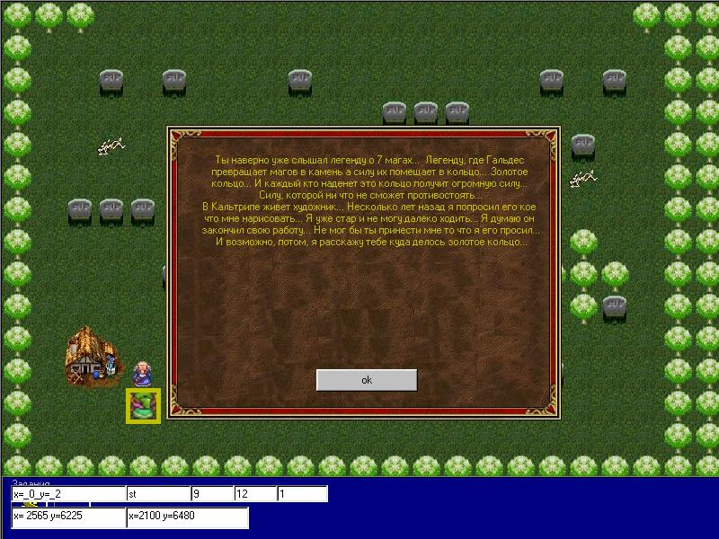
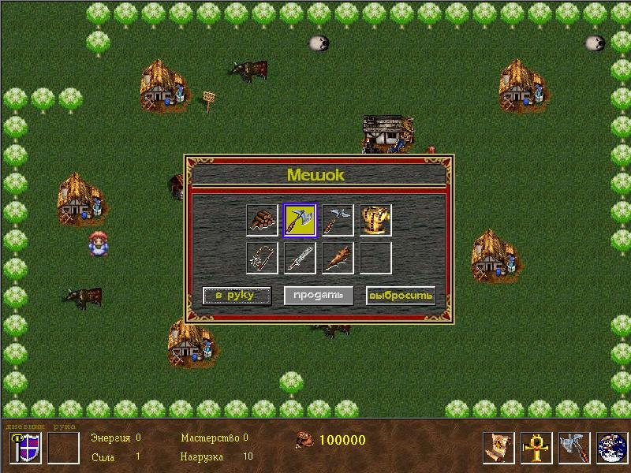
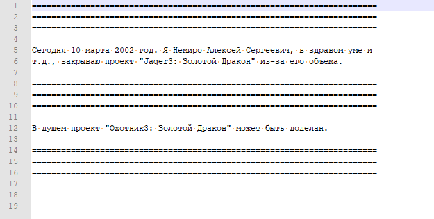

# Jager 3

Jager (translated from German as hunter) is my attempt to create an RPG game.

I came up with a story, recorded a bunch of audio files with dialogue, and drew a huge world.

At that time I didn't know how to draw, so I used graphics from various other games.

I ended up abandoning the project because it was too difficult to implement on my own.

