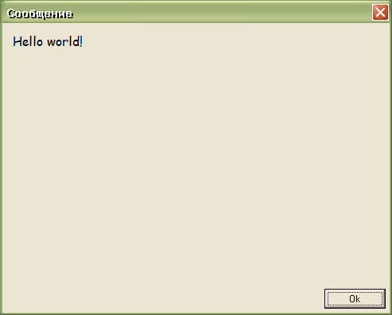

# MyTime

This is an alarm clock, more precisely it is a set of alarm clocks.

This program is my first shareware program. And I managed to sell a few copies of it.

There were problems with logistics, because I only accepted payment through the post office, and these were queues, bureaucracy, and slow speed.

I have made two public releases:

:star: MyTime 2002  
:star: MyTime 9000

Initially, the idea of the program was to offer the user to periodically take a break from working at the computer. However, with the development of the program, the purpose was expanded to the implementation of all kinds of reminders.

Interesting fact, the number 9000 came about because I made major changes to **MyTime 2002** in 2002.

> [!WARNING]
> Author does NOT guarantee the functionality of the presented binary files.
> Author is NOT responsible for any damage that may occur when running or using the presented binary files.

:floppy_disk: [Download MyTime 9000](mytime_9000_2x.exe)  
:floppy_disk: [Download activator for MyTime 9000](mytime_9000_2x_reg.zip)

