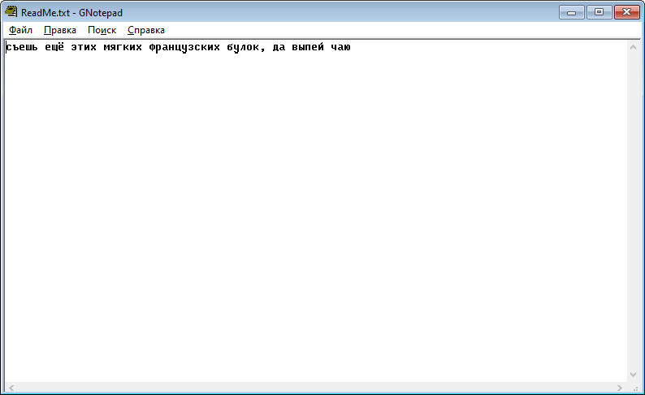

# Golden Notepad

One of my first developments was a notepad.

The fact is that the standard Windows 95/98/ME notepad had serious restrictions on the size of files that could be opened, and also had problems with encodings.

I tried to fix this by creating my own notepad.

But the result was terrible.

> [!WARNING]
> Author does NOT guarantee the functionality of the presented binary files.
> Author is NOT responsible for any damage that may occur when running or using the presented binary files.

:floppy_disk: [Download Golden Notepad](notepad.exe)

