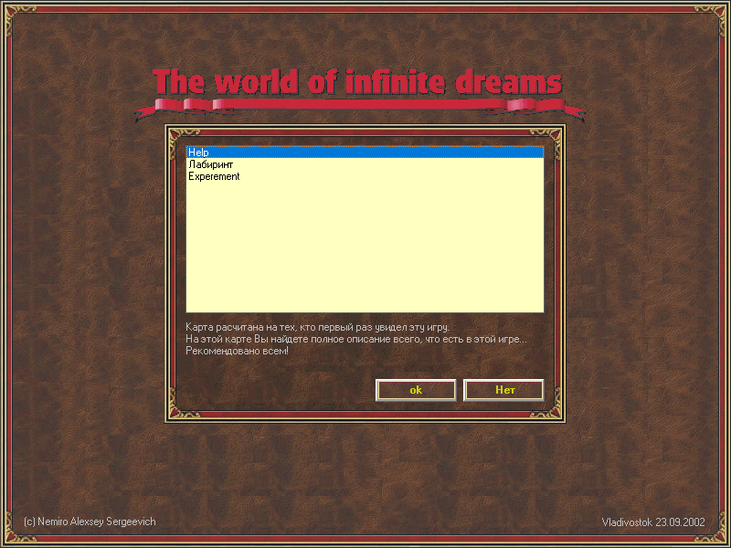
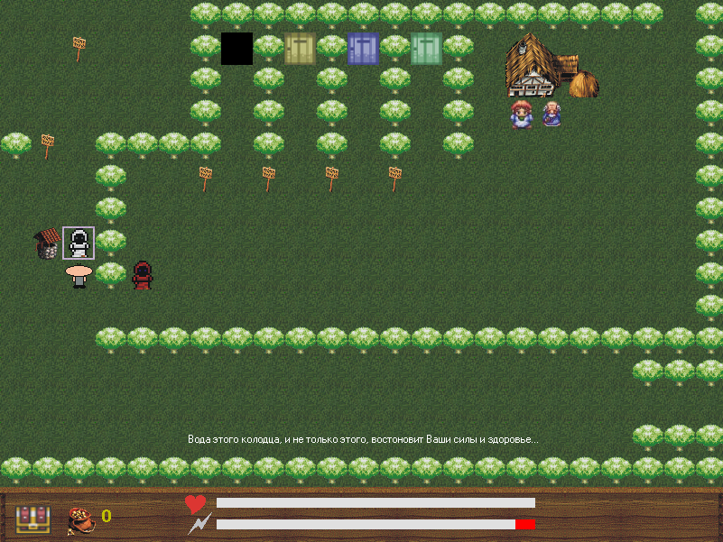

# W.I.D

W.I.D - The world of infinite dreams, this is a continuation of the development of [Jager 3](../jager3).

Since I didn't get around to implementing the Jager 3 idea, I decided to make a game where the user could create the maps and gameplay themselves.

> [!WARNING]
> Author does NOT guarantee the functionality of the presented binary files.
> Author is NOT responsible for any damage that may occur when running or using the presented binary files.

:floppy_disk: [Download W.I.D](wid.zip)

