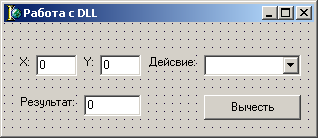

# Delphi 6.0: Первая DLL

Пожалуй самый простой способ обмена информацией между программами – это использование динамически подключаемых библиотек, т.е. **DLL**.

В данной статье я расскажу о том как можно создать **DLL** и использовать ее средствами **Delphi 6.0**.

## Создание DLL

Запустите **Delphi**, выберите меню **Файл** (**File**) => **Создать** (**New**) => **Другие** (**Other**) и в появившемся окне выберите **Мастер DLL** (**DLL Wizard**), после чего перед вами появится пустая заготовка библиотеки.

Обратите внимание, текст модуля начинается со слова `library`, а не `unit`.

Теперь давайте добавим новую функцию, которая будет производить простейшие арифметические действия с числами `X` и `Y`, назовем ее `Arifmetic` (см. листинг 1):

```delphi
library Project1;

uses
  SysUtils,
  Classes;

{$R *.res}

function Arifmetic(X, Y, Action: integer): integer;
  begin

    if (Action = 0) then begin
      Result := X + Y;
    end
    else if (Action = 1) then begin
      Result := X - Y;
    end
    else if (Action = 2) then begin
      Result := X * Y;
    end
    else if (Action = 3) then begin
      Result := Round(X/Y);
    end
    else begin
      Result := X + Y;
    end;

  end;

exports Arifmetic;

begin
end.
```

В 9 строке начинается функция `Arifmetic` с параметрами `X`, `Y` и `Action` типа `Integer`, которая возвращает значение типа `Integer`.

`Action` указывает на тип арифметического действия над числами `X` и `Y`, по умолчанию используются сложение.

В 30 строке директива `export` указывает на то, что функция `Arifmetic` будет доступна другим приложениям.

Функции не указанные в директиве `export` будут не доступны из других приложений.

Если функций несколько, то их разделяют запятыми (например: `exports Arifmetic, TwoFunction, OtherFunction;`).

Вот и все, теперь только осталось скомпилировать проект и вас будет своя рабочая **DLL**!

## Использование DLL

Создать **DLL** это только пол дела, теперь нам надо научиться ее использовать.

Для этого создайте новый проект (**Application**) и разместите на форме три текстовых поля, **ComboBox** и кнопку (см. рис. 1).



Имена контролов можно не изменять.

Теперь перейдем к коду. Для начала нам надо подключить необходимые функции из библиотеке к проекту, в нашем случае это функция `Arifmetic`:

```delphi
function Arifmetic(X, Y, Action: integer): integer;
external 'Project1.dll';
```

Ключевое слово `external` указывает путь к библиотеке **DLL**, если **DLL** находится в одной папке с проектом, то указывается просто имя файла, в противном случае - полный путь.

Далее создадим событие, обрабатывающее щелчок по кнопке:

```delphi
procedure TForm1.Button1Click(Sender: TObject);
begin
  Edit3.Text := IntToStr(Arifmetic(StrToInt(Edit1.Text), StrToInt(Edit2.Text), ComboBox1.ItemIndex));
end;
```

Вот собственно и все, теперь после нажатия на кнопку в текстовом поле `Edit3` будет появляться результат арифметических действий с числами из текстовых полей `Edit1` и `Edit2`.

[Скачать пример](assets/delphi60_dll.zip)

---
Алексей Немиро
2003-09-13
