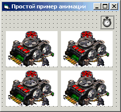

# Visual Basic: Анимация - это несложно!

В последнее время мне много приходит писем с просьбами написать о работе с графикой средствами **Visual Basic 6.0**, и вот, наконец-таки я выделил денек на написание статьи на эту тему.

Начать решил я с анимации, и в данной статье рассмотрены два способа ее создания.

Способ первый до безумия прост, и дальше **VB** вам выходить не придется. Способ второй тоже простой, но с использованием **API**. Ну вот, стихами заговорил, значит пора спать :-) но не будем отвлекаться, а пожалуй начнем!

## Способ 1. Анимация стандартными средствами VB

Самый простой способ создания анимации стандартными средствами **Visual Basic** - это поочередная прорисовка картинок на форме (`Form`) или `PictureBox` методом `PaintPicture`.

Для реализации этого способа нам потребуется форма (`Form`), таймер (`Timer`), и массив имеджей (`Image`), количество последних зависит от количества кадров (картинок), у меня их получилось всего `4` (см. рис. 1).



Установите свойства элементов следующим образом:

| | |
| ---- | -- |
| **Form** |    |
| AutoRedraw | True |
| **Timer** | |
| Interval | 100 |
| **Image** | |
| Name | imgPic |
| Index | от 0 до количества картинок (у меня от 0 до 3) |
| Picture | в каждый по картинке |
| Visible | False |

Теперь, когда все на месте, перейдем к коду. Для начала в **General Declaration** необходимо объявить три локальные переменные:

```vb
Dim i As Integer 'счетчик кадров
Dim fX As Single, fY As Single 'позиция ввода
```

Переменная `i` будет использоваться как счетчик кадров, а `fX` и `fY` необходимы для определения позиции прорисовки картинки на форме.

Позиция будет определяться в событии `Form_Resize`:

```vb
Private Sub Form_Resize()

  'забиваем данные в fX и fY, чтобы картинка была по центру формы
  fX = Round((Me.ScaleWidth - imgPic(0).Width) / 2)
  fY = Round((Me.ScaleHeight - imgPic(0).Height) / 2)

End Sub
```

Далее добавляем код прорисовки в таймер:

```vb
Private Sub Timer1_Timer()

  'Очищаем форму
  Me.Cls
  'Рисуем картинку на форме
  Me.PaintPicture imgPic(i).Picture, fX, fY
  i = i + 1
  If i > (imgPic.Count - 1) Then i = 0

End Sub
```

Вот и все, запускаем проект и любуемся.

Единственный положительный момент этого способа, так это то что он очень простой.

Из минусов могу отметить прожорливость и отсутствие возможности рисовать картинки без фонов.
При создании игр этот способ просто бесполезен, но не пугайтесь, второй способ не более сложный, чем первый.

[Скачать пример](assets/vb60_ani1.zip)

## Способ 2. Анимация с использованием технологии BitBtl

Для создания анимации с использованием технологии **BitBtl** нам также потребуется форма (`Form`), таймер (`Timer`), но в отличие от предыдущего способа, уже два массива имеджей (`Image`) и два пикчербокса (`PictureBox`).

Один массив имеджей будет использоваться для хранения картинок, другой для масок этих картинок.

Маски это те же самые картинки, но черного цвета, сделать их можно средствами обычного **MS Paint(а)** (см. рис. 2).


Установите свойства элементов следующим образом:

| | |
| ---- | -- |
| **Form** |    |
| AutoRedraw | True |
| ScaleMode | 3 |
| **Timer** | |
| Interval | 100 |
| **Image** | |
| Name | imgPic |
| Index | от 0 до количества картинок (у меня от 0 до 3) |
| Picture | в каждый по картинке |
| Visible | False |
| **Image** | |
| Name | imgMask |
| Index | от 0 до количества масок (у меня от 0 до 3) |
| Picture | в каждый по картинке |
| Visible | False |
| **PictureBox** | |
| Name | picPic |
| AutoRedraw | True |
| AutoSize | True |
| ScaleMode | 3 |
| Visible | False |
| **PictureBox** | |
| Name | picMask |
| AutoRedraw | True |
| AutoSize | True |
| ScaleMode | 3 |
| Visible | False |

Далее, по сложившейся традиции, займемся кодом и в **General Declaration** объявим **API** функцию `BitBtl`:

```vb
Private Declare Function BitBlt Lib "gdi32" (ByVal hDestDC As Long, ByVal X As Long, ByVal Y As Long, ByVal nWidth As Long, ByVal nHeight As Long, ByVal hSrcDC As Long, ByVal xSrc As Long, ByVal ySrc As Long, ByVal dwRop As Long) As Long
```

, а также объявим необходимые переменные:

```vb
Dim i As Integer 'счетчик кадров
Dim fX As Single, fY As Single 'позиция ввода
Dim fW As Single, fH As Single 'ширина/высота картинки
```

Помимо уже знакомых `i`, `fX` и `fY`, появились еще две переменные `fW` и `fH` они необходимы для указания размера рисуемой картинки.

Позицию прорисовки определяем также как и в предыдущем способе:

```vb
Private Sub Form_Resize()

  'забиваем данные в fX и fY, чтобы картинка была по центру формы
  fX = Round((Me.ScaleWidth - imgPic(0).Width) / 2)
  fY = Round((Me.ScaleHeight - imgPic(0).Height) / 2)

End Sub
```

Размер картинок установим в событие `Form_Load`:

```vb
Private Sub Form_Load()

  'устанавливаем размер рисуемой картинки в зависимости от размера первой картинки
  fW = imgPic(0).Width
  fH = imgPic(0).Height

End Sub
```

Затем, добавляем код прорисовки в таймер:

```vb
Private Sub Timer1_Timer()

  Me.Cls

  picMask.Picture = imgMask(i).Picture
  picPic.Picture = imgPic(i).Picture

  'Сначала рисуем маску
  BitBlt Me.hDC, fX, fY, fW, fH, _
  picMask.hDC, 0, 0, vbMergePaint

  'Затем картинку
  BitBlt Me.hDC, fX, fY, fW, fH, _
  picPic.hDC, 0, 0, vbSrcAnd

  'Обновляем форму, а то ничего не будет видно
  Me.Refresh

  'Прибавляем счетчик
  i = i + 1

  'Если значение счетчика больше количества кадров то аннулируем его
  If i > (imgPic.Count - 1) Then i = 0

End Sub
```

Как видите, картинка рисуется на прозрачном фоне, при этом тратится значительно меньше ресурсов, нежели в первом способе.

И напоследок, рекомендую вам создавать отдельную процедуру прорисовки и уже из таймера вызвать ее, как показывает практика, в отдельной процедуре все выполняется гораздо быстрее.

[Скачать пример](assets/vb60_ani2.zip)

---
Алексей Немиро
2003-09-14
