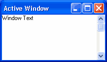

# Разработка окна в стиле Windows XP

В данной статье я расскажу о том, как можно сделать обычное окно в стиле Windows XP, без использования дополнительных элементов управления, за пять минут.

Вы, конечно, можете сказать что есть контролы, которые неплохо справляются с этой задачей, но если Вы так скажете, значит, Вы их просто не видели :)

## Инструменты

Для создания XP-окна нам потребуется скрин самого XP-окна, любой графический редактор (например MS Paint) и, конечно же, Visual Basic 6.0.



## Режем, пилим…

Для начала создадим стандартный EXE-проект. Новое окно, по традиции, назовем `frmMain`, а также добавим модуль, который назовем `mdlMainModul`.

Если Вы заметили, XP(шное) окно имеет толстую синею рамку, для ее создания нам потребуются два `Shape`, назовем их `shpFrame(0)` и `shpFrame(1)`.

Для создания заголовка окна мы возьмем обычный `Image`, который назовем `imgCaption`, и два `Label`, которые будут назваться `lblCaption(0)` и `lblCaption(1)`.

В нашем окне будет две кнопки - **Свернуть** и **Закрыть**, для их создания мы возьмем два `PictureBox`, которые назовем `picButton(0)` и `picButton(1)`.

После того, как все выше описанные элементы окажутся на форме, мы займемся визуальным изменением их свойств:

|  |   |
| ---- | - |
| **Form** | |
| (Name) | frmMain |
| BorderStyle | 1 - FixedSingle |
| Caption | XP-окно |
| MinButton | True |
| **Shape** | |
| (Name) | shpFrame |
| Index | 0 |
| Shape | 0 - Rectangle |
| **Shape** | |
| (Name) | shpFrame |
| Index | 1 |
| Shape | 0 - Rectangle |
| **Image** | |
| (Name) | imgCaption |
| Picture | Небольшой кусок заголовка XP-окна, вырезанный со скрина  | 
| **Label** | |
| (Name) | lblCaption |
| AutoSize | True |
| Caption | XP-окно |
| Index | 0 |
| **Label** | |
| (Name) | lblCaption |
| AutoSize | True |
| Caption | XP-окно |
| Index | 1 |
| **PictureBox** | |
| (Name) | picButton |
| AutoSize | True |
| BorderStyle | 0 - None |
| Index | 0 |
| Picture | Кнопка "Закрыть", вырезанная со скрина  |
| ToolTipText | Закрыть |
| PictureBox | |
| (Name) | picButton |
| AutoSize | True |
| BorderStyle | 0 - None |
| Index | 1 |
| Picture | Кнопка "Свернуть", вырезанная со скрина  |
| ToolTipText | Свернуть |

В итоге, получится нечто вроде того, что изброжено на рисунке 2:


## Кодинг

Теперь займемся превращением всего этого в XP-окно.

Для начала мы пойдем в [Библиотеку кодов](http://vbnet.ru/faq/) и найдем там исходник, который позволит нам скрыть заголовок у формы (`frmMain`) и исходин для перетаскивания формы за "другое место" :).

Поместим их в модуль (`mdlMainModul`):

```vb
'Перетаскивание формы за другое место
Public Declare Function SendMessage Lib "user32" Alias "SendMessageA" (ByVal hwnd As Long, ByVal wMsg As Long, ByVal wParam As Long, lParam As Any) As Long
Public Declare Sub ReleaseCapture Lib "user32" ()
Public Const WM_NCLBUTTONDOWN = &HA1
Public Const HTCAPTION = 2

'Скрыть заголовок окна
Private Declare Function SetWindowLong Lib "user32" Alias "SetWindowLongA" (ByVal hwnd As Long, ByVal nIndex As Long, ByVal dwNewLong As Long) As Long
Private Declare Function GetWindowLong Lib "user32" Alias "GetWindowLongA" (ByVal hwnd As Long, ByVal nIndex As Long) As Long
Private Declare Function SetWindowPos Lib "user32" (ByVal hwnd As Long, ByVal hWndInsertAfter As Long, ByVal X As Long, ByVal Y As Long, ByVal cx As Long, ByVal cy As Long, ByVal wFlags As Long) As Long
Private Declare Function GetWindowRect Lib "user32" (ByVal hwnd As Long, lpRect As RECT) As Long

Private Type RECT
  Left As Long
  Top As Long
  Right As Long
  Bottom As Long
End Type

Private Const GWL_STYLE = (-16)
Private Const WS_SYSMENU = &H80000
Private Const WS_MAXIMIZEBOX = &H10000
Private Const WS_MINIMIZEBOX = &H20000
Private Const WS_CAPTION = &HC00000
Private Const SWP_FRAMECHANGED = &H20
Private Const SWP_NOREPOSITION = &H200
Private Const SWP_NOZORDER = &H4

'Функция, которая скроет заголовок окна, я ее немного подправил
Public Function ShowTitleBar(ByVal frmForm As Form, ByVal bState As Boolean)
  'On Error Resume Next
  Dim lStyle As Long
  Dim tR As RECT
  GetWindowRect frmForm.hwnd, tR
  lStyle = GetWindowLong(frmForm.hwnd, GWL_STYLE)

  If (bState) Then
    frmForm.Caption = frmForm.Tag
    If frmForm.ControlBox Then
      lStyle = lStyle Or WS_SYSMENU
    End If

    If frmForm.MaxButton Then
      lStyle = lStyle Or WS_MAXIMIZEBOX
    End If

    If frmForm.MinButton Then
      lStyle = lStyle Or WS_MINIMIZEBOX
    End If

    If frmForm.Caption = "" Then
      lStyle = lStyle Or WS_CAPTION
    End If
  Else
    frmForm.Tag = frmForm.Caption
    frmForm.Caption = ""
    lStyle = lStyle And Not WS_SYSMENU
    lStyle = lStyle And Not WS_MAXIMIZEBOX
    lStyle = lStyle And Not WS_MINIMIZEBOX
    lStyle = lStyle And Not WS_CAPTION
  End If

  SetWindowLong frmForm.hwnd, GWL_STYLE, lStyle
  SetWindowPos frmForm.hwnd, 0, tR.Left, tR.Top, tR.Right - tR.Left, tR.Bottom - tR.Top, SWP_NOREPOSITION Or SWP_NOZORDER Or SWP_FRAMECHANGED

  frmForm.Refresh
End Function
```

Далее переходим к форме (`frmMain`) и создадаем обработчик события `Form_Resize`, который, как известно, возникает при изменении размера формы:

```vb
Private Sub Form_Resize()
  'On Error Resume Next

  'Настройка цвета
  frmMain.BackColor = RGB(236, 233, 216)
  lblCaption(0).ForeColor = RGB(255, 255, 255)
  lblCaption(1).ForeColor = RGB(0, 0, 128)
  shpFrame(0).BorderColor = RGB(0, 0, 128)
  shpFrame(1).BorderColor = RGB(0, 0, 255)

  'Изменение свойств контролов
  lblCaption(0).BackStyle = 0
  lblCaption(1).BackStyle = 0
  imgCaption.Stretch = True

  'Размер и позиция
  imgCaption.Left = 0: imgCaption.Top = 0
  imgCaption.Width = frmMain.Width
  shpFrame(0).Left = 0: shpFrame(0).Top = 0
  shpFrame(0).Width = frmMain.Width: shpFrame(0).Height = frmMain.Height
  shpFrame(1).Left = (1 * Screen.TwipsPerPixelX): shpFrame(1).Top = (1 * Screen.TwipsPerPixelY)
  shpFrame(1).Width = frmMain.Width - (2 * Screen.TwipsPerPixelX): shpFrame(1).Height = frmMain.Height - (2 * Screen.TwipsPerPixelY)
  lblCaption(0).Left = 60: lblCaption(0).Top = 80
  lblCaption(1).Left = 70: lblCaption(1).Top = 90
  picButton(0).Left = frmMain.Width - picButton(0).Width - 40: picButton(0).Top = 40
  picButton(1).Left = picButton(0).Left - picButton(1).Width - 20: picButton(1).Top = 40
End Sub
```

Затем необходимо скрыть заголовок окна, для этого создадим обработчик для события `Form_Load`:

```vb
Private Sub Form_Load()
  'On Error Resume Next
  ShowTitleBar frmMain, False
  ShowTitleBar frmMain, True
End Sub
```

Для того чтобы нашу форму можно было перемещать за заголовок, создаем обработчики `imgCaption_MouseDow` и `lblCaption_MouseDown`:

```vb
Private Sub imgCaption_MouseDown(Button As Integer, Shift As Integer, X As Single, Y As Single)
  'On Error Resume Next
  Dim ReturnValue As Long

  If Button = 1 Then
    Call ReleaseCapture
    ReturnValue = SendMessage(frmMain.hwnd, WM_NCLBUTTONDOWN, HTCAPTION, 0&)
  End If
End Sub

Private Sub lblCaption_MouseDown(Index As Integer, Button As Integer, Shift As Integer, X As Single, Y As Single)
  'On Error Resume Next
  Dim ReturnValue As Long

  If Button = 1 Then
    Call ReleaseCapture
    ReturnValue = SendMessage(frmMain.hwnd, WM_NCLBUTTONDOWN, HTCAPTION, 0&)
  End If
End Sub
```

Теперь заставим реагировать на клики наши кнопки:

```vb
Private Sub picButton_Click(Index As Integer)
  'On Error Resume Next
  Select Case Index
    Case 0
    End 'Закрываем окно и выходим из программы
  Case 1
    frmMain.WindowState = vbMinimized 'Сворачиваем окно
  End Select
End Sub
```

Вот собственно и все, нажимаем F5 и любуемся результатом (рис. 3):


## Эпилог

Все гениальное просто!

Созданное нами окно запросто можно использовать в любых приложениях, поскольку оно будет выглядит в любых ОС и при любых параметрах, таким каким мы его создали.

В следующий раз я расскажу как можно сделать MDI-окно и кое-какие контролы в таком же стиле.

[Скачать пример](assets/winxp.zip)

---
Алексей Немиро  
Специально для VBNet.Ru  
2003-04-26
