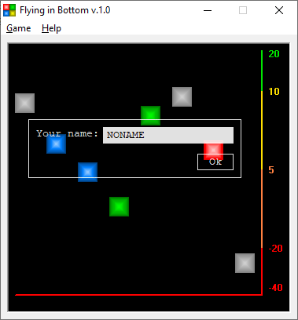
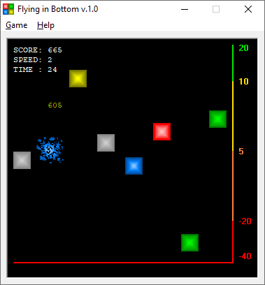

# Flying in bottom

The goal of the game is to knock down falling cubes, the higher the cube, the more points you get.

In this game, I used full rendering of the interface and gameplay for the first time.

In my early games, I mostly used controls such as `PictureBox`, `Image`, `Command`, etc, and made animations using GIF files.
Here everything is completely drawn in real time, without using Visual Basic components.

> [!WARNING]
> Author does NOT guarantee the functionality of the presented binary files.
> Author is NOT responsible for any damage that may occur when running or using the presented binary files.

**:floppy_disk: [Download Flying in bottom v1.0](flying_in_bottom_v10.exe)**

