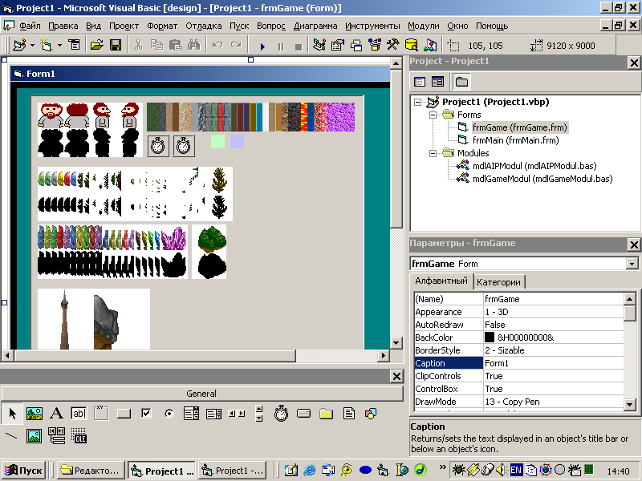
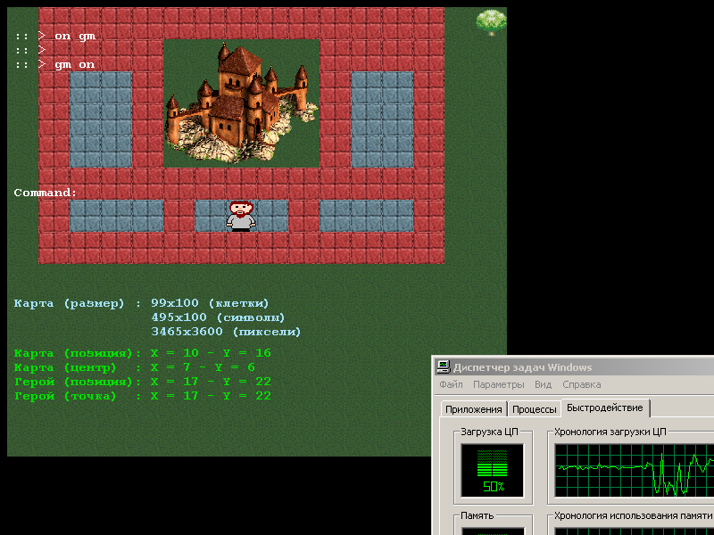
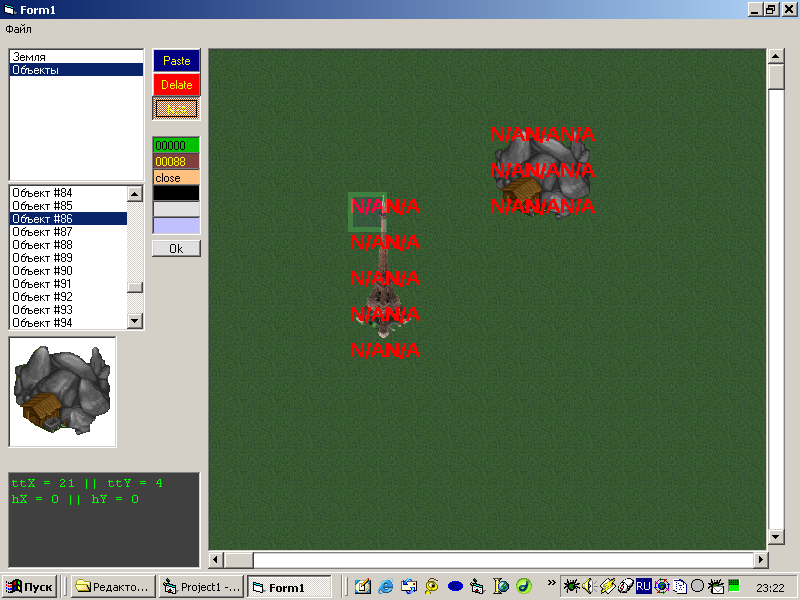
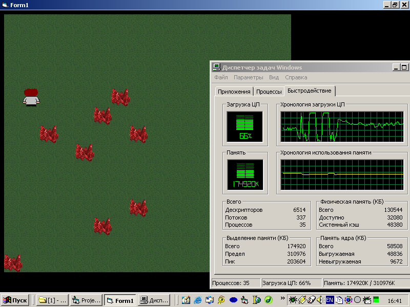
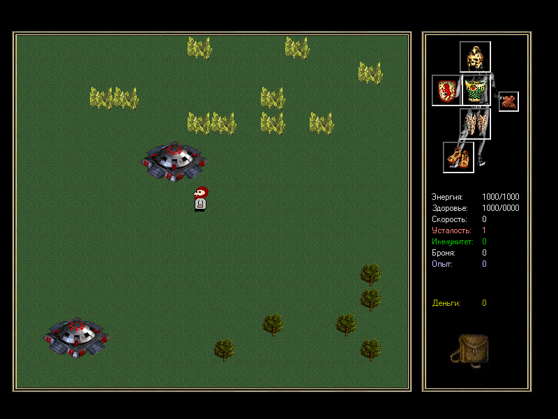

# Game

This is a game engine that I developed in the second half of 2003.

My [first](../../../2002/assets/jager3) and [second](../../../2002/assets/wid) attempts at creating an RPG game had a problem: each section of the map was divided into screens when the character walked to the edge of the screen, he would go to the next screen.

In this engine I solved this problem.

Interestingly, I used text markers to create the maps. However, at that time I already had experience working with binary data and could easily use binary maps. But apparently, for the convenience of developing maps, I decided to use text. Although I already had a map editor.

I also made efforts to achieve better performance. But this is still Visual Basic 6.0 and I did not use DirectX.

I still used graphic elements from various other games. However, I drew the main character myself, in MS Paint.

The project was not finished.

You can download one of the latest test builds of the project:

> [!WARNING]
> Author does NOT guarantee the functionality of the presented binary files.
> Author is NOT responsible for any damage that may occur when running or using the presented binary files.

:floppy_disk: [Download](Project1.zip)
