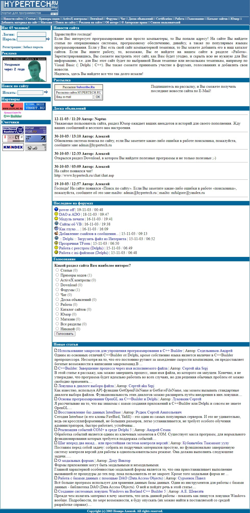

# HyperTech.ru

**HyperTech.ru** is my first website dedicated to programming.

The project was written in Classic ASP. MS Access was used as the DBMS.

When developing the project, I was based on the experience of VBNet.RU.
And to some extent, HyperTech.ru was the best implementation of VBNet.RU.

In this project, I first implemented a system of roles and distribution of user rights.

The following sections were implemented on the site:

* News
* Articles
* Examples of codes
* Software catalog
* Forums
* Chats
* Job search service
* Online testing service
* Humor
* Shop

The project operated for a year. Most of the time, in my absence.

Before I left for the army, I warned the hosting company - [mtw.ru](https://mtw.ru/) that I would not be able to pay for their services. Hosting did not kill the project.
The project ended due to the expiration of the domain name registration.

**:earth_africa: [Open in WebArchive](http://web.archive.org/web/20031202161534/hypertech.ru)**

