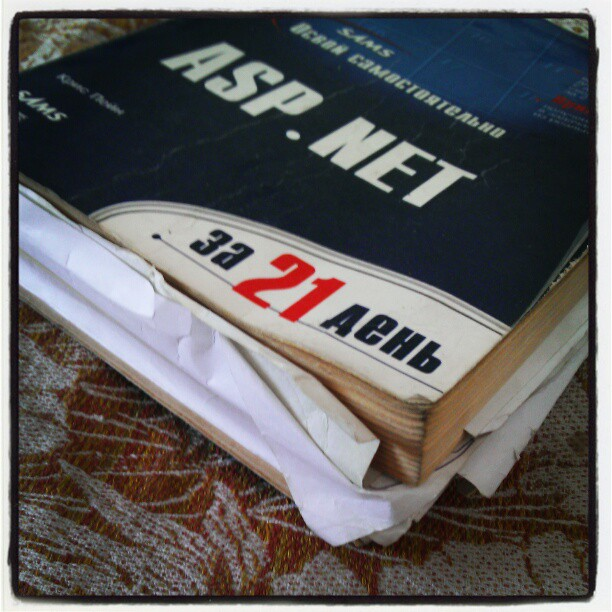

# 2005

2005 is the second year of my military service.

I was completely free and could do whatever I wanted. But there was one small problem.

I was in the forest, where there were nothing but trees, hills, and increased background radiation.

And most importantly, I did not have access to the Internet. I was fixed in the late 2003 state.

One of my friends sent me the Fedora distribution by mail. And I had my first serious experience with Unix systems.

I had a book on ASP.NET that my mother brought me when she was in Moscow. I started actively learning ASP.NET and began to develop my new web project dedicated to programming.

During this period of time, I could boast of excellent knowledge of Visual Basic 6.0. This is not difficult when technology stops developing.

Also, I developed programs, casual games, and components using Visual Basic 6.0.

I retired to the reserves in the fall of 2005 with the rank of starshina 2nd class (junior sergeant).

## Applications for Windows

:star: [Keyboard Statistics](assets/keyboard_statistics.md)  
:star: [PassMe](assets/passme.md) - password manager  
:star: [Wallpapers changer](assets/wallchang.md) - automatic change of desktop pictures for Windows 98/ME/2000/XP

## Casual games

:star: [Golden Rush](assets/golden_rush.md) - control a little man to find a gold in the forest  
:star: [Sapper](assets/sapper.md) - little man must be careful not to step on the mines

## Articles

:page_facing_up: [ASP – Работа с базами данных](articles/ASP_Databases.md) :ru:

---
[< 2004](/2004) &nbsp; **2005** &nbsp; [2006 >](/2006)

---
Aleksey Nemiro  
2023-09-09
