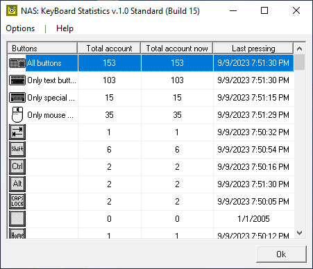
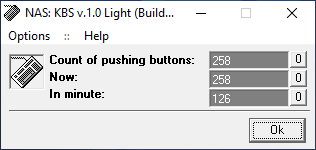

# Keyboard Statistics

The program allows the user to keep track of keyboard keystrokes and mouse buttons.

Two implementations of the program were released: Light Edition and Standard Edition.

> [!WARNING]
> Author does NOT guarantee the functionality of the presented binary files.
> Author is NOT responsible for any damage that may occur when running or using the presented binary files.

**:floppy_disk: [Download Keyboard Statistics Standard Edition v1.0](keyboard_statistics_standard_edition.exe)**  
**:floppy_disk: [Download Keyboard Statistics Light Edition v1.0](keyboard_statistics_v1x_light_edition.exe)**

