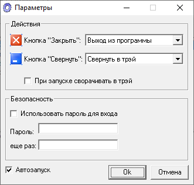

# PassMe

Program for storing passwords.

> [!WARNING]
> The program is a bit buggy, there are problems with copying Russian characters to the clipboard.
> There is a possibility of data loss if the computer unexpectedly turns off.

> [!WARNING]
> Author does NOT guarantee the functionality of the presented binary files.
> Author is NOT responsible for any damage that may occur when running or using the presented binary files.

:floppy_disk: [Download PassMe v1.0](passme_1x.exe)

