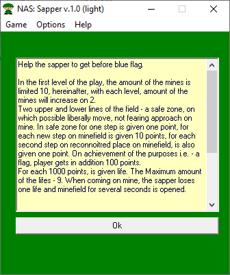
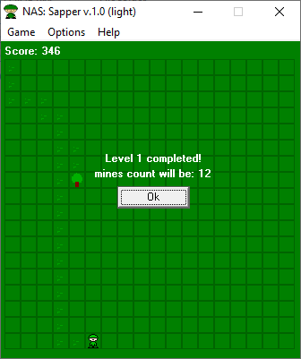
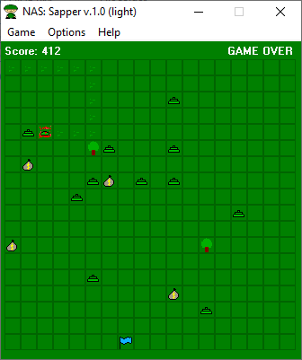

# Sapper

This is the first game in the light series.

The user has at his disposal a small man with three lives left and a large minefield (18x18 squares).

The number of mines on the field varies from 10 to infinity.

The man, called the Sapper in the game, must be brought to the blue flag located at the other end of the field.

On the field, in addition to mines, there are trees, and if the player is lucky, then a bag of money, an extra life, or even a map of the location of mines on the field (red flag).

As the user progresses through levels, the number of mines on the field increases.

> [!WARNING]
> Author does NOT guarantee the functionality of the presented binary files.
> Author is NOT responsible for any damage that may occur when running or using the presented binary files.

**:floppy_disk: [Download Sapper v1.0](saper_v10_light.exe)**

