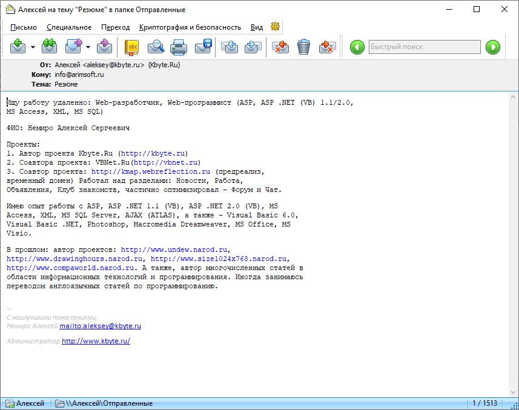

# 2006

2006 was a year of rebirth for me.

When I returned home from my military service, I discovered that my computer was broken.

It was sad because I didn't have the money to buy a new one. The government paid me somewhere around $50 for my service.

I bought some electronic parts and using a soldering iron I was able to get my computer working again.

I continued developing my new web project dedicated to programming - [Kbyte.Ru](assets/kbyte.md).
I managed to make the first sketches of the project while still in the army, in [2005](../2005).
The first public release was presented in February 2006.

Later, I found a job as a computer operator in a liquor warehouse.

I have never tried to look for a job in information technology. It sounds strange. At that time, I had about twenty projects under my belt.

I missed a lot in two years and I had to catch up.

I joined the VBNet.RU team again. By this time, the team was already working on commercial projects.
From time to time I helped them. But I couldn't work fully because my main job had an irregular schedule and often I didn't have time to sleep.

In the middle of the year, my friend offered me a position as a remote programmer.

That's how I got a job as a programmer at Arimsoft. It was a small company with less than ten employees at that time.

My work was related to the support and development of travel websites. We primarily used ASP.NET WebForms, Visual Basic .NET, and SQL Server.

For the Kbyte.Ru project, I actively developed email services. In particular, automatic reading and parsing of letters, and integration of mail with the site.

In addition to programming, in the Kbyte.Ru project, I was involved in organizational issues and project promotion.
I was looking for sponsors for competitions held on the site.
I was looking for information partners, and looking for advertisers.

In October, I joined the International Union of Internet Activists [EZHE](https://ezhe.ru/).

I also did not forget about my old projects, and in 2006 I released the last version of [Drawing Hours](assets/drawing_hours.md).

_Aleksey Nemiro  
2023-09-09_

## Applications for Windows

:star: [Drawing Hours v4.0](assets/drawing_hours.md)

## Solutions for ASP.NET

:star: [TextBoxLimited.NET](assets/textboxlimited.md)

## Web projects

:star: [Kbyte.Ru v1.0-v3.0](assets/kbyte.md)

## Articles

:page_facing_up: [Работаем с MIME](articles/MIME.md) :ru:  
:page_facing_up: [ASP .NET 2.0: Эталонные страницы](articles/ASPNET_MasterPages.md) :ru:  
:page_facing_up: [Форум своими руками на ASP](articles/Creation_forum_using_Classic_ASP.md) :ru:

---
[< 2005](/2005) &nbsp; **2006** &nbsp; [2007 >](/2007)
