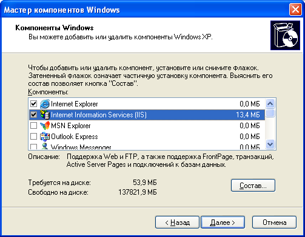
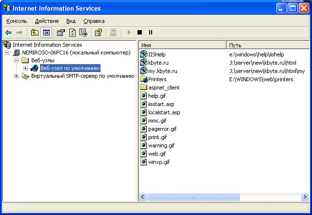
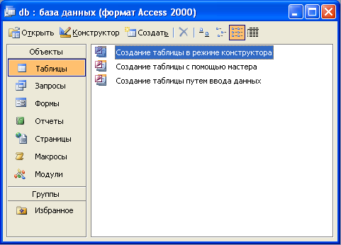

# Форум своими руками на ASP

Как известно, форум – это средство общения пользователей сети Интернет, и в тоже время, это большой справочник вопросов и ответов определенной тематики, и, пожалуй, ни один современный сайт не может обойтись без форума.
В данной статье я расскажу, как можно быстро сделать собственный форум на **ASP**, причем, для этого не надо никуда ходить, искать и закачивать какие-либо дополнительные программы, и даже вовсе не обязательно быть программистом.
Для этого достаточно иметь **Windows 2000/XP** и комплект программ **MS Office**, а именно - **MS Access**.
В качестве реактора **ASP**-страниц, можно использовать обычный **Блокнот**.

## Active Server Pages

**ASP** (**Active Server Pages**) - технология динамического создания веб-страниц, разработанная корпорацией **Microsoft** для серверов **Windows NT/2000/XP/2003**.

Основой синтаксиса **ASP** является язык программирования высокого уровня – **Visual Basic**.
Если вы ранее работали с **Visual Basic**, то для вас не составит особо труда разобраться с **ASP**.
Но даже, если вы вообще никогда не встречались с программированием, вам все равно будет не сложно разобраться с **ASP**, поскольку, как известно, **Visual Basic** довольно легкий для освоения язык.

## Собственный Web-сервер? Легко!

Прежде чем приступать к созданию форума, вам потребуется установить **IIS** (**Internet Information Services**) – это профессиональный веб-сервер, разработанный компанией **Microsoft**.
В состав **Windows 2000** и **Windows XP** входит **IIS** версии 5.0.
По умолчанию, **IIS** не устанавливается, поэтому его нужно установить отдельно.
Для этого нажмите **Пуск** => **Панель управления** => **Установка/удаление программ**, в появившемся окне, нажмите **Установка Windows**.
Должно появиться окно компонентов **Windows**. Выберите **Internet Information Services** и нажмите **Далее**.



По завершению установки, в **Панель управления** => **Администрирование**, появится ярлык - **Internet Information Services**, более того, теперь ваш компьютер может играть роль веб-сервера!
Для проверки этого, запустите браузер (например, **Internet Explorer**) и в строку адреса введите: http://localhost/, после чего откроется веб-узел, созданный по умолчанию **IIS**.
Кроме этого, получить доступ к серверу можно, если в строку адреса ввести http://имя_вашего_компьютера, либо указать локальный **IP**-адрес – http://127.0.0.1.

Теперь, когда собственный веб-сервер у нас есть, его нужно настроить. Запустите **IIS**: **Пуск** => **Панель управления** => **Администрирование** => **Internet Information Services**.



В появившемся окне отображается структура каталогов вашего Web-узла, а также серверов **SMTP** и **FTP**, если данные компоненты были установлены.
Разверните список **Веб-узлы** и щелкните правой кнопкой мышки по **Веб-узел по умолчанию**, выберите меню **Создать** => **Виртуальный каталог**. Появится окно **Мастер создания виртуальных каталогов**.
Нажмите **Далее**, мастер предложит указать **Псевдоним виртуального каталога**. Псевдоним должен состоять из латинских символов, напишите, например, `myforum.ru` и нажмите **Далее**. Мастер предложит выбрать физический каталог на диске.
Нажмите на кнопку **Обзор**, в появившемся окне выберите **Диск C:** и нажмите на кнопку **Новая папка**, имя папки может также быть любым, но во избежание недоразумений, русские символы использовать не рекомендуется.
Чтобы не путаться, назовите ее, например, `first_web_page`. Выберите созданный каталог и нажмите **Далее**.
В появившемся окне поставьте опции **Чтение** и **Запуск сценариев (например ASP)**, и нажмите **Далее**, а затем **Готово**.

Теперь, в списке **Веб-узел по умолчанию** должен появиться только что созданный вами виртуальный каталог – **myforum.ru**.
Вот собственно и все, больше настраивать ничего не требуется.

## База данных

Сообщения форума нужно где-то хранить. Обычно для этого используют базы данных.
Базы данных бывают разные, но наиболее доступны базы **MS Access**.
Программа **MS Access** входит в состав **MS Office**. Если у вас по каким-то причинам **MS Access** не установлена, ее нужно установить.
Для этого нажмите **Пуск** => **Панель управления** => **Установка/удаление программ**, в появившемся окне найдите **Microsoft Office** и нажмите на кнопку **Изменить** (либо, **Изменить/Удалить**).
В появившемся окне установите опцию **Access** и нажмите на кнопку **Обновить**. Процесс установки займет несколько минут.
После чего, на **Рабочем столе** появится иконка **Microsoft Office Access**.

Запустите **MS Access** и создайте новую базу данных. Программа сразу предложит вам сохранить бузу данных, сохраните ее под именем `db.mdb` в созданную ранее папку - `C:\first_web_page`. Далее, должно появиться окно управления базой данных.



В разделе **Объекты**, выберите **Таблицы** и нажмите **Создание таблицы в режиме конструктора**. Добавить следующие поля таблицы:

| Имя поля | Тип данных |  Описание |
| ---------| -----------| --------- |
| id | Счетчик | |
| author_name | Текстовой (50 символов) | Имя автора |
| author_mail | Текстовой (25 символов) | E-Mail автора |
| subject | Текстовой (255 символов) | Тема сообщения |
| main_text | Поле MEMO | Текст сообщения |
| parent_id | Числовой | Идентификатор родителя |
| date_add | Дата/время | Дата добавления |

Закройте окно конструктора, на предложения сохранить изменения, ответьте **Да** и укажите имя таблицы `tblMessages`, на предложение создать ключевые поля, ответьте **Нет**.

Всё! База данных готова! Конечно, профессиональные форумы имеют гораздо большее количество полей, но для первого раза этого достаточно.

## Программирование

Итак, дело за малым, осталось создать asp-странички, их будет три: `default.asp`, `show.asp` и `add.asp`.
Для этого, в папке `C:\first_web_page` создайте три обычных текстовых документа (правая кнопка мышки => **Создать** => **Текстовой документ**) и переименуйте их в `default.asp`, `show.asp` и `add.asp`. Обратите внимание, чтобы изменить расширение файла (с `.txt`, на `.asp`), необходимо, чтобы в параметрах папки была отключена опция **Скрывать расширения для зарегистрированных типов файлов** (меню папки **Сервис** => **Свойства папки**, вклада **Вид**).

Файл `default.asp` - это основной файл, который будет искать веб-сервер, при обращении к созданному вами виртуальному каталогу (http://localhost/myforum.ru).
В этом файле будет отображаться список тем форума. Откройте `default.asp` блокнотом и введите следующий код:

```asp
<%
  'параметры кэширования страницы
  Response.CacheControl = "no-cache"
  Response.AddHeader "Pragma", "no-cache"
  Response.Expires = -1
  adOpenStatic = 3
  'создаем объекты доступа к базе данных
  Set Conn = Server.CreateObject("ADODB.Connection")
  Set RS = Server.CreateObject("ADODB.Recordset")
  'получаем путь к базе данных
  strDBPath = Server.MapPath("db.mdb")
  'подключаемся к базе данных
  Conn.Open "Provider=Microsoft.Jet.OLEDB.4.0;Data Source=" & _
  strDBPath
  'создаем запрос выборки данных
  strSQL = "SELECT * FROM tblMessages " & _
           "WHERE (parent_id = 0) " & _
           "ORDER BY date_add DESC, id ASC"
  'выполняем запрос в подключенной БД
  RS.Open strSQL, Conn, adOpenStatic
  'если данные есть, то выводим их
  If RS.RecordCount > 0 Then
    'выводим список тем форума
    'пока данные не кончатся
    Do Until RS.EOF
      If RS.EOF Or RS.BOF Then Exit Do
        strSubjectList = strSubjectList & _
                "<p><b><a href='show.asp?id=" & _
                RS("id") & "'>" & RS("subject") & _
                "</a></b><br />" & vbCrLf
        strSubjectList = strSubjectList & _
                "Автор: <a href='mailto:" & _
                RS("author_mail") & "'>" & _
                RS("author_name") & "</a> "
        strSubjectList = strSubjectList & "Добавлено: " & _
                RS("date_add") & "</p>" & vbCrLf
        'переход к следующей записи
        RS.MoveNext
    Loop
  Else
    'тем нету, выводим сообщение об этом
    strSubjectList = "<p style='text-align:center;'>" & _
          "Список тем пуст...</p>"
  End If

  'закрываем БД
  Conn.Close
  'удаляем объекты из памяти
  Set RS = Nothing
  Set Conn = Nothing
%>

<html>
  <head>
    <title>Мой первый форум!</title>
    <meta http-equiv="Content-Type" 
     content="text/html; charset=windows-1251">
  </head>
  <body>
    <p style='text-align:center;'>
      <a href='add.asp?id=0'>
        Добавить новую тему
      </a>
    </p>
    <hr />
    <!-- вставляем результат операции из БД -->
    <%=strSubjectList%>
    <hr />
    <p style='text-align:center;'>
      <a href='add.asp?id=0'>
        Добавить новую тему
      </a>
    </p>
  </body>
</html>
```

Вот, собственно, первая страница и готова! Чтобы проверить ее, запустите браузер и в адресную строку введите: http://localhost/myforum.ru.
В браузере должно появиться сообщение: **Список тем пуст...**, поскольку база данных, пока еще, не содержит каких-либо данных.
Обратите внимание на две ссылки **Добавить новую тему**, эти ссылки переводят пользователя на страницу добавления новой темы, т.е. `add.asp`, как раз её, вам сейчас и предстоит сделать. Откройте файл `add.asp` блокнотом и введите следующий код:

```asp
<%
  Response.CacheControl = "no-cache"
  Response.AddHeader "Pragma", "no-cache"
  Response.Expires = -1
  adOpenStatic = 3
  adOpenDynamic = 2
  adUseClient = 3
  adOpenKeyset = 1
  adLockOptimistic = 3
  'добавляем сообщение в базу данных
  If Not CStr(Request("tbAuthorName")) = vbNullString Then
    Set Conn = Server.CreateObject("ADODB.Connection")
    Set RS = Server.CreateObject("ADODB.Recordset")
    strDBPath = Server.MapPath("db.mdb")
    Conn.Open "Provider=Microsoft.Jet.OLEDB.4.0;Data Source=" & _
              strDBPath
    RS.ActiveConnection = Conn
    RS.CursorLocation = adUseClient
    RS.CursorType = adOpenKeyset
    RS.LockType = adLockOptimistic
    RS.Source = "tblMessages"
    RS.Open
    RS.AddNew

    RS("author_name") = Request("tbAuthorName")
    RS("author_mail") = Request("tbAuthorMail")
    RS("subject") = Request("tbSubject")
    RS("main_text") = Request("tbMainText")
    RS("date_add") = Now
    RS("parent_id") = CLng(Request("tbParentID"))
    RS.Update
    RS.Close
    Conn.Close
    Set RS = Nothing
    Set Conn = Nothing
  End If
%>

<html>
  <head>
    <title>Мой первый форум!</title>
    <meta http-equiv="Content-Type" 
     content="text/html; charset=windows-1251">
  </head>
  <body>
    <%If CStr(Request("tbAuthorName")) = vbNullString Then%>
    <form name="frmAddNewMessage"
     method="post" 
     action="add.asp" 
     onSubmit="btnAdd.disabled=true;">
      <input type="hidden"
       id="tbParentID"
       name="tbParentID"
       value="<%=CInt(Request("id"))%>"
      />
      <p><b>Ваше имя: </b>
        <input name="tbAuthorName"
         type="text" 
         id="tbAuthorName" 
         style="width:50%"
         maxlength="50" /></p>
      <p><b>Ваш E-Mail: </b>
        <input name="tbAuthorMail"
         type="text" 
         id="tbAuthorMail" 
         style="width:50%"
         maxlength="25" /></p>
      <%If CInt(Request("id")) <= 0 Then%>
        <p><b>Тема сообщения: </b>
         <input name="tbSubject"
           type="text" 
           id="tbSubject" 
           style="width:50%"
           maxlength="255" /></p>
      <%End If%>
      <p>
        <textarea name="tbMainText"
         id="tbMainText"
         cols="60" rows="7" 
         style="width:100%;">
        </textarea>
      </p>
      <p style='text-align:center;'>
        <input name="btnAdd" 
         type="submit" 
         id="cmdAdd" 
         value="Добавить" />
      </p>
    </form>
    <%Else%>
    <p style='text-align:center;'>
      Сообщение успешно добавлено!<br />
      <a href='default.asp'>
        Перейти к списку тем
      </a>
    </p>
    <%End If%> 
  </body>
</html>
```

Теперь, при нажатии на ссылку **Добавить новую тему**, загрузится страничка с формой добавления нового сообщения в форум.
Попробуйте добавить новое сообщение. Обратите внимание, если имя автора будет не указано, то сообщение не будет добавлено в базу данных.
После заполнения формы и нажатия на кнопку **Добавить**, должна появиться надпись: **Сообщение успешно добавлено!**, и ссылка для перехода к списку тем. При переходе по ссылке, в списке тем должна появиться созданная вами тема.
Теперь осталось сделать еще одну страничку – `show.asp`. На этой старичке пользователи вашего форума смогут просматривать сообщения форума.
Код немного похож на `default.asp`:

```asp
<%
  Response.CacheControl = "no-cache"
  Response.AddHeader "Pragma", "no-cache"
  Response.Expires = -1
  adOpenStatic = 3
  Set Conn = Server.CreateObject("ADODB.Connection")
  Set RS = Server.CreateObject("ADODB.Recordset")
  strDBPath = Server.MapPath("db.mdb")
  Conn.Open "Provider=Microsoft.Jet.OLEDB.4.0;Data Source=" & _
              strDBPath
  ' выводим тему
  strSQL = "SELECT * FROM tblMessages " & _
           "WHERE (id = " & Request("id") & ")"
  RS.Open strSQL, Conn, adOpenStatic
  If RS.RecordCount > 0 Then

    strSubjectList = _
    "<p><b>Тема сообщения: " & _
    RS("subject") & _
    "</b></p>" & vbCrLf
    strSubjectList = strSubjectList & _
    "<b>Автор: </b><a href='mailto:" & _
    RS("author_mail") & "'>" & _
    RS("author_name") & "</a> "
    strSubjectList = strSubjectList & "Добавлено: " & _
    RS("date_add") & "</p>" & vbCrLf
    strSubjectList = strSubjectList & _
    "<p>" & _
    RS("main_text") & _
    "</p>" & vbCrLf
    RS.Close
    ' выводим ответы
    strSQL = "SELECT * FROM tblMessages " & _
             "WHERE (parent_id = " & Request("id") & ") " & _
             "ORDER BY date_add DESC, id ASC"
    RS.Open strSQL, Conn, adOpenStatic
    If RS.RecordCount > 0 Then
      Do Until RS.EOF
        If RS.EOF Or RS.BOF Then Exit Do
        strSubjectList = strSubjectList & _
        "<b>Автор: </b><a href='mailto:" & _
        RS("author_mail") & "'>" & _
        RS("author_name") & "</a> "
        strSubjectList = strSubjectList & "Добавлено: " & _
        RS("date_add") & "</p>" & vbCrLf
        strSubjectList = strSubjectList & _
        "<p>" & _
        RS("main_text") & _
        "</p>" & vbCrLf
        RS.MoveNext
      Loop
    Else
      strSubjectList = strSubjectList & _
      "<p style='text-align:center;'>" & _
      "Нет ответов...<p>"
    End If
  Else
    strSubjectList = "<p style='text-align:center;'>" & _
    "Тема не найдена...<p>"
  End If
  Conn.Close
  Set RS = Nothing
  Set Conn = Nothing
%>

<html>
  <head>
    <title>Мой первый форум!</title>
    <meta http-equiv="Content-Type" 
     content="text/html; charset=windows-1251">
  </head>
  <body>
    <p style='text-align:center;'>
      <a href='default.asp'>
        Вернуться к списку тем
      </a>
      ||
      <a href='add.asp?id=<%=Request("id")%>'>
        Добавить ответ
      </a>
    </p>
    <hr />
    <%=strSubjectList%>
    <hr />
    <p style='text-align:center;'>
      <a href='default.asp'>
        Вернуться к списку тем
      </a>
      ||
      <a href='add.asp?id=<%=Request("id")%>'>
        Добавить ответ
      </a>
    </p>
  </body>
</html>
```

Вот, собственно, и все! Форум готов! Конечно, это самый простой вариант форума и здесь еще очень многое можно (нужно) сделать, например: разбивку тем на страницы, проверку заполнения формы добавления сообщения, добавить количество просмотров тем форума, автора последнего ответа, дату последнего ответа, организовать регистрацию пользователей и многое другое.

Но данный форум уже можно разместить на каком-нибудь сервере в сети Интернет под управлением **Windows**, либо в локальной сети и использовать для общения.

## Вывод

Как видите, ничего сложного в создании форума нет. Если вы знакомы с **HTML** и **Visual Basic**, то вы с легкостью сможете сделать любую **asp**-страничку на основе приведенных примеров.
Кончено, если вы ни когда раньше не сталкивались с программированием, то вас может отпугнуть объем кода, но бояться не стоит, в большинстве своем код однотипный.

Корпорация **Microsoft** активно развивает технологию **ASP** и сейчас уже есть новая версия – **ASP.NET 2.0** на базе библиотек и компонентов **.NET Framework 2.0**. Новая версия **ASP** гораздо сложнее и предоставляет разработчику гораздо больше возможностей, нежели классический **ASP**. Но об этом я постараюсь рассказать в следующий раз.

---
Алексей Немиро  
02 апреля 2006 г.
