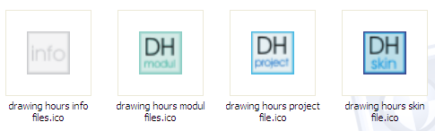
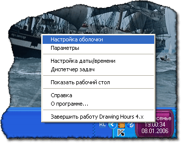
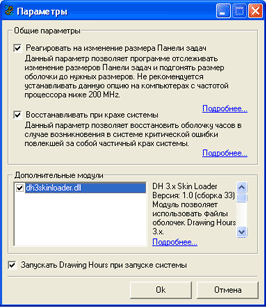
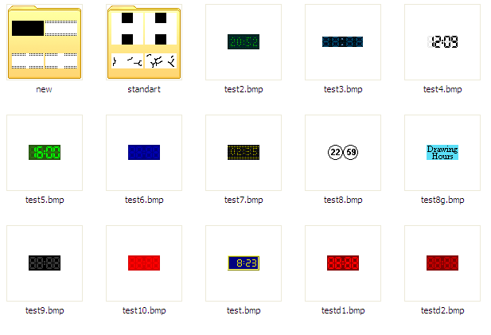

# Drawing Hours

In 2006, I released the latest version with major changes to the Drawing Hours program.

Drawing Hours 4.0 has improved the quality and quantity of skins and added support for plugins that significantly expand the capabilities of the program.

The program was written in Visual Basic 6.0.

:earth_africa: [Project website](http://drawinghours.narod.ru)

> [!WARNING]
> Author does NOT guarantee the functionality of the presented binary files.
> Author is NOT responsible for any damage that may occur when running or using the presented binary files.

**:floppy_disk: [Download Drawing Hours v.4.00.0031](drawing_hours_4x.exe)**  
**:floppy_disk: [Download additional skins for Drawing Hours 4](dh_4x_skins.zip)**  
**:floppy_disk: [Download Drawing Hours Skins Editor](dh_4x_editor.zip)**

