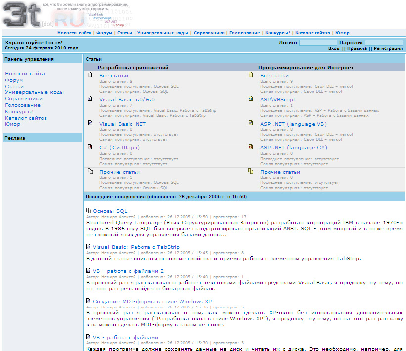
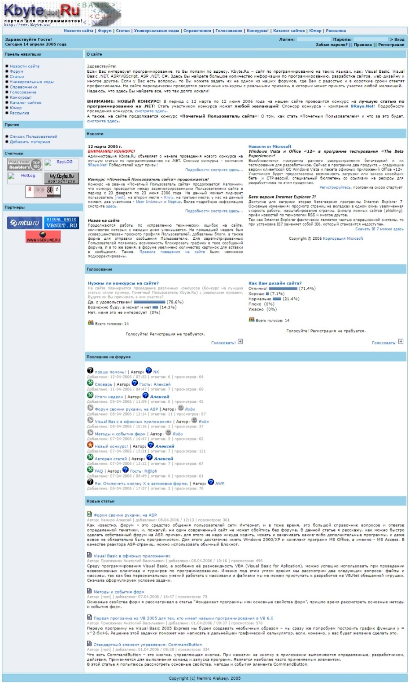

# Kbyte.Ru

Kbyte.Ru is a portal for programmers and developers.

In fact, this is a logical continuation of VBNet.RU and [HyperTech.ru](../../2003/assets/hypertech.md).

I started developing the project in 2005. Initially, the project was called wTech - Web Technologies, and then 3t(ech) - Free Technologies.

*First logo*

*3tech - Main page*

The project was written in ASP.NET 1.0 using MS Access. In fact, the first version was made in the style of Classic ASP, but using some of the innovations that appeared in .NET.

The first version was presented on February 13, 2006.

On March 25, 2006, Kbyte.Ru v2.0 was presented. The project was ported to ASP.NET 2.0. SQL Server was used as the DBMS. Integration of the forum with the postal service was created.

In the fall of 2006, Kbyte.Ru v3.0 with a new architecture was presented. At this point, the project truly became an ASP.NET project.

**:earth_africa: [Open in WebArchive](http://web.archive.org/web/20060414191817/http://www.kbyte.ru/)**

