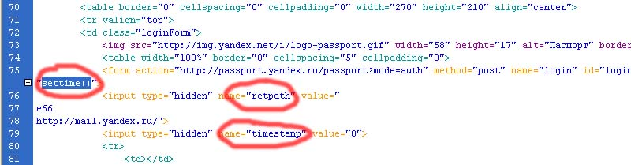
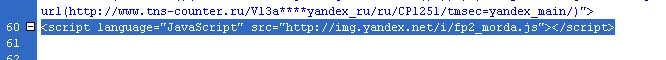
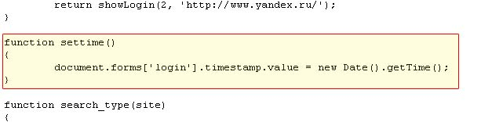
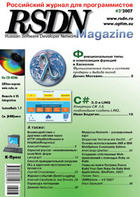

# Взаимодействие с другими сайтами через HTTP (HttpWebRequest и HttpWebResponse)

В последнее время к нам на форум и в систему Эксперт поступает большое количество вопросов на тему взаимодействия с другими сайтами.

Большие трудности у авторов таких вопросов вызывают проблемы программного заполнения и отправки веб-форм, причем многие из авторов идут, по их мнению, легким путем и пытаются использовать компонент `WebBrowser`, или всячески манипулировать «живыми» браузерами, и многие даже пытаться это делать при разработке веб-приложений! Помимо того, что подобный подход попросту не является правильным, так он еще и «сложный».

В данной статье я расскажу о том, как можно программно заполнить и отправить веб-форму, а также получить результат с использованием довольно простых классов `HttpWebRequest` и `HttpWebResponse`.

## Инструменты

Для полноценной работы нам понадобится локальный прокси-сервер для анализа трафика, в данной статье я буду использовать **Fiddler**.

Все примеры будут приведены на языках **Visual Basic** и **C#**, под **Framework .NET 2.0**.

В статье я буду все делать на примере консольного приложения, однако приведенные примеры кода можно легко использовать и в стандартных Windows-приложениях или в веб-проектах, или в любых других проектах **.NET**, без какой-либо особой модернизации.

## HttpWebRequest и HttpWebResponse

Классы `HttpWebRequest` и `HttpWebResponse` принадлежат к пространству имен `System.Net`.

Класс `HttpWebRequest` позволяет отправлять HTTP-запросы, а класс `HttpWebResponse` позволяет обрабатывать полученные ответы.

Перед началом работы, нам потребуется импортировать пространство имен `System.Net` в проект, а также дополнительно пространство имен `System.Text` и `System.IO`:

**VB**
```vb
Imports System.Net
Imports System.Text
Imports System.IO
```

**C#**
```c#
using System.Net;
using System.Text;
using System.IO;
```

## Имитация работы браузера

Возможно, вам может показаться, что имитация работы браузера это что-то сверхъестественное и не выполнимое, но на самом деле это не так, более того, в **.NET** это делается довольно легко, при этом, даже не надо знать основ **HTTP** протокола, хотя конечно подобные знания никому не повредят.

Собственно сделать простейший **HTTP** запрос можно всего двумя-тремя строчками кода:

**VB**
```vb
Dim myHttpWebRequest As HttpWebRequest = HttpWebRequest.Create("http://kbyte.ru")
Dim myHttpWebResponse As HttpWebResponse = myHttpWebRequest.GetResponse()
```

**C#**
```c#
HttpWebRequest myHttpWebRequest = (HttpWebRequest)HttpWebRequest.Create("http://kbyte.ru");
HttpWebResponse myHttpWebResponse = (HttpWebResponse)myHttpWebRequest.GetResponse();
```

В данном примере, в первой строке создается экземпляр класса `HttpWebRequest` для работы с сервером http://kbyte.ru.

Во второй строке сдается экземпляр класса `HttpWebResponse`, который получает результат выполнения GET-запроса к серверу http://kbyte.ru.

Метод `GET` – это значение по умолчанию. Для того чтобы вывести полученный результат в консоль, достаточно добавить еще несколько строчек кода:

**VB**
```vb
Dim myStreamReader As New StreamReader(myHttpWebResponse.GetResponseStream, Encoding.GetEncoding(1251))
Console.WriteLine(myStreamReader.ReadToEnd())
Console.ReadKey()
```

**C#**
```c#
StreamReader myStreamReader = new StreamReader(myHttpWebResponse.GetResponseStream(), Encoding.GetEncoding(1251));
Console.WriteLine(myStreamReader.ReadToEnd());
Console.ReadKey();
```

В первой строке создается экземпляр `StreamReader`, который принимает данные из `HttpWebResponse`, при этом указывается кодировка `Windows-1251`, если ее не указать, получится «абракадабра».

Во второй строке полученные данные выводятся в консоль.

В третьей строке консоль ждет нажатия любой клавиши, чтобы работа программы не завершилась.

Для того чтобы посмотреть, какой запрос сформировал этот код, запустите локальный прокси-сервер, напомню, что я использую **Fiddler**, который по умолчанию прослушивает `8888` порт.

Чтобы наш экземпляр класса `HttpWebRequest` использовал прокси-сервер, необходимо указать параметры прокси-сервера в свойстве `Proxy`:

**VB**
```vb
myHttpWebRequest.Proxy = New WebProxy("127.0.0.1", 8888)
```

**C#**
```c#
myHttpWebRequest.Proxy = new WebProxy("127.0.0.1", 8888);
```

В данном случае `127.0.0.1` – это локальный адрес компьютера, а `8888` - это порт, который прослушивает прокси-сервер.

**VB**
```vb
Dim myHttpWebRequest As HttpWebRequest = HttpWebRequest.Create("http://kbyte.ru")
myHttpWebRequest.Proxy = New WebProxy("127.0.0.1", 8888)
Dim myHttpWebResponse As HttpWebResponse = myHttpWebRequest.GetResponse()
```

**C#**
```c#
HttpWebRequest myHttpWebRequest = (HttpWebRequest)HttpWebRequest.Create("http://kbyte.ru");
myHttpWebRequest.Proxy = new WebProxy("127.0.0.1", 8888);
HttpWebResponse myHttpWebResponse = (HttpWebResponse)myHttpWebRequest.GetResponse();
```

После выполнения данного кода, в отчете прокси-сревера, вы должны увидеть что-то типа этого:

```http
GET / HTTP/1.1
Host: kbyte.ru
Proxy-Connection: Keep-Alive
```

Теперь, попробуйте подключить ваш браузер к локальному прокси-серверу (см. параметры подключения браузера к сети) и перейдете по ссылке http://kbyte.ru, и вы увидите немного другие заголовки:

```http
GET / HTTP/1.1
Accept: image/gif, image/x-xbitmap, image/jpeg, image/pjpeg, application/x-shockwave-flash, application/vnd.ms-excel, application/vnd.ms-powerpoint, application/msword, */*
Accept-Language: ru
User-Agent: Mozilla/4.0 (compatible; MSIE 6.0; Windows NT 5.1; SV1; MyIE2; .NET CLR 1.1.4322; .NET CLR 2.0.50727)
Host: kbyte.ru
Proxy-Connection: Keep-Alive
Cookie: Kbyte.Ru=XXX&Theme=XXX; ASP.NET_SessionId=XXX
```

Как видите, браузер передает гораздо больше заголовков серверу, главным образом это информация о себе (`User-Agent`), куки (`Cookies`), предпочитаемый язык (`Accept-Language`) и тип данных (`Accept`).

Все эти заголовки также можно создать программно через коллекцию `Headers`, либо одноименные свойства объекта `HttWebRequest`.

Конечно, объем кода придется увеличить, но сложнее он от этого точно не станет:

**VB**
```vb
Dim myHttpWebRequest As HttpWebRequest = HttpWebRequest.Create("http://kbyte.ru")
myHttpWebRequest.Proxy = New WebProxy("127.0.0.1", 8888)
myHttpWebRequest.UserAgent = "Mozila/4.0 (compatible; MSIE 6.0; Windows NT 5.1; SV1; MyIE2;"
myHttpWebRequest.Accept = "image/gif, image/x-xbitmap, image/jpeg, image/pjpeg, application/x-shockwave-flash, application/vnd.ms-excel, application/vnd.ms-powerpoint, application/msword, */*"
myHttpWebRequest.Headers.Add("Accept-Language", "ru")
Dim myHttpWebResponse As HttpWebResponse = myHttpWebRequest.GetResponse()
```

**C#**
```c#
HttpWebRequest myHttpWebRequest = (HttpWebRequest)HttpWebRequest.Create("http://kbyte.ru");
myHttpWebRequest.Proxy = new WebProxy("127.0.0.1", 8888);
myHttpWebRequest.UserAgent = "Mozila/4.0 (compatible; MSIE 6.0; Windows NT 5.1; SV1; MyIE2;";
myHttpWebRequest.Accept = "image/gif, image/x-xbitmap, image/jpeg, image/pjpeg, application/x-shockwave-flash, application/vnd.ms-excel, application/vnd.ms-powerpoint, application/msword, */*";
myHttpWebRequest.Headers.Add("Accept-Language", "ru");
HttpWebResponse myHttpWebResponse = (HttpWebResponse)myHttpWebRequest.GetResponse();
```

Если теперь посмотреть на отчет проскси-сервера, то там будут видны все заголовки, которые мы передали.

Таким образом, сервер будет «думать», что на сайт пришел пользовать с браузером **Internet Explorer**, для которого предпочитаемый язык – русский (`ru`).

В данном примере я не стал передавать куки (`Cookies`), поскольку для начала их надо бы получить, но об этом речь пойдет в следующей части статьи.

## Подопытный Яндекс: Авторизация на сайте

### Анализ

В приведенных ранее примерах мы использовали GET-запросы, однако, для того чтобы заполнить и отправить какую-либо веб-форму, потребуется использовать POST-запросы.

Для примера, попробуем пройти авторизацию на сайте http://yandex.ru. Да не будет в обиде на меня Яндекс, выбрал я его случайным образом, потому что ничего другого в голову не пришло :)

Для тестирования, я специально зарегистрировал себе новый логин. Для отправки запроса методом **POST** мы будем использовать уже знакомый нам класс `HttpWebRequest`.

Метод запроса указывается в свойстве `Method`.

Чтобы узнать, что и как нужно передавать, мы просто запустим локальный прокси-сервер, и пройдем процедуру авторизации на сайте через браузер (не забудьте настроить браузер), а затем детально изучим отчет проскика:

```http
POST /passport?mode=auth HTTP/1.1
Accept: image/gif, image/x-xbitmap, image/jpeg, image/pjpeg, application/x-shockwave-flash, application/vnd.ms-excel, application/vnd.ms-powerpoint, application/msword, */*
Referer: http://www.yandex.ru/
Accept-Language: ru
Content-Type: application/x-www-form-urlencoded
User-Agent: Mozilla/4.0 (compatible; MSIE 6.0; Windows NT 5.1; SV1; MyIE2; .NET CLR 1.1.4322; .NET CLR 2.0.50727)
Host: passport.yandex.ru
Content-Length: 90
Proxy-Connection: Keep-Alive
Pragma: no-cache
Cookie: yandexuid=1125763961176350273; yabs-frequency=/1/0G00; L=Twgqw==.; my=Yw%3D; yandex_login=

retpath=http%3A%2F%2Fmail.yandex.ru%2F&timestamp=1185426616093&login=kbyte2007&passwd=****
```

В первой строке указан метод **POST** и страница, на которую отправляется форма - /passport?mode=auth, это путь относительно `Host`. В данном случае `Host` имеет значение `passport.yandex.ru`, следовательно, данные отправляются на страницу `http://passport.yandex.ru/passport?mode=auth`.

Заголовок `Referer` содержит адрес страницы, с которой пришел пользователь, в данном случае - это `http://yandex.ru`.

Заголовок `Content-Length` содержит объем передаваемых данных в байтах.

Заголовок `Cookies` – содержит информацию о куках, которые передает браузер серверу.

Далее, через одну пустую строку (`\r\n\r\n`) начинается контент, который наш браузер передает серверу, т.е. это и есть данные формы. Мы видим, что передается 4 параметра: `retpath`, `timestamp`, `login` и `passwd`.

Судя по всему, параметр `retpath` содержит адрес страницы, на который мы перейдем после успешной проверки логина и пароля. Параметр `timestamp` содержит штамп времени.

Вообще, важной частью анализа является не только анализ заголовков, но и анализ всего остального трафика, который возвращает сервер (**HTML** и т.п).

Если открыть HTML-код главной страницы Яндекс, то мы увидим, что все параметры, которые передаются, входят в состав формы «lonig», которая собственно и содержит в себе все передаваемые элементы (см. рис. 1).



Обратите внимание, при отправке формы (на рисунке это 75 строка) идет вызов функции `settime()` – это клиентская функция, если вы попытаетесь найти ее на странице, то не найдете, так как она находится в отдельном файле **JavaScript** (см. рис. 2).



Чтобы узнать, как эта функция может повлиять на успех выполнения поставленной задачи, нужно просто открыть файлик со скриптом, найти функцию `settime()` и посмотреть, что она делает (рис. 3).



Как видите, эта функция присваивает элементу `timestamp` (см. рис. 1. строка 79) текущее unix-время клиента (т.к. **JavaScript** выполняется на стороне клиента), т.е. это количество секунд прошедшее с 1 января 1970 года, нам придется сделать то же самое.

Все эти данные, также должны находится в логах **Fiddler**, однако смотреть их там не очень удобно :)

С параметрами `login` и `passwd`, думаю, и так все понятно.

Теперь давайте ознакомимся с ответом сервера:

```http
HTTP/1.1 302 Found
Date: Thu, 26 Jul 2007 05:10:41 GMT
Server: Apache/1.3.33 (Debian GNU/Linux) mod_ssl/2.8.22 OpenSSL/0.9.7e mod_perl/1.29
P3P: policyref="/w3c/p3p.xml", CP="NON DSP ADM DEV PSD IVDo OUR IND STP PHY PRE NAV UNI"
Set-Cookie: yandex_fio=%cf%f3%ef%ea%e8%ed%20%c2%e0%f1%e8%eb%e8%e9; path=/; domain=.yandex.ru
Set-Cookie: yandex_login=kbyte2007; path=/; domain=.yandex.ru
Set-Cookie: yandex_nickname=; path=/; domain=.yandex.ru
Set-Cookie: yandex_mail=kbyte2007; path=/; domain=.yandex.ru
Set-Cookie: L=QU0Rg==.118; path=/; domain=.yandex.ru; expires=Wednesday, 24-Oct-07 05:10:41 GMT
Set-Cookie: Session_id=111; path=/; domain=.yandex.ru
Location: /passport?mode=ckicheck&idkey=09w
Connection: close
Transfer-Encoding: chunked, chunked
Content-Type: text/plain

0
```

Как видите, сервер возвращает `302` код (временно перемещено), т.е. это обычный редирект, причем если посмотреть на заголовок `Location`, то видно, что перенаправление идет на страницу `/passport?mode=ckicheck&idkey=09w`.

Помимо этого, сервер передает куки (`Set-Cookie`) и идентификатор сессии (также в куках).

Нам придется получить все эти заголовки и передать в следующем запросе, чтобы сервер принял наши данные и выдал желаемый результат.

Если посмотреть далее, куда нас перенаправил Яндекс, то мы увидим нечто вроде этого:

```http
HTTP/1.1 200 OK
Date: Thu, 26 Jul 2007 06:24:00 GMT
Server: Apache/1.3.33 (Debian GNU/Linux) mod_ssl/2.8.22 OpenSSL/0.9.7e mod_perl/1.29
Cache-Control: no-cache,no-store,max-age=0,must-revalidate
Pragma: no-cache
Expires: Thu, 26 Jul 2007 06:24:00 GMT
Transfer-Encoding: chunked
Content-Type: text/html; charset=windows-1251
Proxy-Connection: Close

247
<!DOCTYPE HTML PUBLIC "-//W3C//DTD HTML 4.0 Transitional//EN">
<html>
<head><title>Яндекс: Паспорт</title>
<meta http-equiv="content-type" content="text/html; charset=windows-1251">
<script language="JavaScript">
<!--
window.location.replace("http://mail.yandex.ru/");
// -->
</script>
<meta http-equiv="refresh" content="0;url=http://mail.yandex.ru/">
</head>
<body>
<p>Если вы видите эту страницу, это означает что ваш браузер не поддерживает автоматическое перенаправление.</p>
<p>Чтобы продолжить, нажмите на <a href="http://mail.yandex.ru/">эту ссылку</a>.</p>
</body>
</html>
```

Обратите внимание на **HTML**, здесь при помощи **JavaScript** идет перенаправление на страницу `http://mail.yandex.ru/`, которая была в первом запросе.
Также редирект указан в мета-тэге `refresh`. Нам придется вручную перенаправить пользователя на эту страницу, при этом очень важно не потерять куки, которые мы получили в предыдущих запросах, иначе Яндекс нас просто не пустит.

### Кодинг

Пожалуй, хватит анализировать, займемся самым интересным – написанием кода.

Первым делом нужно сформировать запрос, причем для начала на главную страницу Яндекс, поскольку именно там нам выдаются первые куки (`Cookies`), без которых дальнейшая работа в данном направлении попросту может завести нас в тупик.

Запрос будет выполняться методом **GET**:

**VB**
```vb
Dim myHttpWebRequest As HttpWebRequest = HttpWebRequest.Create("http://yandex.ru")
myHttpWebRequest.Proxy = New WebProxy("127.0.0.1", 8888)
myHttpWebRequest.UserAgent = "Mozilla/4.0 (compatible; MSIE 6.0; Windows NT 5.1; SV1; MyIE2;"
myHttpWebRequest.Accept = "image/gif, image/x-xbitmap, image/jpeg, image/pjpeg, application/x-shockwave-flash, application/vnd.ms-excel, application/vnd.ms-powerpoint, application/msword, */*"
myHttpWebRequest.Headers.Add("Accept-Language", "ru")
Dim myHttpWebResponse As HttpWebResponse = myHttpWebRequest.GetResponse()
myStream = myHttpWebResponse.GetResponseStream
Dim sCookies As String = ""
If Not String.IsNullOrEmpty(myHttpWebResponse.Headers("Set-Cookie")) Then
  sCookies = myHttpWebResponse.Headers("Set-Cookie")
End If
```

**C#**
```c#
HttpWebRequest myHttpWebRequest = (HttpWebRequest)HttpWebRequest.Create("http://yandex.ru");
myHttpWebRequest.Proxy = new WebProxy("127.0.0.1", 8888);
myHttpWebRequest.UserAgent = "Mozila/4.0 (compatible; MSIE 6.0; Windows NT 5.1; SV1; MyIE2;";
myHttpWebRequest.Accept = "image/gif, image/x-xbitmap, image/jpeg, image/pjpeg, application/x-shockwave-flash, application/vnd.ms-excel, application/vnd.ms-powerpoint, application/msword, */*";
myHttpWebRequest.Headers.Add("Accept-Language", "ru");
HttpWebResponse myHttpWebResponse = (HttpWebResponse)myHttpWebRequest.GetResponse();
string sCookies = "";
if (!String.IsNullOrEmpty(myHttpWebResponse.Headers["Set-Cookie"]))
{
  sCookies = myHttpWebResponse.Headers["Set-Cookie"];
}
```

Куки мы получаем из заголовка `Set-Cookies` и записываем их в переменную `sCookies` (строки – 8-11).

Далее нам надо пройти процедуру авторизации на Яндекс, делать мы это будем уже методом **POST**:

**VB**
```vb
myHttpWebRequest = HttpWebRequest.Create("http://passport.yandex.ru/passport?mode=auth")
myHttpWebRequest.Proxy = New WebProxy("127.0.0.1", 8888)
myHttpWebRequest.Method = "POST"
myHttpWebRequest.Referer = "http://yandex.ru"
myHttpWebRequest.UserAgent = "Mozilla/4.0 (compatible; MSIE 6.0; Windows NT 5.1; SV1; MyIE2;"
myHttpWebRequest.Accept = "image/gif, image/x-xbitmap, image/jpeg, image/pjpeg, application/x-shockwave-flash, application/vnd.ms-excel, application/vnd.ms-powerpoint, application/msword, */*"
myHttpWebRequest.Headers.Add("Accept-Language", "ru")
myHttpWebRequest.ContentType = "application/x-www-form-urlencoded"

'передаем куки, полученные в предыдущем запросе
If Not String.IsNullOrEmpty(sCookies) Then
  myHttpWebRequest.Headers.Add(HttpRequestHeader.Cookie, sCookies)
End If

'ставим False, чтобы не делать автоматический редирект
myHttpWebRequest.AllowAutoRedirect = False

'передаем параметры
Dim sQueryString As String = "retpath=http%3A%2F%2Fmail.yandex.ru%2F&timestamp=" & DateDiff(DateInterval.Second, New Date(1970, 1, 1), Now) & "&login=kbyte2007&passwd=****"
Dim ByteArr As Byte() = Text.Encoding.GetEncoding(1251).GetBytes(sQueryString)
myHttpWebRequest.ContentLength = ByteArr.Length()
myHttpWebRequest.GetRequestStream().Write(ByteArr, 0, ByteArr.Length)

'делаем запрос
myHttpWebResponse = myHttpWebRequest.GetResponse()
```

**C#**
```c#
HttpWebRequest myHttpWebRequest = (HttpWebRequest)HttpWebRequest.Create("http://passport.yandex.ru/passport?mode=auth");
myHttpWebRequest.Proxy = new WebProxy("127.0.0.1", 8888);
myHttpWebRequest.Method = "POST";
myHttpWebRequest.Referer = "http://yandex.ru";
myHttpWebRequest.UserAgent = "Mozila/4.0 (compatible; MSIE 6.0; Windows NT 5.1; SV1; MyIE2;";
myHttpWebRequest.Accept = "image/gif, image/x-xbitmap, image/jpeg, image/pjpeg, application/x-shockwave-flash, application/vnd.ms-excel, application/vnd.ms-powerpoint, application/msword, */*";
myHttpWebRequest.Headers.Add("Accept-Language", "ru");
myHttpWebRequest.ContentType = "application/x-www-form-urlencoded";

// передаем куки, полученные в предыдущем запросе
if (!String.IsNullOrEmpty(sCookies))
{
  myHttpWebRequest.Headers.Add(HttpRequestHeader.Cookie, sCookies);
}

// ставим False, чтобы при получении кода 302 не делать автоматический редирект
myHttpWebRequest.AllowAutoRedirect = false;

// передаем параметры
TimeSpan ts = DateTime.Now - new DateTime(1970, 1, 1);
string sQueryString = "retpath=http%3A%2F%2Fmail.yandex.ru%2F&timestamp=" +
Math.Floor(ts.TotalSeconds).ToString() +
"&login=" + sLogin + "&passwd=" + sPassword;
byte[] ByteArr = System.Text.Encoding.GetEncoding(1251).GetBytes(sQueryString);
myHttpWebRequest.ContentLength = ByteArr.Length;
myHttpWebRequest.GetRequestStream().Write(ByteArr, 0, ByteArr.Length);

// делаем запрос
HttpWebResponse myHttpWebResponse = (HttpWebResponse)myHttpWebRequest.GetResponse();
```

Очень важно не забыть у свойства `AllowAutoRedirect` указать значение `False`, если этого не сделать, то при получении кода `301`/`302`, `HttpWebRequest` автоматически перейдет на указанную в заголовках страницу, при этом могут потеряться важные данные, например, куки, и следовательно, сервер не пустит нас на нужную страницу.

Также не забудьте указать в строке запроса (переменная `sQueryString`) параметры `login` и `passwd` (только не звездочками ;) ...).

Если вы сделаете все правильно, то сервер возвратит код `302`. В противном случае сервер вернет код `200`, со страницей, содержащей информацию об ошибке, либо форму авторизации.

Далее, нам надо получить адрес страницы, на которую нас перенаправляет сервер, эта информация содержится в заголовке `Location`.

Все последующие запросы будут выполняться методом **GET**:

**VB**
```vb
Dim sLocation As String = myHttpWebResponse.Headers("Location")

'получам куки
sCookies = ""
If Not String.IsNullOrEmpty(myHttpWebResponse.Headers("Set-Cookie")) Then
  sCookies = myHttpWebResponse.Headers("Set-Cookie")
End If

'формируем запрос
myHttpWebRequest = HttpWebRequest.Create("http://passport.yandex.ru" & sLocation)
myHttpWebRequest.Proxy = New WebProxy("127.0.0.1", 8888)
myHttpWebRequest.Referer = "http://passport.yandex.ru/passport?mode=auth"
myHttpWebRequest.UserAgent = "Mozilla/4.0 (compatible; MSIE 6.0; Windows NT 5.1; SV1; MyIE2;"
myHttpWebRequest.Accept = "image/gif, image/x-xbitmap, image/jpeg, image/pjpeg, application/x-shockwave-flash, application/vnd.ms-excel, application/vnd.ms-powerpoint, application/msword, */*"
myHttpWebRequest.Headers.Add("Accept-Language", "ru")
myHttpWebRequest.ContentType = "text/plain"

If Not String.IsNullOrEmpty(sCookies) Then
  myHttpWebRequest.Headers.Add(HttpRequestHeader.Cookie, sCookies)
End If

'выполняем запрос
myHttpWebResponse = myHttpWebRequest.GetResponse()
```

**C#**
```c#
string sLocation = myHttpWebResponse.Headers["Location"];

// получам куки
sCookies = "";
if (!String.IsNullOrEmpty(myHttpWebResponse.Headers["Set-Cookie"]))
{
  sCookies = myHttpWebResponse.Headers["Set-Cookie"];
}

// формируем запрос
myHttpWebRequest = (HttpWebRequest)HttpWebRequest.Create("http://passport.yandex.ru" + sLocation);
myHttpWebRequest.Proxy = new WebProxy("127.0.0.1", 8888);
myHttpWebRequest.Referer = "http://passport.yandex.ru/passport?mode=auth";
myHttpWebRequest.UserAgent = "Mozilla/4.0 (compatible; MSIE 6.0; Windows NT 5.1; SV1; MyIE2;";
myHttpWebRequest.Accept = "image/gif, image/x-xbitmap, image/jpeg, image/pjpeg, application/x-shockwave-flash, application/vnd.ms-excel, application/vnd.ms-powerpoint, application/msword, */*";
myHttpWebRequest.Headers.Add("Accept-Language", "ru");
myHttpWebRequest.ContentType = "text/plain";

if (!String.IsNullOrEmpty(sCookies))
{
  myHttpWebRequest.Headers.Add(HttpRequestHeader.Cookie, sCookies);
}

// выполняем запрос
myHttpWebResponse = (HttpWebResponse)myHttpWebRequest.GetResponse();
```

Вот мы и приблизились к нашей цели, следующая страница, которую возвратит сервер, будет содержать информацию о том, что наш браузер не поддерживает автоматический редирек, и предложение нажать на ссылку, для входа в ящик.

Редирект производится при помощи **JavaScript**, а также через мета-тэги. Мы будем отталкиваться от **JavaScript**, хотя принципиального значения это не имеет.

Собственно адрес, на который нужно перейти, был в самом первом шаге, когда мы отправляли POST-запрос, вот на него мы и будем сейчас переходить.

Здесь очень важно не потерять куки, поскольку в них содержится идентификатор сессии (Session), если мы потеряем куки, то сервер перенаправит нас на страницу авторизации.

**VB**
```vb
myHttpWebRequest = HttpWebRequest.Create("http://mail.yandex.ru/")
myHttpWebRequest.Proxy = New WebProxy("127.0.0.1", 8888)
myHttpWebRequest.Referer = "http://passport.yandex.ru" & sLocation
myHttpWebRequest.UserAgent = "Mozilla/4.0 (compatible; MSIE 6.0; Windows NT 5.1; SV1; MyIE2;"
myHttpWebRequest.Accept = "image/gif, image/x-xbitmap, image/jpeg, image/pjpeg, application/x-shockwave-flash, application/vnd.ms-excel, application/vnd.ms-powerpoint, application/msword, */*"
myHttpWebRequest.Headers.Add("Accept-Language", "ru")
myHttpWebRequest.ContentType = "text/plain"
If Not String.IsNullOrEmpty(sCookies) Then
  myHttpWebRequest.Headers.Add(HttpRequestHeader.Cookie, sCookies)
End If

'выполняем запрос
myHttpWebResponse = myHttpWebRequest.GetResponse()

'выводим результат в консоль
Dim myStreamReader As New StreamReader(myHttpWebResponse.GetResponseStream, Encoding.GetEncoding(1251))
Console.WriteLine(myStreamReader.ReadToEnd())
Console.WriteLine("Нажмите любую клавишу для завершения.")
Console.ReadKey()
```

**C#**
```c#
myHttpWebRequest = (HttpWebRequest)HttpWebRequest.Create("http://mail.yandex.ru/");
myHttpWebRequest.Proxy = new WebProxy("127.0.0.1", 8888);
myHttpWebRequest.Referer ="http://passport.yandex.ru" & sLocation;
myHttpWebRequest.UserAgent = "Mozilla/4.0 (compatible; MSIE 6.0; Windows NT 5.1; SV1; MyIE2;";
myHttpWebRequest.Accept = "image/gif, image/x-xbitmap, image/jpeg, image/pjpeg, application/x-shockwave-flash, application/vnd.ms-excel, application/vnd.ms-powerpoint, application/msword, */*";
myHttpWebRequest.Headers.Add("Accept-Language", "ru");
myHttpWebRequest.ContentType = "text/plain";
if (!String.IsNullOrEmpty(sCookies))
{
  myHttpWebRequest.Headers.Add(HttpRequestHeader.Cookie, sCookies);
}

// выполняем запрос
myHttpWebResponse = (HttpWebResponse)myHttpWebRequest.GetResponse();

// выводим результат в консоль
StreamReader myStreamReader = new StreamReader(myHttpWebResponse.GetResponseStream(), Encoding.GetEncoding(1251));
Console.WriteLine(myStreamReader.ReadToEnd());
Console.WriteLine("Нажмите любую клавишу для завершения.");
Console.ReadKey();
```

Вот собственно и все, если запустить данный код и посмотреть на отчет прокси-сервера, то будет видно, что при первом запросе сервер выдает код `200`, затем `302`, и опять два раза `200`, т.е. все точно так же, как если бы мы прошли процедуру авторизации через браузер.

В окне консоли должно появится содержимое страницы сервиса работы с почтовым ящиком на Яндекс.

## Заключение

Признаюсь честно, с первого раза написанный мой код не сработал, и со второго тоже, и даже с третьего раза Яндекс не принял мои запросы :).

Несмотря на то, что программно выполнить POST-запрос не сложно, иногда все же приходится помучиться.

По большому счету, все трудности возникают из-за не качественного анализа трафика, или потери некоторых важных параметров при выполнении запросов.

Если вы вдруг столкнетесь с подобными проблемами, то попробуйте просто передавать все полученные через обычный браузер заголовки один к одному, даже не смотря на то, что многие из них попросту не нужны.

Продолжая данную тему, можно запросто при помощи регулярных выражений получить список сообщений в ящике, и даже написать новое сообщение, но конкретно тема работы с почтой это уже другая история, и совершенно никак не связанная с `HttpWebRequest` и `HttpWebResponse`, поскольку в **.NET** существуют другие более мощные, специально созданные для этого, средства.

Пример с Яндекс я выбрал совершенно случайно, на его основе вы можете создать автоматическую «заполнялку» форм и «бродилку» по страницам любой степени сложности и вложенности.

Если у вас возникнут какие-либо вопросы, жалобы или предложения, пишите мне на e-mail, либо на форум, или в систему «Эксперт».

И помните, никто не решит ваши проблемы лучше, чем вы сами ©

Скачать немного модифицированный пример для VB можно [здесь](assets/HttpWebRequestResponseVB.zip), для C# – [здесь](assets/HttpWebRequestResponseCS.zip).

Удачи!

---
Алексей Немиро  
2007-07-27

Статья опубликована в журнале RSDN Magazine #03'07

[](https://rsdn.org/article/inet/httpweb.xml)
