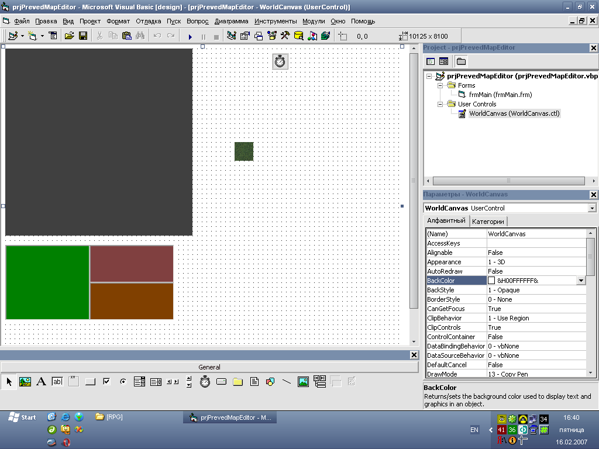

# Map Editor

This is my latest author project in Visual Basic 6.0.

This is a continuation of the development of the [game engine](../../../2003/assets/game), which I did not finish before joining the army in 2003.

In this project, I solved many problems that were in the first version of the engine.

To solve the problem with my lack of drawing skills, I made it possible to replace resources.

I also tried creating my own graphics using CorelDRAW.

It was truly something amazing. But unfortunately, the project was not destined to survive to release.

Visual Basic 6.0 is hopelessly outdated. I completed the project and concentrated on .NET technology.

> [!WARNING]
> Author does NOT guarantee the functionality of the presented binary files.
> Author is NOT responsible for any damage that may occur when running or using the presented binary files.

**:floppy_disk: [Download Map Editor](MapEditor.zip)**

