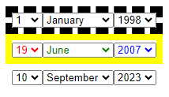

# DateSelectControl

This is a small component for ASP.NET WebForms projects that allows to select a date.

Parts of the date are presented as dropdown lists.

## Usage

```asp
<%@ Register Namespace="DateSelectControl" Assembly="DateSelectControl" TagPrefix="nas" %>
```

```asp
<nas:DateSelect runat="server" />
```

## Download

> [!WARNING]
> Author does NOT guarantee the functionality of the presented binary files.
> Author is NOT responsible for any damage that may occur when running or using the presented binary files.

**:floppy_disk: [Download DateSelectControl](DateSelectControl.zip)**


