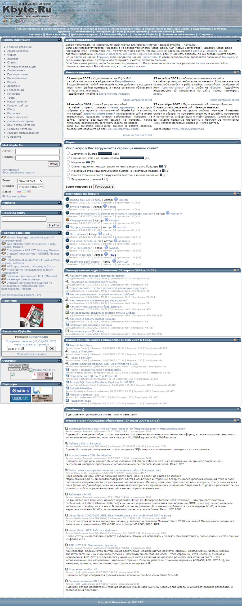
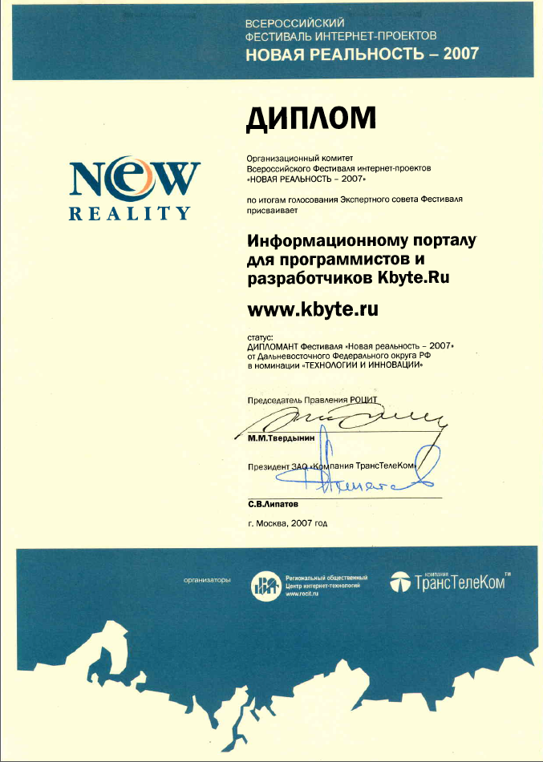

# Kbyte.Ru

[Kbyte.Ru](../../2006/assets/kbyte.md) v4.0 was presented in July 2007.

The new version had multilingual support and expanded interface customization options.

The project was created using ASP.NET WebForms technology with SQL Server DBMS.
The source code was written in Visual Basic .NET.

**:earth_africa: [Open in WebArchive](http://web.archive.org/web/20071230180149/http://kbyte.ru/)**

