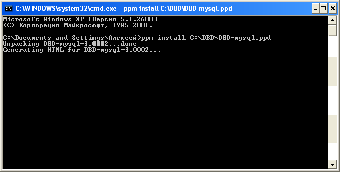
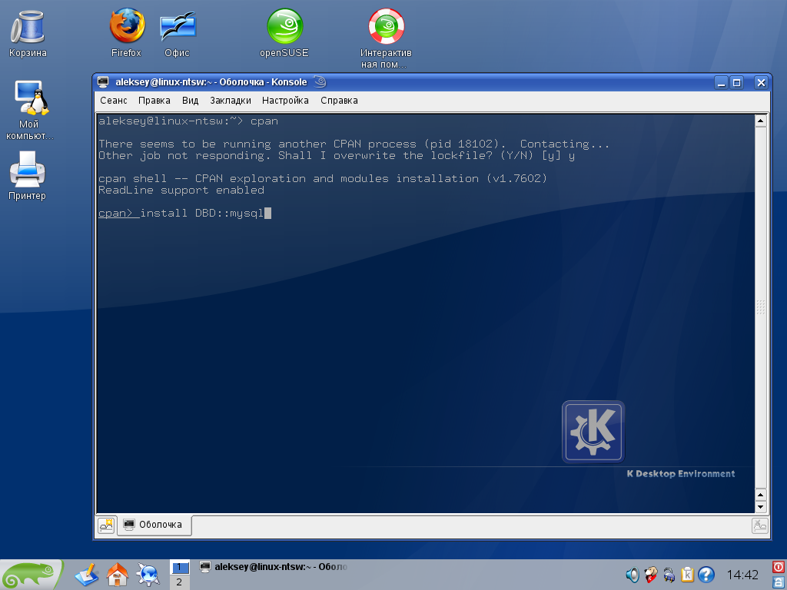
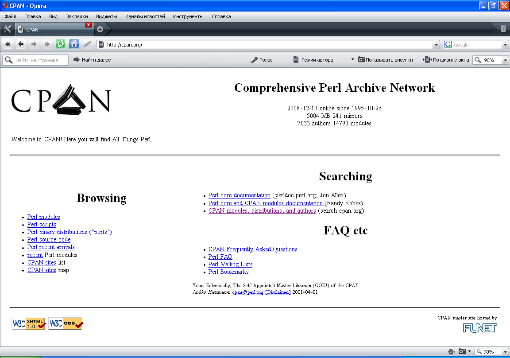
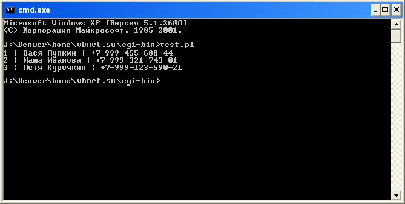

# Работа с базами данных MySql в Perl

> Системы управления базами данных (СУБД) – это мощный костяк современного Интернета.
> Без баз данных невозможно представить существование поисковых систем, форумов и блогов.
> СУБД предоставляют удобные средства для работы с данными, а языки программирования, такие как **Perl**, позволяют легко использовать базы данных при разработке интернет-сайтов.

Сложно представить серьезный сайт, не использующий базы данных.

Оно и понятно, ведь системы управления базами данных предоставляют гибкие возможности для работы с информацией.

Благодаря структурированной организации хранения данных, доступ к ним занимает считанные миллисекунды, при этом, нагрузка на сервер незначительная.

Использование баз данных упрощает поиск информации, обеспечивает её надежную сохранность и безопасность.

Существует множество различных СУБД, каждая из которых имеет свои уникальные особенности.

Наиболее популярные СУБД в Web-программировании: **MySql**, **PostgreSQL**, **Oracle**, **MS Access**, **MS SQL Server**.

Выбор той или иной СУБД зависит от конкретных задач и технических ресурсов, необходимых для их реализации.

Работать с базами данных можно в любом современном языке программирования.

Многие хостинг-провайдеры предлагают использовать для сайтов свободную СУБД - **MySql**.

Как правило, для работы с **MySql** чаще всего используются языки программирования **Perl**, **PHP**, **Python**, **Java**, **Ruby**.

Популярность этих технологий в первую очередь обусловлена доступностью, малыми финансовыми и техническими затратами, в совокупности с простотой и гибкостью.

В данной статье будет рассмотрено использование СУБД **MySql** на языке программирования **Perl**.

> [!NOTE]
> Предполагается, что читатель имеет базовые знания **Perl**.

## Установка необходимых компонентов

Для работы с **MySql** в **Perl** должен быть установлен модуль `DBD-mysql`.

На хостинге, как правило, все необходимые компоненты уже установлены.

Если вас не интересует установка данного модуля на локальную машину, пропустите этот раздел.

Вариантов установки новых модулей в **Perl** несколько.

Для пользователей **Windows**, наиболее простым способом установки нового модуля будет использование **Perl Package Manager**, который входит в состав дистрибутива **ActivePerl**.

Модуль `DBD-mysql` можно скачать с сайта http://ppm.activestate.com/PPMPackages/zips/8xx-builds-only/Windows/DBD-mysql-3.0002.zip.

Для установки модуля, его необходимо разархивировать, запустить командную строку (меню **Пуск** -> **Выполнить** -> **cmd**) и написать следующее:

```
ppm install C:\DBD\DBD-mysql.ppd
```

Где `C:\DBD\` – путь к разархивированному модулю.



Для пользователей *nix-систем можно использовать установку через **CPAN** (**Comprehensive Perl Archive Network**), для этого необходимо запустить консоль и написать:

```
cpan
cpan> install DBD::mysql
```

После чего **CPAN** загрузит необходимые компоненты с сервера и установит их.



Также можно скачать модуль самостоятельно с сайта **CPAN** (http://cpan.org): http://search.cpan.org/CPAN/authors/id/C/CA/CAPTTOFU/DBD-mysql-4.010.tar.gz и установить его вручную.

Для ручной установки, скаченный модуль необходимо разархивировать в любую директорию, затем сделать эту директорию рабочей (команда `cd`) и выполнить команды:

```
perl Makefile.PL
make
make test
make install
```

Собственно, все эти действия можно проделать и в **Windows**, также как и использовать установку через **Perl Package Manager** в *nix-системах, однако, есть вероятность столкнуться с некоторыми трудностями, которые могут стать для кого-то непреодолимыми.



## Работа с данными средствами Perl

Доступ к данным можно осуществлять через интерфейс **DBD/DBI** - **DataBase Dependent/DataBase Independent** (Зависимый/Независимый от типа СУБД интерфейс доступа к данным).

Собственно, о зависимом (**DBD**) элементе этого интерфейса речь шла в предыдущей части статьи.

Следует отметить, что использование интерфейсов **DBD/DBI** отнюдь неединственный способ работы с данными, существуют и другие модули для этих целей, которые можно найти на сайте search.cpan.org.

Для использования **DBI**, его необходимо подключить к скрипту, используя директиву `use`:

```perl
use DBI;
```

Подключиться к базе данных, можно при помощи метода `connect`, который принимает три параметра: источник данных, логин и пароль, и, в случае успешного подключения, возвращает указатель на базу данных:

```perl
$dbh = DBI->connect("DBI:mysql:MyTestDB:localhost", "MyLogin", "MyPassword");
```

`MyTestDB` – имя базы данных, к которой нужно подключиться. 
`Localhost` – адрес сервера, обычно это `localhost`. Также можно указать порт, через двоеточие, например: `localhost:3306`.

Для отключения от базы данных, существует метод `disconnect`:

```perl
$dbh->disconnect;
```

Для выполнения SQL-запрос, можно использовать связку методов `prepare` и `execute`.

Метод `prepare` подготавливает запрос к выполнению и возвращает указатель на запрос.
Метод `execute` выполняет указанный запрос, и возвращает количество измененных строк:

```perl
$sth = $dbh->prepare("SELECT * FROM MyTestTable");
$rc = $sth->execute;
```

Также, для выполнения запроса, можно использовать метод `do`, который совмещает в себе методы `prepare` и `execute`:

```perl
$rc = $dbh->do("SELECT * FROM MyTestTable");
```

Для вывода данных **DBI** имеет четыре метода: `fetchrow_array`, `fetchrow_arrayref`, `fetchrow_hashref` и `fetchall_arrayref`.

Метод `fetchrow_array` возвращает следующую строку из результата запроса в виде массива.
Метод `fetchrow_arrayref`, также возвращает следующую строку из результата запроса, но уже в виде указателя на массив.
Метод `fetchrow_hashref` возвращает указатель на ассоциативный массив (коллекцию).
Метод `fetchall_arrayref` возвращает указатель на массив, содержащий все данные из результата выполнения запроса.

Вывод данных производится циклом.

Например, в следующем примере выводятся данные построчно из первого поля запроса:

```perl
while ($ref = $sth->fetchrow_arrayref)
{
  print "$$ref[0]\n"; 
}
```

По завершению работы, необходимо освободить системные ресурсы и вызвать метод `finish` указателя на запрос:

```perl
$sth->finish;
```

Как видите, ничего сложно в этом нет. 
Нижеследующий пример создает таблицу phone_book в базе `MyTestDB`, заполняет эту таблицу данными и затем выводит их:

```perl
#!/usr/bin/perl -w
# подключаем интерфейс для работы с данными
use DBI;

# параметры соединения с MySql
$host = "localhost";   # адрес  
$port = 3306;          # порт
$user = "root";        # логин
$pass = "123456";      # пароль
$db   = "MyTestDB"; # база

# открываем соединение
$dbh = DBI->connect("DBI:mysql:$db:$host:$port", $user, $pass) 
or die "Error connection";

# создаем таблицу phone_book
$dbh->do("
  CREATE TABLE `phone_book` 
  (`id` bigint(20) NOT NULL auto_increment, 
  `name` varchar(50) NOT NULL,
  `phone` varchar(25) NOT NULL,
  PRIMARY KEY  (`id`)) 
  ENGINE=MyISAM AUTO_INCREMENT=0 DEFAULT CHARSET=utf8 AUTO_INCREMENT=0;");

# добавляем данные в эту таблицу
$dbh->do("INSERT INTO `phone_book` VALUES (1, 'Вася Пупкин', '+7-999-455-688-44')");
$dbh->do("INSERT INTO `phone_book` VALUES (2, 'Маша Иванова', '+7-999-321-743-01')");
$dbh->do("INSERT INTO `phone_book` VALUES (3, 'Петя Курочкин', '+7-999-123-590-21')");

# получаем добавленные данные
$sth = $dbh->prepare("SELECT * FROM phone_book"); 
$sth->execute;

# листаем полученные данные и выводим
while ($ref = $sth->fetchrow_arrayref)
{
  print "$$ref[0] | $$ref[1] | $$ref[2]\n";
} 

$sth->finish;      # освобождаем ресурсы
$dbh->disconnect;  # закрываем соединение
```



## Послесловие

Интерфейс **DBD/DBI** позволяет использовать одинаковый код для работы с различными типами СУБД.

Благодаря этому, в **Perl** можно легко работать с любыми базами данных, а также легко переносить данные из одной СУБД в другую, при этом, практически не изменяя код.

Исключение составляют SQL-запросы, так как в разных СУБД используются разные спецификации языка структурированных запросов (**SQL**).

Конечно, в рамках данной статьи рассмотрены не все методы **DBI**, но этого вполне достаточно для решения повседневных задач.

---
Алексей Немиро  
2008-12-14  
kbyte.ru
