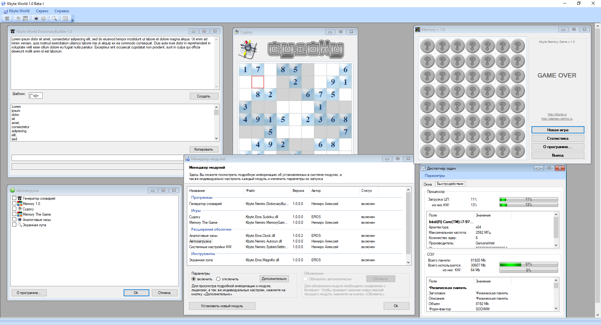

# Kbyte World - Collaborative of the Kbyte.Ru team

This is a companion application to the [Kbyte.Ru](kbyte.md) project.

Alternative name of the program in Russian - Лена Цтулховна.

Applications is a Windows application that provides a wrapper for all sorts of plugins and macros.

The application is written in Windows Forms C#.

This is a joint project of the Kbyte.Ru team.

We have developed seven plugins and five macros:

* Clock - analog clock
* Magnific - magnifying glass
* Autorun - automatic launch of plugins
* DictionaryBuilder - program for creating dictionaries from text
* SystemSettings - settings module
* Base64 - Base64 converter
* OpenenForms - technical macro that allows to view the insides of program elements
* Scaner - Network Port Scanner
* WindowCaptionClock - macro displays the system time in the program title
* MemoryGame - memory game, reincarnation of [Balls](../../2002/aasets/balls.md)
* Sudoku - casual game
* Tetris - casual game

> [!WARNING]
> Author does NOT guarantee the functionality of the presented binary files.
> Author is NOT responsible for any damage that may occur when running or using the presented binary files.

**:floppy_disk: [Download Kbyte World v1.0-beta](kw-1x-beta-full.zip)**

This is truly world!

