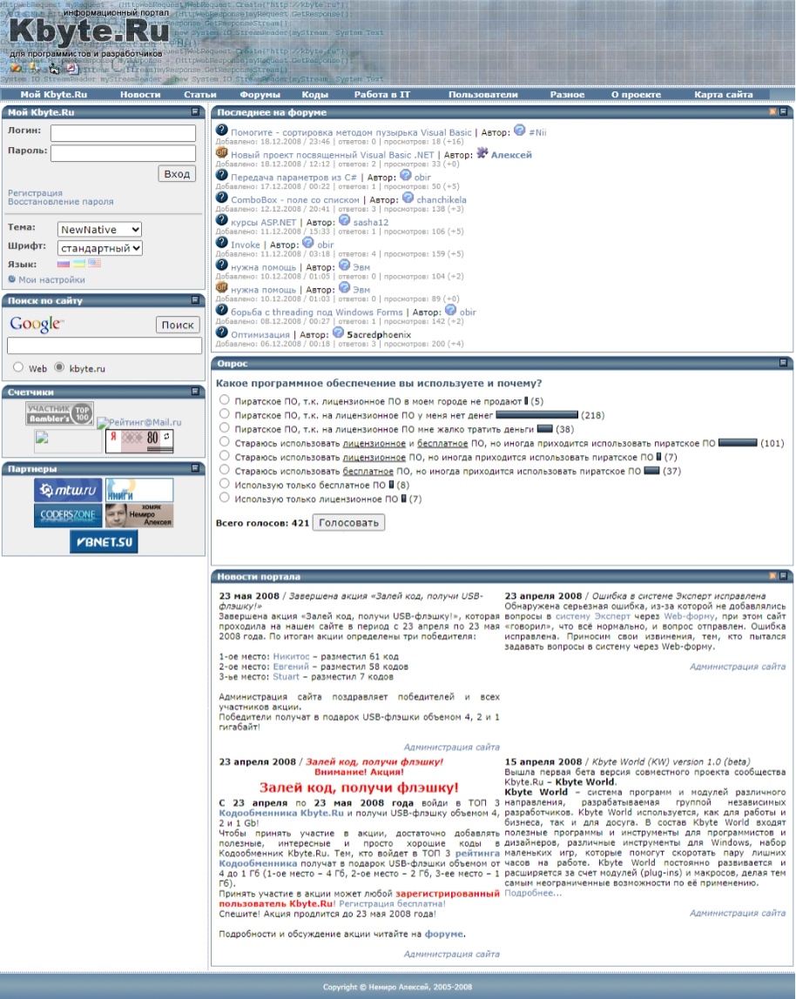
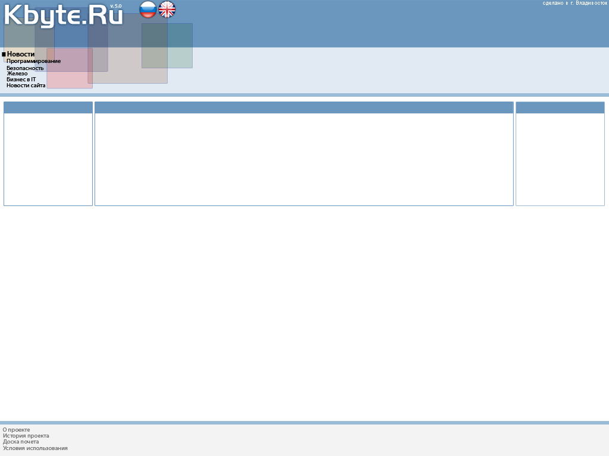

# Kbyte.Ru

In 2008, version 4.5 of the [Kbyte.Ru](../../2006/assets/kbyte.md) project was released.

This update showed that the project has reached a dead end and there is no longer any point in developing it in this form.

By the end of the year, I defined the concept for the development of the project in five basic areas: information, programming, business, communications, and humans.
But it was just an idea.

**:earth_africa: [Open in WebArchive](https://web.archive.org/web/20081219044655/http://kbyte.ru)**

*Kbyte.Ru v4.5*

*Concept*
