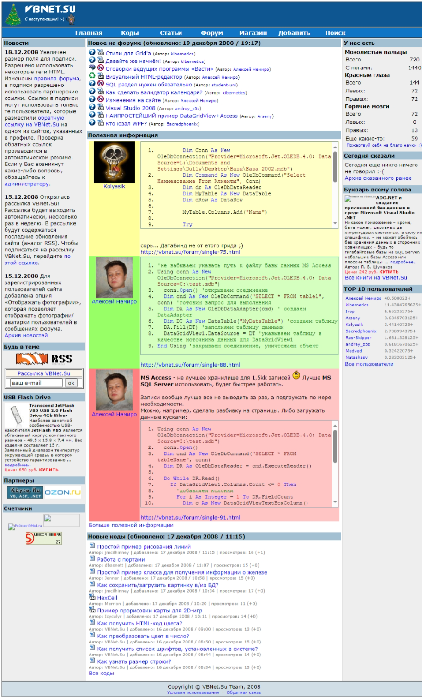

# VBNet.Su

This is a web project dedicated to programming in Visual Basic .NET.

The project was written in PHP and MySql DBMS.

Registration of new users on the project was limited.

By the end of 2008, about a hundred users were registered on the project.

**:earth_africa: [Open in WebArchive](http://web.archive.org/web/20081223041652/http://vbnet.su/)**

