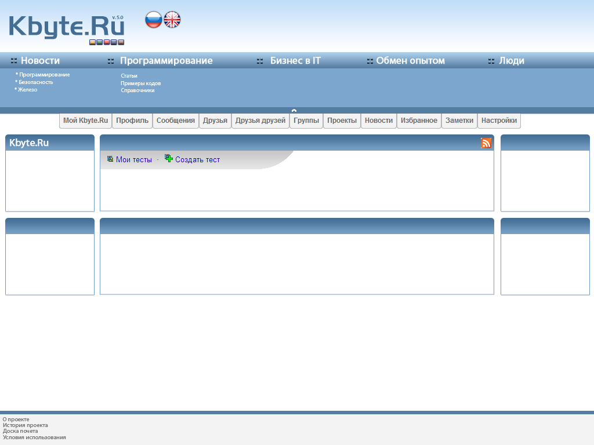

# Kbyte.Ru

In 2009, I began developing the fifth version of the [Kbyte.Ru](../../2006/assets/kbyte.md) project.

I started developing the project using a preview version of the new ASP.NET MVC framework.
With the release of new versions of ASP.NET MVC, I updated the project.

I used Visual Basic .NET as the programming language because this language was the most comfortable for the project community and I expected that someday someone would join the development of the project.

As in previous versions, I used the SQL Server DBMS.

As planned, the project should become, de facto, a social network.
It was a very large and complex project. Development was slow.

