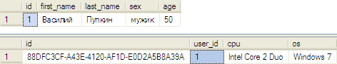
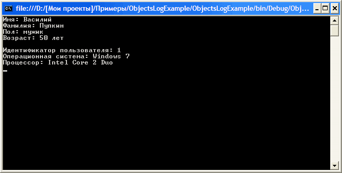
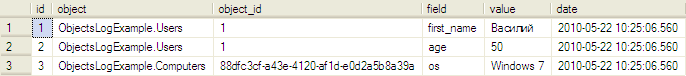

# Ведение журнала изменений объектов в .NET Framework

В процессе разработки какой-либо системы, может потребоваться вести журнал изменений пользовательских объектов (классов).

Пользовательский объект может представлять собой, например, учетную запись пользователя, электронный заказ, либо иную запись или комплекс записей в базе данных или файле.

В зависимости от реализации программного кода, эта задача может превратиться в рутину.

В данной статье будет рассмотрено создание универсального класса для работы с СУБД **MS SQL Server** с интегрированной возможностью ведения журнала изменений данных, с использованием языка программирования **Visual Basic .NET**.

## Задача

В базе данных **MS SQL Server** есть таблицы `users` и `computers`.

Таблица `users` предназначена для хранения данных о пользователях, и содержит следующие поля:

* `id` – уникальный идентификатор пользователя (ключевое поле, типа `Int32`)
* `first_name` – имя пользователя
* `last_name` – фамилия пользователя
* `sex` – пол пользователя
* `age` – возраст пользователя

Таблица `computers` предназначена для хранения некой информации о компьютерах пользователей и содержит следующие поля:

* `id` – уникальный идентификатор записи (ключевое поле, типа `Guid`)
* `user_id` – идентификатор пользователя
* `cpu` – тип процессора
* `os` – тип операционной системы

Необходимо отслеживать изменения полей таблиц `users` и `computers`, и записывать их в таблицу `log`.

В соответствии с этим, таблица `log`, как минимум, должна содержать следующие поля:

* `id` – уникальный идентификатор записи журнала (ключевое поле)
* `object` – тип объекта
* `object_id` – идентификатор объекта (типа `String`)
* `field` – имя свойства объекта
* `value` – измененное значение
* `date` – дата события

## Проблемы

Все таблицы у нас, за исключением таблицы `log`, будут иметь объектное представление.
Другими словами, для каждой таблицы будет создан отдельный класс, воплощающий в себе таблицу, а поля таблицы будут свойствами этого класса.

К чему такие сложности? Если проект большой и хорошо продуман, то подобной подход поможет упростить процесс разработки и решить поставленную задачу с минимальными временными затратами.
В тоже время, если работа ведется в стиле импровизации, то использование этого метода может усложнить достижение конечной цели, особенно, если создание таких объектов производится вручную.
Хотя «усложнить» – это относительно, описанный в данной статье подход позволит полностью отделить объектное представление данных от, непосредственно, взаимодействия с базой данных.
Так что, если автоматизировать процесс создания классов для таблиц, то проблем вообще никаких не будет.

Каждый класс должен иметь методы для загрузки, сохранения и удаления строки данных из базы данных прообразом которой он является.

Поскольку у нас две таблицы (`users` и `computers`), а в перспективе их может быть десятки, а то и сотни, то правильней будет сделать один универсальный класс.
Этот класс должен содержать необходимые методы взаимодействия с базой данных, и от него, в свою очередь, будут наследоваться классы таблиц.
Класс должен быть полностью самодостаточным, т.е. чтобы не пришлось постоянно писать отдельный код для методов работы с БД у каждого наследника (класса, который наследуется от основного).
Для реализации этого, придется определять, какие свойства есть у текущего класса и по ним формировать необходимые SQL-запросы.
Благо механизм **.NET Reflection** позволяет это сделать без особых проблем.

Помимо этого, при сохранении класса в базу данных, необходимо отслеживать сделанные изменения.
Это можно осуществить непосредственно перед сохранением данных, поскольку на этот момент информация в БД находится в том виде, в котором была после загрузки в объект.
Однако для этого потребуется делать лишний запрос к базе данных, а это не очень хорошо и может негативно отразиться на производительности.
Поэтому правильней будет при загрузке объекта сохранять в память оригинальные данные.
Хранить данные проще всего в коллекции вида ключ-значение (`Dictionary`).

Также следует учесть, что может потребоваться отслеживать изменения только определенных полей, а не всех подряд.
Более того, нужно принять во внимание, что некоторые свойства классов таблиц могут вообще не иметь никакого отношения к базе данных.

Чтобы помечать, какие свойства классов нужны для БД, а какие – нет, мы будем использовать атрибуты.
Для большей гибкости, атрибуты также будут устанавливаться и на классы таблиц.

## Реализация

В этой статье, все будет делаться в виде консольного приложения, хотя принципиального значения это не имеет, поскольку описанные методы можно одинаково использовать как в **Windows**, так и в **Web** приложениях.

Для работы нам потребуется база данных, и чтобы не подымать этот вопрос в дальнейшем, необходимо прописать строку соединения с БД.

В консольном приложении, для хранения строки соединения, в основном модуле программы можно создать глобальную переменную, назовем её `_ConnectionString` (листинг 1).

**Листинг 1. Строка соединения с базой данных**
```vb
Public _ConnectionString As String = "Data Source=BOOK-2008\MSSMLBIZ;Initial Catalog=test;Trusted_Connection=True;"
```

> [!NOTE]
> Примечание. Строку соединения можно прописать и в настройках программы и получать через `My.Settings`.
> В web-приложениях для этого лучше использовать секцию connectionStrings файла конфигурации – `web.config`.

Теперь сделаем класс для записи журнала изменений в таблицу `log`.

Класс будет довольно простым, назовем его, по подобию имени таблицы, `Log`.

Фактически, класс должен заносить в таблицу `log` изменение каждого свойства.
Т.е. предполагается, что будут производиться запросы к БД равные количеству измененных свойств объекта.
Однако это может негативно отразиться на производительности.
Поэтому лучше формировать в памяти запрос на добавление данных в журнал и затем выполнять его по требованию, используя всего одно обращение к базе данных (листинг 2).

**Листинг 2. Класс Log**
```vb
Imports System.Data.SqlClient

Public Class Log

  Private _Cmd As New SqlCommand()

  Private _ObjectType As String = ""
  Private _ObjectId As String = ""
  Private _Counter As Integer = 0

  Public Sub New(ByVal objectType As String, ByVal objectId As String)
    _ObjectId = objectId
    _ObjectType = objectType
  End Sub

  Public Sub Add(ByVal field As String, ByVal value As String)
    If Not String.IsNullOrEmpty(_Cmd.CommandText) Then _Cmd.CommandText &= vbCrLf
    _Cmd.CommandText &= String.Format("INSERT INTO [log] ([object], [object_id], [field], [value], [date]) " & _
                        "VALUES (@obj, @obj_id, @field{0}, @value{0}, getDate());", _
                        _Counter)
    If Not _Cmd.Parameters.Contains("@obj") Then _Cmd.Parameters.Add("@obj", SqlDbType.VarChar).Value = _ObjectType
    If Not _Cmd.Parameters.Contains("@obj_id") Then _Cmd.Parameters.Add("@obj_id", SqlDbType.VarChar).Value = _ObjectId
    _Cmd.Parameters.Add(String.Format("@field{0}", _Counter), SqlDbType.VarChar).Value = field
    _Cmd.Parameters.Add(String.Format("@value{0}", _Counter), SqlDbType.VarChar).Value = value
    _Counter += 1
  End Sub

  Public Sub Flush()
    If String.IsNullOrEmpty(_Cmd.CommandText) Then Return
    Using myConn As New SqlConnection(_ConnectionString)
      myConn.Open()
      _Cmd.Connection = myConn
      _Cmd.ExecuteNonQuery()
    End Using
  End Sub

End Class
```

В классе `Log` у нас описан конструктор, который принимает имя логируемого объекта (`objectType`) и его идентификатор (`objectId`).
Идентификатор объекта имеет строкой тип, это связано с тем, что у нас в таблице `computers` используется идентификатор типа `Guid`, который в большей степени является строкой, нежели числом, а в таблице `users` применяется идентификатор числового типа.

Метод `Add` служит для добавления задания на запись изменений объекта в журнал событий.
Метод принимает имя измененного поля (`field`) и его старое значение (`value`).
Мы будем записывать только старые значения, поскольку новые значения записываются непосредственно в отслеживаемую таблицу.
При каждом вызове метода `Add` в `SqlCommand` добавляется новый запрос на запись данных в таблицу `log`.
Значения полей помещаются в коллекцию параметров (`Parameters`) экземпляра `SqlCommand`.
Чтобы как-то различать параметры, у нас есть суммирующий счетчик – `_Counter`, значение которого после каждого добавленного задания увеличивается на единицу.

Метод `Flush` выполняет сформированный запрос и заносит данные в таблицу `log`.

С классом `Log` мы разобрались, теперь создадим классы для таблиц `users` и `computers` (листинг 3).

Каждое поле таблиц должно иметь аналогичное свойство в соответствующем таблице классе.

**Листинг 3. Классы Users и Computers**
```vb
Public Class Users

  Private _id As Integer = 0
  Private _first_name As String = String.Empty
  Private _last_name As String = String.Empty
  Private _sex As String = String.Empty
  Private _age As Integer = 0

  Public Property id() As Integer
    Get
      Return _id
    End Get
    Set(ByVal value As Integer)
      _id = value
    End Set
  End Property

  Public Property first_name() As String
    Get
      Return _first_name
    End Get
    Set(ByVal value As String)
      _first_name = value
    End Set
  End Property

  Public Property last_name() As String
    Get
      Return _last_name
    End Get
    Set(ByVal value As String)
      _last_name = value
    End Set
  End Property

  Public Property sex() As String
    Get
      Return _sex
    End Get
    Set(ByVal value As String)
      _sex = value
    End Set
  End Property

  Public Property age() As Integer
    Get
      Return _age
    End Get
    Set(ByVal value As Integer)
      _age = value
    End Set
  End Property

End Class
```
```vb
Public Class Computers

  Private _id As Guid = Guid.Empty
  Private _user_id As Integer = 0
  Private _cpu As String = String.Empty
  Private _os As String = String.Empty

  Public Property id() As Guid
    Get
      Return _id
    End Get
    Set(ByVal value As Guid)
      _id = value
    End Set
  End Property

  Public Property user_id() As Integer
    Get
      Return _user_id
    End Get
    Set(ByVal value As Integer)
      _user_id = value
    End Set
  End Property

  Public Property cpu() As String
    Get
      Return _cpu
    End Get
    Set(ByVal value As String)
      _cpu = value
    End Set
  End Property

  Public Property os() As String
    Get
      Return _os
    End Get
    Set(ByVal value As String)
      _os = value
    End Set
  End Property

End Class
```

Далее необходимо сделать основной класс взаимодействия с базой данных. Назовем его `DataObject`.

Этот класс должен содержать методы `Load`, `Save` и `Delete` для загрузки, сохранения и удаления данных (листинг 4).

От него в последующем будут наследоваться классы таблиц – `users` и `computers`.

**Листинг 4. Класс DataObject**
```vb
Imports System.Reflection
Imports System.Data.SqlClient

Public Class DataObject

  Public Sub Load()
  End Sub

  Public Sub Save()
  End Sub

  Public Sub Delete()
  End Sub

End Class
```

В идеале, в методах `Load`, `Save` и `Delete` нужно написать универсальный код, который будет выполнять некие действия в базе данных.

Но мы ведь не знаем, какой класс будет наследоваться от `DataObject` и какие у него буду свойства?

На самом деле знаем, и мы можем запросто получить эти свойства и их значения при помощи **.NET Reflection**.

Но здесь возникает еще одна проблема, ведь любой класс таблицы может содержать дополнительные свойства, никак не связанные с самой таблицей и базой данных в целом, как их определять?

Вот тут к нам в помощь приходят атрибуты.

Атрибуты – это обычные классы наследованные от класса `System.Attribute`, содержащие определенные параметры.

Нам требуется сделать два новых атрибута, один – для классов таблиц, второй – для свойств.

Атрибут для классов таблиц должен содержать имя таблицы, это необходимо для формирования SQL-запросов, т.е. в принципе класс таблицы может иметь название отличное от имени таблицы, которую он представляет.

Для этого атрибут, назовем его `DataTableAttribute`, должен иметь соответствующее свойство - `TableName`, которое будет устанавливаться в конструкторе (листинг 5).

**Листинг 5. Класс DataTableAttribute**
```vb
Public Class DataTableAttribute
  Inherits Attribute

  Private _TableName As String = String.Empty

  Public ReadOnly Property TableName As String
    Get
      Return _TableName
    End Get
  End Property

  Public Sub New(ByVal tableName As String)
    _TableName = tableName
  End Sub

End Class
```

Аналогично сделаем атрибут для свойств классов таблиц, назовем его `DataColumnAttribute`, который будет содержать имя поля в таблице - свойство `ColumnName`.

Но помимо этого, нужно добавить три дополнительных параметра (листинг 6):

* `SqlDataType` – будет содержать информацию о SQL-типе данных поля
* `PrimaryKey` – будет указывать на то, что свойство является ключевым, чтобы иметь возможность по этому полю работать с данными в базе данных
* `Log` – будет указывать на то, что следует следить за изменением значения конкретного свойства

**Листинг 6. Класс DataColumnAttribute**
```vb
Public Class DataColumnAttribute
  Inherits Attribute

  Private _ColumnName As String = String.Empty
  Private _Log As Boolean = False
  Private _PrimaryKey As Boolean = False
  Private _SqlDataType As SqlDbType = SqlDbType.Variant

  Public ReadOnly Property ColumnName As String
    Get
      Return _ColumnName
    End Get
  End Property

  Public ReadOnly Property SqlDataType As SqlDbType
    Get
      Return _SqlDataType
    End Get
  End Property

  Public ReadOnly Property PrimaryKey As Boolean
    Get
      Return _PrimaryKey
    End Get
  End Property

  Public ReadOnly Property Log As Boolean
    Get
      Return _Log
    End Get
  End Property

  Public Sub New(ByVal columnName As String, ByVal sqlDataType As SqlDbType, ByVal primaryKey As Boolean, ByVal log As Boolean)
    _ColumnName = columnName
    _SqlDataType = sqlDataType
    _Log = log
    _PrimaryKey = primaryKey
  End Sub

End Class
```

Атрибуты могут содержать множество различных параметров, функций, методов и событий, и вы можете их расширять по своему усмотрению.

Теперь можно приступит к написанию универсальных методов `Load`, `Save` и `Delete` в классе `DataObject`.

Начнем с метода `Load`, который будет загружать информацию из базы данных в объект.

При помощи функции `GetType()` мы можем получить доступ к текущему объекту. Т.е. если текущий объект `Users`, который наследован от `DataObject`, мы из класса `DataObject` можем получить любые свойства, методы и функции класса `Users`.

Первым делом, нам нужно определить имя таблицы и ключевое поле таблицы.

Имя таблицы находится в атрибуте `DataTableAttribute`, именно этот атрибут нам и нужно найти в текущем объекте.

Поскольку атрибуты у нас «самодельные», то искать их нужно через функцию `GetCustomAttributes`, которая, в случае успеха, возвращает массив найденных атрибутов.

У нас предполагается наличие не более одного атрибута, т.е. первый найденный атрибут – это то, что нам нужно.

То же самое необходимо проделать со свойствами.

Получить коллекцию свойств текущего объекта можно через функцию `GetProperties`.

Нас интересуют только свойства с атрибутом `DataColumnAttribute`, иные свойства, у которых данного атрибута нет, считаются никак несвязанными с базой данных.

Для начала нужно найти ключевое поле, которое имеет параметр `PrimaryKey = True`.

Лучше всего, и правильней, все это реализовать в конструкторе класса `DataObject`, и занести данные в память, чтобы не выполнять по несколько раз одни и те же операции, поскольку имя таблицы и ключевое поле нам будут необходимы в каждом случае работы с данными (листинг 7).

**Листинг 7. Конструктор класса DataObject**
```vb
_TableName = CType(Me.GetType().GetCustomAttributes(GetType(DataTableAttribute), False)(0), DataTableAttribute).TableName

For Each p As PropertyInfo In Me.GetType().GetProperties()
  Dim atr As DataColumnAttribute = GetColumnAttribute(p)
  If atr IsNot Nothing AndAlso atr.PrimaryKey Then
    _PrimaryProperty = p
    Exit For
  End If
Next
```

Также нам довольно часто придется производить поиск атрибута `DataColumnAttribute` в свойствах класса, поэтому целесообразно сделать для этого отдельную функцию (листинг 8).

**Листинг 8. Функция GetColumnAttribute**
```vb
Private Function GetColumnAttribute(ByVal p As PropertyInfo) As DataColumnAttribute
  Dim atr() As Object = p.GetCustomAttributes(GetType(DataColumnAttribute), False)
  If atr Is Nothing OrElse atr.Length <= 0 Then Return Nothing
  Return CType(atr(0), DataColumnAttribute)
End Function
```

Для хранения оригинальных данных, загруженных из базы, будет использоваться переменная `_OriginalValues` (листинг 7).

Зная имя таблицы (`_TableName`), имя и значение ключевого поля (`_PrimaryProperty`), можно сформировать запрос на выборку строки данных из БД и заполнить ими текущий объект (листинг 9).

**Листинг 9. Реализация метода Load класса DataObject**
```vb
Public Sub Load()
  Using myConn As New SqlConnection(_ConnectionString)
    myConn.Open()

    'получаем атрибуты PrimaryKey
    Dim pk As DataColumnAttribute = GetColumnAttribute(_PrimaryProperty)

    'формируем SQL-запрос на получение данных
    Dim myCmd As New SqlCommand(String.Format("SELECT * FROM [{0}] WHERE [{1}] = @{1}", _TableName, pk.ColumnName), myConn)
    myCmd.Parameters.Add("@" & pk.ColumnName, pk.SqlDataType).Value = _PrimaryProperty.GetValue(Me, Nothing)

    'выполняем запрос
    Dim DR As SqlDataReader = myCmd.ExecuteReader()

    If Not DR.Read Then
      If pk.SqlDataType = SqlDbType.UniqueIdentifier Then
        _PrimaryProperty.SetValue(Me, Guid.Empty, Nothing)
      Else
        _PrimaryProperty.SetValue(Me, 0, Nothing)
      End If

      Return ' Throw New Exception("Ошибка. Данные не найдены.")
    End If

    'листаем все свойства объекта
    For Each p As PropertyInfo In Me.GetType().GetProperties()
      Dim atr As DataColumnAttribute = GetColumnAttribute(p)

      If atr IsNot Nothing Then
        'передаем данные в свойства текущего объекта
        p.SetValue(Me, DR.Item(atr.ColumnName), Nothing)
        'запоминаем оригинальное значение в коллекцию
        _OriginalValues.Add(p.Name, DR.Item(atr.ColumnName))
      End If
    Next
  End Using
End Sub
```

В блоке `Using` создается и открывается новое соединение с базой данных **SQL Server**. 

Затем в переменную `pk`, при помощи функции `GetColumnAttribute` (листинг 8), переносится атрибут ключевого свойства класса, который содержит имя ключевого поля в текущей таблице (`_TableName`).

Значение этого поля берется непосредственно из копии ключевого свойства `_PrimaryProperty` (которое было получено в листинге 7), при помощи метода `GetValue`.

Далее формируется SQL-запрос на выборку данных. Открывается `DataRead` и циклом данные переносятся в свойства экземпляра текущего объекта, при условии, что свойство имеет атрибут `DataColumnAttribute`.

Также копия данных заносится в коллекцию `_OriginalValues`, чтобы в последующем иметь возможность отслеживать их изменения.

Теперь, аналогично можно реализовать метод `Save` (листинг 10), который будет производить запись объекта в базу данных, а также делать запись в журнал изменений данных.

**Листинг 10. Реализация метода Save класса DataObject**
```vb
Public Sub Save()
  Using myConn As New SqlConnection(_ConnectionString)
    myConn.Open()

    'получаем атрибуты PrimaryKey
    Dim pk As Object = _PrimaryProperty.GetValue(Me, Nothing)
    Dim pkAtr As DataColumnAttribute = GetColumnAttribute(_PrimaryProperty)

    'определяем, это новые данные и их нужно создать,
    'или данные уже есть в БД и нужно сохранить изменения
    Dim isNewData As Boolean = False
    If pkAtr.SqlDataType = SqlDbType.UniqueIdentifier Then
      'PrimaryKey - это Guid,
      'смотрим, если его нет, или он равен Empry, значит это новые данные
      isNewData = pk Is Nothing OrElse CType(pk, Guid) = Guid.Empty
    Else
      'скорей всего PrimaryKey - числовой счетчик, проверяем на ноль
      'Если ноль, то это новые данные, если больше нуля - то данные уже есть в БД
      isNewData = pk <= 0
      'вообще, PrimaryKey может быть и строковым и датой, это исключением можно и нужно учесть,
      'однако в данном примере я этого делать не буду, т.к. такие PrimeryKey бывают редко
    End If

    'формируем SQL-запрос на получение данных
    Dim myCmd As New SqlCommand() With {.Connection = myConn}
    Dim parUpdate As String = "", parInsertFields As String = "", parInsertValues As String = ""

    'если это не новые данные, то инициализируем журнал
    Dim myLog As Log = Nothing
    If Not isNewData Then myLog = New Log(Me.GetType().ToString(), pk.ToString())

    'перебираем свойства и формируем данные для SQL-запроса, а также для журнала отчета
    For Each p As PropertyInfo In Me.GetType().GetProperties()
      Dim atr As DataColumnAttribute = GetColumnAttribute(p)
      If atr IsNot Nothing Then
        If Not isNewData Then
          'нужно сохранить данные
          If Not atr.PrimaryKey Then
            If Not String.IsNullOrEmpty(parUpdate) Then parUpdate &= ", "
            parUpdate &= String.Format("[{0}] = @{0}", atr.ColumnName)
          End If
          myCmd.Parameters.Add("@" & atr.ColumnName, atr.SqlDataType).Value = p.GetValue(Me, Nothing)
          'если свойство нужно записывать в журнал, и оно изменились
          If atr.Log AndAlso DataIsChanged(p) Then
            'добавляем задание на запись
            myLog.Add(p.Name, _OriginalValues(atr.ColumnName).ToString())
          End If
        Else
          'нужно добавить новые данные
          If Not atr.PrimaryKey Then
            'подразумевается, что PrimaryKey - это числовой счетчик, его указывать не нужно
            If Not String.IsNullOrEmpty(parInsertFields) Then parInsertFields &= ", "
            If Not String.IsNullOrEmpty(parInsertValues) Then parInsertValues &= ", "
            parInsertFields &= String.Format("[{0}]", atr.ColumnName)
            parInsertValues &= "@" & atr.ColumnName
            myCmd.Parameters.Add("@" & atr.ColumnName, atr.SqlDataType).Value = p.GetValue(Me, Nothing)
          ElseIf atr.PrimaryKey AndAlso atr.SqlDataType = SqlDbType.UniqueIdentifier Then
            'это PrimaryKey, но он имеет тип Guid
            'мы будем генерировать его на строне .NET (а не использовать SQL-функцию NEWID), 
            'чтобы знать, какой идентификатор был создан
            If Not String.IsNullOrEmpty(parInsertFields) Then parInsertFields &= ", "
            If Not String.IsNullOrEmpty(parInsertValues) Then parInsertValues &= ", "
            parInsertFields &= String.Format("[{0}]", atr.ColumnName)
            parInsertValues &= "@" & atr.ColumnName
            myCmd.Parameters.Add("@" & atr.ColumnName, atr.SqlDataType).Value = Guid.NewGuid()
          End If
        End If
      End If
    Next

    If isNewData Then
      'нужно добавить новые данные
      myCmd.CommandText = String.Format("INSERT INTO [{0}] ({1}) VALUES ({2});SELECT SCOPE_IDENTITY();", _TableName, parInsertFields, parInsertValues)
      'запоминаем новый идентификатор
      Dim newId As Object = Nothing
      If pkAtr.SqlDataType = SqlDbType.UniqueIdentifier Then
        myCmd.ExecuteNonQuery()
        newId = CType(myCmd.Parameters("@" & pkAtr.ColumnName).Value, Guid)
      ElseIf pkAtr.SqlDataType = SqlDbType.Int Then
        newId = CType(myCmd.ExecuteScalar(), Integer)
      ElseIf pkAtr.SqlDataType = SqlDbType.BigInt Then
        newId = CType(myCmd.ExecuteScalar(), Long)
        'список (ElseIf) можно продолжить :-)
      End If
      'передаем в свойство текущего объекта PrimeryKey новый идентификатор
      _PrimaryProperty.SetValue(Me, newId, Nothing)
    Else
      'нужно сохранить данные
      myCmd.CommandText = String.Format("UPDATE [{0}] SET {1} WHERE [{2}] = @{2}", _TableName, parUpdate, pkAtr.ColumnName)
      myCmd.ExecuteNonQuery()
      'запись данных в журнал
      myLog.Flush()
    End If
  End Using
End Sub
```

Здесь следует учесть, что данных может не быть в БД, тогда нужно будет их добавить.

Т.е. метод `Save` должен уметь, как сохранять данные, так и создавать новые при их отсутствии.

При этом, если вставляются новые данные, то запись в журнал делать ненужно.

Определить, что делать с данными можно по значению ключевого поля. Решение на этот счет нужно принимать в соответствии с типом данных ключевого поля.

Тип данных ключевого поля таблицы может быть абсолютно любым.

Однако чаще всего используется числовой тип, а также `uniqueidentifier` (`Guid`).

Если тип данных числовой, и свойство, соответствующее ключевому полю таблицы, имеет значение равное нулю, значит нужно создать (`INSERT`) новые данные в базе данных, в противном случае - сохранить (`UPDATE`) данные.

В случае с `Guid`, если значение `Nothing` или `Guid.Empty`, то данные нужно создать, в противном случае – сохранить.

Другие типы данных ключевых полей в рамках этой статьи не рассматриваются.

Поскольку запросы `INSERT` и `UPDATE` имеют разную структуру, для их формирования используются дополнительные переменные.

Для полей, у которых атрибут `DataColumnAttribute` имеет свойство `Log` равное `True` требуется фиксировать изменения и заносить их в журнал (таблица `log`), для этого у нас используется класс `Log`.

Проверка значений свойств производится при формировании SQL-запроса.

Для большей гибкость, проверять изменения лучше в отдельной функции - `DataIsChange` (листинг 11).

Запись изменений в журнал осуществляется методом `Flush` после проверки значений всех свойств.

Если в таблице создаются новые данные, в зависимости от типа данных ключевого поля, идентификатор данных передается в значение свойства, соответствующего ключевому полю (строки 78-86). Это позволит продолжить работу с созданной строкой данных из текущего экземпляра объекта. Следует отметить, что если ключевое поле имеет тип Guid, то значение для него формируется непосредственно в нашем приложении, а не на стороне SQL Server (строка 65), как это происходит с числовыми идентификаторами.

**Листинг 11. Функция DataIsChanged класса DataObject**
```vb
Private Function DataIsChanged(ByVal p As PropertyInfo) As Boolean
  'если в памяти нет значения для указанного свойства, возвращаем False - данные не менялись
  If Not _OriginalValues.ContainsKey(p.Name) Then Return False
  Dim v As Object = p.GetValue(Me, Nothing)
  'некоторые типы данных нельзя сравнивать оператором =, используем оператор Is - инвертно IsNot
  If v.GetType().BaseType() IsNot Nothing AndAlso v.GetType().BaseType() Is GetType(Array) Then Return v IsNot _OriginalValues(p.Name)
  If v.GetType() Is GetType(Guid) Then Return v IsNot _OriginalValues(p.Name)
  'остальные можно сранивать оператором =
  Return Not _OriginalValues(p.Name) = v
End Function
```

Далее можно сделать метод `Delete`, он у нас совсем простой (листинг 12).

**Листинг 12. Реализация метода Delete класса DataObject**
```vb
Public Sub Delete()
  Using myConn As New SqlConnection(_ConnectionString)
    myConn.Open()

    'получаем атрибуты PrimaryKey
    Dim pk As DataColumnAttribute = GetColumnAttribute(_PrimaryProperty)

    'формируем SQL-запрос
    Dim myCmd As New SqlCommand(String.Format("DELETE FROM [{0}] WHERE [{1}] = @{1}", _TableName, pk.ColumnName), myConn)
    myCmd.Parameters.Add("@" & pk.ColumnName, pk.SqlDataType).Value = _PrimaryProperty.GetValue(Me, Nothing)
    'выполняем запрос
    myCmd.ExecuteNonQuery()
  End Using
End Sub
```

Вот собственно и все.

Осталось наследовать классы таблиц `users` и `computers` от класса `DataObject` и прописать соответствующие атрибуты.

## Тестирование

Теперь можно проверить, как все это работает.

Сначала проверим создание новых данных в БД.

Для этого в программе нужно создать экземпляр класса соответствующего таблице, запись в которой требуется сделать (листинг 14).

**Листинг 13. Тестирование создания новых данных в таблицах users и computers**
```vb
Dim u As New Users()
u.first_name = "Василий"
u.last_name = "Пупкин"
u.sex = "мужик"
u.age = 50
u.Save()

Dim c As New Computer()
c.user_id = u.id
c.os = "Windows 7"
c.cpu = "Interl Core 2 Duo
c.Save()
```

После выполнения этого кода, в таблицах `users` и `computers` появятся новые данные (рисунок 1).

Обратите внимание, что в записи `computers` для поля `user_id` установлен идентификатор пользователя из таблицы `users`, который был получен и передан в объект после сохранения данных).



Далее проверим, как работает загрузка данных.

Для этого, аналогично, нужно создать экземпляр класса соответствующего таблице, данные из которой требуется получить, а также установить идентификатор данных в ключевое поле и вызвать метод `Load()`.

В моём случае, в таблице `users` есть запись с идентификатором (поле `id`) равным `1`, а в таблице `computers` - `88DFC3CF-A43E-4120-AF1D-E0D2A5B8A39A`, у вас эти значения могут отличаться.

Именно эти идентификаторы и нужно указывать, чтобы загрузить данные (листинг 14).

**Листинг 14. Загрузка и вывод данных из БД**
```vb
Sub Main()
  Dim u As New Users()
  u.id = 1
  u.Load()

  Console.WriteLine("Имя: {0}", u.first_name)
  Console.WriteLine("Фамилия: {0}", u.last_name)
  Console.WriteLine("Пол: {0}", u.sex)
  Console.WriteLine("Возраст: {0}", u.age)

  Dim c As New Computers()
  c.id = New Guid("88DFC3CF-A43E-4120-AF1D-E0D2A5B8A39A")
  c.Load()

  Console.WriteLine("Идентификатор пользователя: {0}", c.user_id)
  Console.WriteLine("Операционная система: {0}", c.os)
  Console.WriteLine("Процессор: {0}", c.cpu)

  Console.ReadKey()
End Sub
```

В результате выполнения этого кода в консоль будут выведены загруженные из таблиц данные (рисунок 2).



Теперь вернемся к основной теме статьи – ведение журнала изменений.

Для проверки этого, нужно загрузить данные, изменить их и сохранить (листинг 15).

**Листинг 15. Загрузка данных, изменение и сохранение изменений.**
```vb
Sub Main()
  Dim u As New Users()
  u.id = 1
  u.Load()

  u.first_name = "Федя"
  u.age = 30
  u.Save()

  Dim c As New Computers()
  c.id = New Guid("88DFC3CF-A43E-4120-AF1D-E0D2A5B8A39A")
  c.Load()

  c.os = "Ubuntu"
  c.cp = "Pentium 133"
  c.Save()
  Console.ReadKey()
End Sub
```

После выполнения этого кода, в таблице `log` появятся записи со старыми данными (рисунок 3).



Все работает, задача выполнена!

## Что еще можно сделать

Для удобства загрузки данных, можно в классах таблиц `users` и `computers` прописать конструктор, в котором принимать идентификатор и загружать данные по нему в текущий объект.

Можно связать классы `Users` и `Computers`.
Как вы помните, в таблице `computers` у нас есть поле `user_id`, которое содержит идентификатор пользователя в таблице `users`.
Благодаря объектной модели, в классе `Computers` у нас есть возможность сделать свойство `User`, которое будет содержать экземпляр пользователя.

А может так получиться, что один пользователь будет иметь более одной записи в таблице computers.
Тогда целесообразно сделать в классе `Users` коллекцию `Computers`, которая будет содержать все связанные с указанным пользователем компьютеры.
В общем, усложнять задачу можно бесконечно. Данные могут иметь довольно сложную структуру, но за счет объектной модели, в конечном счете, работать с ними будет достаточно просто

## Послесловие

Как видите, рутина была нейтрализована и теперь мы можем с минимальными временными затратами отслеживать изменения определенных данных.
Не имеет значение, сколько таблиц будет в проекте, ибо писать отдельный функционал для этого не требуется.
Классы таблиц являются своего рода скелетом. Если автоматизировать процесс создания классов для таблиц, то можно с большей пользой провести сэкономленное время.
За счет наследования, мы в любое время можем улучшить и дополнить функционал базового класса – `DataObject`, не трогая классы наследники (скелеты).

Что касается производительности, то большое количество типового кода, помимо увеличения размера программы и скорости его обработки и отладки, ни к чему хорошему не приведет.
Так что этот вопрос можно считать исчерпанным. Максимум функционала при минимуме кода – это, пожалуй, то к чему должен стремиться каждый программист.
Хотя и приведенные в статье примеры можно было бы еще значительно укоротить, правда, тогда они могут оказаться понятными не для всех.

[Скачать пример](assets/ObjectsLogExample.zip)

---
Алексей Немиро  
2010-05-22

Статья написана специально для проекта Kbyte.Ru.  
Полная, либо частичная перепечатка статьи запрещена.
