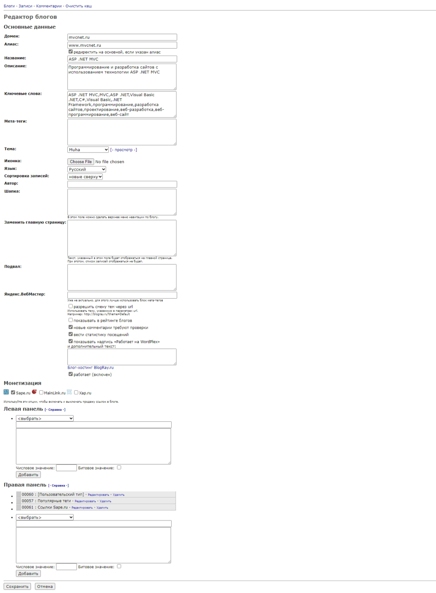

# BlogRay.ru

At the end of 2010, I released a blogging platform - BlogRay.ru.

The project was written in ASP.NET WebForms, Visual Basic .NET, and SQL Server.

First of all, I did this project for myself, to make it easier to create content projects and earn money from advertising and affiliate programs.

The platform allowed the user to customize the site layout, select a design theme, and display blocks.

It was possible to link external domains to sites.

I have created many websites using BlogRay.ru.

**:earth_africa: [Open in WebArchive](https://web.archive.org/web/20101120111551/blogray.ru)**

