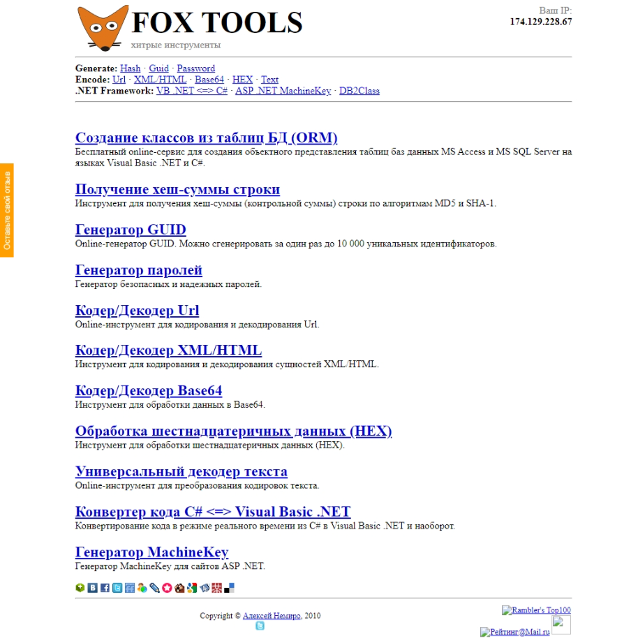

# FoxTools.ru

In the summer of 2010, the [Kbyte.Ru](kbyte.md) online tools section was moved to a separate project - FoxTools.ru.

To create FoxTools.ru I used ASP.NET WebForms, Visual Basic .NET, and SQL Server.

The peculiarity of the project was that it consisted of one page.
Each tool was a separate ASP.NET component (`.ascx`).
The list of tools was generated dynamically.

This approach allowed us to release the first version of the project very quickly.

I used the database only for statistics.

At the time of the project's release, the following tools were available to users:

* ORM files generator - my own implementation of creating classes from MS Access and SQL Server database tables in VB.NET and C#
* Hash calculator - MD5, SHA-1
* GUID generator
* Password generator
* Encoder/Decoder URL
* Encoder/Decoder HTML
* Encoder/Decoder Base64
* Encoder/Decoder HEX
* Universal text decoder - code page conversion
* Creating and reading QR codes
* Encoder/Decoder IDN
* C#/Visual Basic .NET code converter
* MachineKey generator

**:earth_africa: [Open in WebArchive](https://web.archive.org/web/20100916183202/foxtools.ru)**

