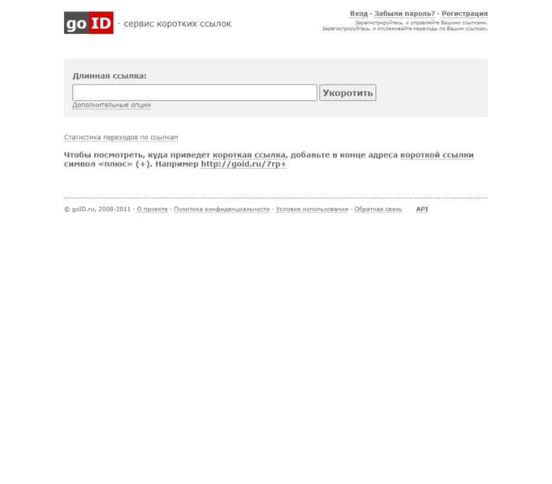

# goID.ru

In October 2010, I created a short link service - goID.ru.

The project was implemented using ASP.NET WebForms, Visual Basic .NET, and SQL Server.

This project appeared as part of [Kbyte.Ru v5.0](kbyte.md).

I needed a simple and unified way to manage external links on the Kbyte.Ru website.

Interaction between sites took place using ASP.NET Web Services and REST API.

Access to the API was free.

It was a very simple and non-resource-intensive project.

**:earth_africa: [Open in WebArchive](https://web.archive.org/web/20110322040934/goid.ru)**

