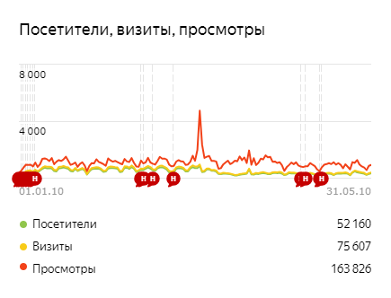
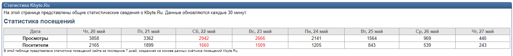
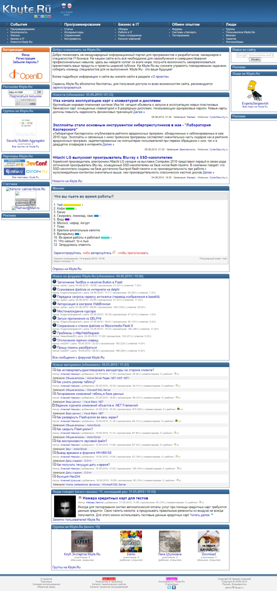

# Kbyte.Ru

In 2010 I released [Kbyte.Ru](../../2006/assets/kbyte.md) v5.0.

It was a completely new project, with a new concept and new architecture.

v5.0 of the project was implemented using ASP.NET MVC (WebPages), Visual Basic .NET, and SQL Server.
Some parts of the projects were implemented using C#.

Despite the fact that the project was actually completely rewritten from scratch, I completely preserved the legacy and did not break the functionality of the old links.

The new Kbyte.Ru included the following sections:

* News
* Programming: articles, sources, guides, tools
* Bussines: articles, employee search service, job search service, company directory
* Experience exchange: forum, Expert system, testing system
* Social: personality pages, groups, voting system, blogs, photo albums

It was a really big project and great work was done.

The social component of the project was the most difficult.

Each registered user of the project had the opportunity to create his own personal page, a virtual business card, private and public notes, articles, and source codes, create and join interest groups, create photo albums, look for work or employees, and create and participate in online testing.

The greatest difficulty was the news feed, which had to be individual for each user.

For Kbyte.Ru v5.0, I rented a virtual server (Hyper-V) based on Microsoft Windows 2003, with 1 GB of RAM.
I used SQL Server Express because a full-fledged SQL Server is too expensive, I would even say incredibly expensive, and unfathomable for a non-profit project.

Of course, the resources of such a server for a social network were not enough.

To solve the performance problem, I divided the project into many small parts.

At the web server level, these were separate websites. For example, there were several websites for presenting images and there were separate servers (websites ) for binary files.

At the DBMS level, these were separate databases for different purposes. There was a main database, a separate database for logs, a separate database for statistics, a separate database for user data, etc.

This distribution was designed to expand the number of servers in the future.

This division of the project into parts was designed to ensure that the number of servers could be increased in the future.

However, it also worked quite efficiently with a single server, despite the modest resources.

I have configured the pools so that less important parts of the project are shut down and rebooted when there are insufficient resources.
Unused pools were simply turned off before the first request. Also, some pools were responsible for the old data, others for the new one.

Thus, users could continue to work with the site, but sometimes, for example, not all images were loaded, or binary files were not accessed the first time.

On average, in the first half of 2010, the site was visited by 600-700 unique users daily.
At the time of v5.0 release, the site had just over 1500 registered users.

*Statistics from Yandex.Metrika*

In addition to external tools for tracking user activity (such as Yandex.Metrika, Google Analytics), I was interested in collecting data using my own tools.
But this required storing and processing an incredible amount of data!

*Internal statistics*

The server maintenance process has been automated. I made several console applications using C#.
For example, there was an application for creating backups, there were separate applications for optimizing indexes and compressing the database, etc.

An interesting fact is that Kbyte.Ru v5.0 put me in a hospital bed.
During this period, I periodically experienced back pain.
However, I was so focused on releasing a new version of the project that I simply ignored the pain.
At some point I found myself lying on the floor in the middle of my room. I couldn't move!
I had to ask for help. I lay with painkillers for two weeks and practically could not walk.

The release of Kbyte.Ru v5.0 attracted new users, advertisers, and partners.

This was the biggest project I've done alone.

**:earth_africa: [Open in WebArchive](http://web.archive.org/web/20100606015006/http://kbyte.ru/ru)**

