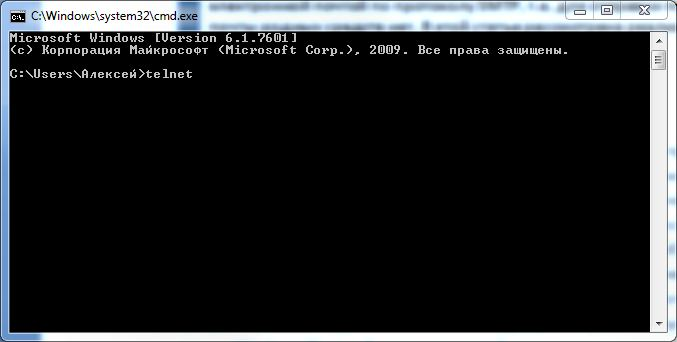

# Получение почты по протоколу POP3 и обработка MIME

Протокол **POP3** является важным элементом в работе любого почтового клиента и предназначен для получения сообщений электронной почты.

Как правило, протокол **POP3** работает в паре с протоколом **SMTP**, который в отличие от **POP3** предназначен для рассылки сообщений.

В **.NET Framework** существуют достаточно удобные средства для работы с электронной почтой по протоколу **SMTP**, т.е. для отправки почты, однако для получения почты родных средств нет.

В этой статье рассмотрена реализация набора классов для получения и обработки электронной почты по протоколу **POP3** на языке **C#**.

## Введение

Протокол **POP3** (**Post Office Protocol Version 3**) предназначен для получения сообщений электронной почты.

Третья версия протокола **POP** неизменно действует вот уже более 15 лет.

Как и любой другой протокол, **POP3** представляет собой набор строго определенных текстовых команд и правил их использования.

Протокол **POP3** достаточно простой, он позволяет подключаться к почтовому серверу, запрашивать информацию об электронных письмах, получать письма и удалять их.

Вся работа с протоколом **POP3** делается буквально десятком команд, к основным из которых относятся:

* `USER` – позволяет передавать серверу имя пользователя для авторизации
* `PASS` – позволяет передавать серверу пароль пользователя для авторизации
* `STAT` – запрашивает информацию о количестве писем на сервере
* `TOP` – позволяет получать ограниченное количество строк из любого письма, которое есть на сервере
* `RETR` – позволяет получать любое письмо целиком
* `DELE` – помечает указанное сообщение для удаления
* `QUIT` – завершает сеанс работы с сервером, если есть помеченные для удаления письма, то происходит их реальное удаление

Вы можете самостоятельно убедиться в том, насколько прост протокол **POP3**.

Для этого запустите программу **telenet**.

Сделать это можно следующим образом: запустите интерпретатор командной строки **Windows** (**Пуск** -> **Выполнить** -> **cmd**), затем в окно консоли введите строку `telnet` и нажмите клавишу **ВВОД**.



Если все сделано правильно, то вы увидите приветствие программы **telnet**.

При помощи этой программы можно совершать низкоуровневые подключения к серверам по различным протоколам, в том числе и по протоколу **POP3**.

Допустим, у вас есть почтовый ящик на сервере **Яндекс**.

Чтобы проверить почту, в **telnet** необходимо указать команду `o` (**open**), адрес pop3-сервера, у Яндекс – это `pop.yandex.ru`, а также номер порта, для протокола **POP3** обычно используется `110` порт.

```
o pop.yandex.ru 110
```

> [!NOTE]
> Адрес сервера и порт можно указать и во время запуска программы **telnet**. Например: `telnet pop.yandex.ru 110`
> Тогда отдельно подключаться к серверу будет не нужно.

В случае успеха, сервер вернет ответ вида:

```
+OK POP Ya! v1.0.0na@17 1pXO3RuoOiE1
```

`+OK` означает, что команда выполнена успешно, в данном случае произведено успешное подключение к pop3-серверу.

При возникновении ошибки, сервер вернет строку, начинающуюся с `-ERR`.

Теперь можно пройти авторизацию на сервере, для этого существуют две команды: `USER` – имя пользователя (логин) и `PASS` – пароль.

```
+OK POP Ya! v1.0.0na@6 W2Ya3wYc8Gk1
USER pupkin
+OK password, please.
PASS secretstring
+OK 1 1340
```

> [!NOTE]
> При подключении к почтовому серверу **Яндекс** логиноном, как правило, является строка до символа собаки (`@`).

В данном случае у пользователя адрес электронной почты – `pupkin@yandex.ru`, а логин – `pupkin`.

У других почтовых серверов логин может являться адресом электронной почты целиком.

Подробнее об этом можно узнать в справочных руководствах этих почтовых серверов.

После успешного прохождения процедуры авторизации, можно запросить у почтового сервера информацию о новых письмах.

Делается это при помощи команды `STAT`.

```
STAT
+OK 1 1340
```

> [!NOTE]
> Если вы обратили внимание, информацию о количестве писем и их размере сервер вернул сразу после успешного прохождения процедуры авторизации (ввода пароля), так что запрашивать её отдельно нет необходимости.

При положительном ответе в первом числе будет содержаться информация о количестве писем, а во втором – размер писем в байтах.

В данном случае в ящике одно письмо размером `1340` байт.

Теперь, используя команду `RETR`, можно получить содержимое любого письма, указав в качестве параметра идентификатор письма (отсчет начинается с `1` и до количества писем в ящике).

```
RETR 1
+OK 1340 octets.
X-Yandex-FolderName: Vhodyashchie
Received: from smtp17.mail.yandex.net ([95.108.252.17])
 by mxback34.mail.yandex.net with LMTP id 123
Received: from smtp17.mail.yandex.net (localhost [127.0.0.1])
 by smtp17.mail.yandex.net (Yandex) with ESMTP id 111
Received: from dynamicip-91-144-161-182.pppoe.yola.ertelecom.ru (dynamicip-91-14
4-161-182.pppoe.yola.ertelecom.ru [52.189.261.112])
 by smtp17.mail.yandex.net (nwsmtp/Yandex) with ESMTP id 0943434;
 Sun, 14 Aug 2011 13:17:03 +0400
X-Yandex-Front: smtp17.mail.yandex.net
X-Yandex-TimeMark: 1313313423
X-Yandex-Spam: 1
Date: Sun, 14 Aug 2011 13:17:07 +0400
From: =?windows-1251?B?zeXs6PDuIMDr5erx5ek=?= <admin@kbyte.ru>
Reply-To: =?windows-1251?B?wOvl6vHl6SDN5ezo8O4=?= <admin@kbyte.ru>
X-Priority: 3 (Normal)
Message-ID: <705834462.20110814131707@kbyte.ru>
To: mfulgore@yandex.ru
Subject: Test E-Mail
MIME-Version: 1.0
Content-Type: text/plain; charset=windows-1251
Content-Transfer-Encoding: 8bit
Return-Path: admin@kbyte.ru
X-Yandex-Forward: 0660017ffd70b6c9d09ba677053f6146

Hello, world!

This is test e-mail for article.


--
╤ эршыєў°шьш яюцхырэшш,
═хьшЁю └ыхъёхщ mailto:admin@kbyte.ru
```

Как видно в приведенном примере, письмо представляет собой содержимое **MIME**.

Именно в таком виде письма проходят от сервера к серверу и попадают в почтовый клиент конечного пользователя.

**MIME** – это отдельная тема для разговора, но не смотря на это, и на то что в 2006 году я уже [писал статью на тему обработки **MIME**](../../2006/articles/MIME.md), в этой статье я также затрону тему чтения **MIME**.

Чтобы завершить сеанс работы с pop3-сервером, достаточно указать команду `QUIT`.

```
QUIT
+OK shutting down.
```

Все очень просто, если с чем-то и придется повозиться, так это с приданием полученным письмам человеческого вида, поскольку на сервере они хранятся в MIME-формате.

Программно взаимодействовать с почтовым сервером можно при помощи сокетов, собственно об этом и пойдет речь в следующей части статьи.

Подробная спецификация протокола **POP3** определена в **[RFC-1939](http://tools.ietf.org/html/rfc1939)**.

## Получение почты по протоколу POP3

В этой статье все классы для получения и обработке почты по протоколу **POP3** будут находиться в проекте типа **Библиотека классов** с именем **Pop3Lib**.

Это позволит подключать готовую библиотеку к различным типам проектов.

Первый, и основной, класс будет отвечать за взаимодействие с почтовым сервером по протоколу **POP3**. Я назвал его `Client`.

```c#
public class Client
{
}
```

Для подключения к любому почтовому серверу потребуется четыре обязательных параметра: адрес сервера, порт, имя пользователя и пароль.

Поэтому имеет смысл предопределить в классе конструктор, который будет принимать эти четыре параметра.

```c#
private string _Host = String.Empty;
private int _Port = 110;
private string _UserName = String.Empty;
private string _Password = String.Empty;

public Client(string host, int port, string userName, string password)
{
  // проверка указания всех необходимых данных
  if (String.IsNullOrEmpty(host)) throw new Exception("Необходимо указать адрес pop3-сервера.");
  if (String.IsNullOrEmpty(userName)) throw new Exception("Необходимо указать логин пользователя.");
  if (String.IsNullOrEmpty(password)) throw new Exception("Необходимо указать пароль пользователя.");
  if (port <= 0) port = 110;
  // --
  this._Host = host;
  this._Password = password;
  this._Port = port;
  this._UserName = userName;
}
```

Взаимодействие с почтовым сервером будет производиться посредствам сокетов, точнее одного сокета, который должен быть доступен на уровне всего класса.

```c#
private Socket _Socket = null;
```

> [!NOTE]
> Для использования класса `Socket` необходимо импортировать пространство имен `System.Net.Sockets`, а также `System.Net`.

Теперь, когда есть все необходимые данные для подключения к почтовому серверу, можно инициализировать и открыть сокет.

Делать это лучше в отдельном публичном методе, например `Connect`.

```c#
public void Connect()
{
}
```

Этот метод можно вызывать в конструкторе, чтобы сразу после инициализации экземпляра POP3-клиента открывалось соединение с почтовым сервером.

Для открытия соединения с сервером, необходимо получить IP-адрес сервера, в случае, если в качестве адреса указан домен, и на его основе получить конечную сетевую точку доступа.


```c#
IPHostEntry myIPHostEntry = Dns.GetHostEntry(_Host);

if (myIPHostEntry == null || myIPHostEntry.AddressList == null || myIPHostEntry.AddressList.Length <= 0)
{
  throw new Exception("Не удалось определить IP-адрес по хосту.");
}

IPEndPoint myIPEndPoint = new IPEndPoint(myIPHostEntry.AddressList[0], _Port);

_Socket = new Socket(AddressFamily.InterNetwork, SocketType.Stream, ProtocolType.Tcp);
_Socket.ReceiveBufferSize = 512;
_Socket.Connect(myIPEndPoint);
```

После установки соединения с почтовым сервером, ему можно отправлять команды и, соответственно, обрабатывать ответы сервера.

Удобней всего это делать в два этапа.

На первом этапе серверу будет отправляться команда, а на втором – производиться обработка ответа.

Т.е. будет как минимум две отдельные функции.

Функцию для отправки команды можно назвать `Command`, она должна принимать строку – команду, соответствующую спецификации протокола **POP3**.

```c#
public void Command(string cmd)
{
  if (_Socket == null) throw new Exception("Соединение с сервером не установлено. Откройте соединение методом Connect.");

  byte[] b = System.Text.Encoding.ASCII.GetBytes(String.Format("{0}\r\n", cmd));

  if (_Socket.Send(b, b.Length, SocketFlags.None) != b.Length)
  {
    throw new Exception("При отправке данных удаленному серверу произошла ошибка...");
  }
}
```

В ответах сервера, какого бы размера они не были, по правилам протокола **POP3**, первая строка всегда содержит результат выполнения запроса.

При получении ответа от сервера могут возникнуть небольшие задержки соединения и, если ответ большой, то это может занять длительное время, в зависимости от размера буфера сокета и скорости соединения.

Поэтому можно сделать две функции для получения ответов.

Первая функция будет получать лишь одну строку из ответа сервера, а вторая – весь ответ целиком.

Эти функции можно назвать, например, `ReadLine` и `ReadToEnd`.

```c#
public string ReadLine()
{
  byte[] b = new byte[_Socket.ReceiveBufferSize];
  StringBuilder result = new StringBuilder(_Socket.ReceiveBufferSize);
  int s = 0;

  while (_Socket.Poll(1000000, SelectMode.SelectRead) && (s = _Socket.Receive(b, _Socket.ReceiveBufferSize, SocketFlags.None)) > 0)
  {
    result.Append(System.Text.Encoding.ASCII.GetChars(b, 0, s));
  }

  return result.ToString().TrimEnd("\r\n".ToCharArray());
}

public string ReadToEnd()
{
  byte[] b = new byte[_Socket.ReceiveBufferSize];
  StringBuilder result = new StringBuilder(_Socket.ReceiveBufferSize);
  int s = 0;

  while (_Socket.Poll(1000000, SelectMode.SelectRead) && ((s = _Socket.Receive(b, _Socket.ReceiveBufferSize, SocketFlags.None)) > 0))
  {
    result.Append(System.Text.Encoding.ASCII.GetChars(b, 0, s));
  }

  return result.ToString();
}
```

Как я уже говорил, первая строка в ответе сервера содержит результат выполнения запроса, который может быть успешным, или неуспешным.

Если команда выполнена без ошибок, то ответ сервера будет начинаться со строки `+OK`, а в случае ошибки – `-ERR`.

Ответ желательно всегда проверять, чтобы не бомбить понапрасну сервер множеством запросов, на которые он не может ответить по тем или иным причинам, иначе он обидеться и уйдет в глубокую депрессию, минут эдак на 10-30, в зависимости от конфигурации.

Для обработки ответа сервера можно сделать отдельный класс, который будет отделять котлеты от мух, т.е. содержать флаг о фотальности выполнения команды (т.к. фатальность проверяется относительно редко), системное сообщение сервера и тело (если запрашивается письмо).

Этот класс можно назвать `Result`, он будет очень простым. Обработка ответа сервера будет реализована прямо в конструкторе.

```c#
public class Result
{
  public string Source { get; set; }
  public bool IsError { get; set; }
  public string ServerMessage { get; set; }
  public string Body { get; set; }

  public Result() { }

  public Result(string source)
  {
    this.Source = source;

    // обрабатываем ответ
    this.IsError = source.StartsWith("-ERR"); // ошибка, или нет

    // получаем отдельно сообщение о результате выполнения команды
    Regex myReg = new Regex(@"(\+OK|\-ERR)\s{1}(?<msg>.*)?", RegexOptions.Multiline | RegexOptions.IgnoreCase);
    if (myReg.IsMatch(source))
    {
      this.ServerMessage = myReg.Match(source).Groups["msg"].Value;
    }
    else
    {
      this.ServerMessage = source;
    }

    // если есть, получаем тело сообщения, удаляя сообщение сервера и лишние маркеры протокола
    if (source.IndexOf("\r\n") != -1)
    {
      this.Body = source.Substring(source.IndexOf("\r\n") + 2, source.Length - source.IndexOf("\r\n") - 2);

      if (this.Body.IndexOf("\r\n\r\n.\r\n") != -1)
      {
        this.Body = this.Body.Substring(0, this.Body.IndexOf("\r\n\r\n.\r\n"));
      }
    }
    // --
  }
}
```

> [!NOTE]
> Для использования регулярных выражений, необходимо импортировать пространство имен `System.Text.RegularExpressions`.

При желании, можно сделать в классе `Result` свойство по умолчанию, чтобы была возможность присваивать классу строку – ответ сервера, и сразу его обрабатывать.

Для этого достаточно добавить в класс всего три строчки кода.

```c#
public static implicit operator Result(string value)
{
  return new Result(value);
}
```

Итак, вернемся к классу `Client`, в котором нас дожидается открытое соединение с почтовым сервером.

После подключения к серверу, сервер возвращает результат подключения. Его необходимо получить, чтобы он «не засорял эфир».

Для этого достаточно сделать вызов функции `ReadLine`, а сам ответ обрабатывать необязательно, т.к. если соединение не будет установлено, то в программе просто возникнет исключение.

Затем можно пройти процедуру авторизации, для этого нужно отправить две команды: `USER` и `PASS`, с указанием логина и пароля.

После каждой команды необходимо получать ответ сервера, вызывая функцию `ReadLine`.

Проверку же на ошибки, в данном случае, имеет смысл проводить только после указания пароля.

Такая построчная работа удобна в плане обработки ответов, т.к. ответ в буфере всегда будет только один, и память компьютера не будет засоряться.

```c#
Command(String.Format("USER {0}", _UserName));
ReadLine();

Command(String.Format("PASS {0}", _Password));
_ServerResponse = ReadLine();

if (_ServerResponse.IsError)
{
  throw new Exception(_ServerResponse.ServerMessage);
}
```

> [!NOTE]
> Перменная `_ServerResponse` – это глобальная переменная типа `Result` на уровне класса `Client`.

В случае успешного прохождения процедуры авторизации, сервер вернет информацию о количестве писем, находящихся в ящике.

Эту информацию также можно получить командой `STAT`, что собственно я и сделаю ниже, для наглядности.

Статистику сервер возвращает в строгом формате: `+OK[пробел][количество писем][пробел][размер писем]`.

Данная информация очень важна, т.к. все операции с письмами делаются по их индексу.

Поэтому можно сделать функцию, которая будет парсить статистику и возвращать два целочисленных значения – количество писем и размер.

Поскольку ответ сервера обрабатывается в классе `Result`, то обработку статистики логичней сделать в нем же.

```c#
public void ParseStat(out int messagesCount, out int messagesSize)
{
  Regex myReg = new Regex(@"(?<count>\d+)\s+(?<size>\d+)");
  Match m = myReg.Match(this.Source);

  int.TryParse(m.Groups["count"].Value, out messagesCount);
  int.TryParse(m.Groups["size"].Value, out messagesSize);
}
```

Статистические сведения можно хранить в памяти, в отдельных глобальных переменных на уровне класса `Client`.

```c#
public int MessageCount = 0;
public int MessagesSize = 0;
```

Сам запрос статистики и передача данных в переменные `MessageCount` и `MessagesSize` показаны ниже.

```c#
Command("STAT");

_ServerResponse = ReadLine();

if (_ServerResponse.IsError)
{
  throw new Exception(_ServerResponse.ServerMessage);
}

_ServerResponse.ParseStat(out this.MessageCount, out this.MessagesSize);
```

Теперь, когда известно, сколько писем в ящике, можно выполнять команды по обработке каждого отдельного письма.

Основные команды – это получение ограниченного количества строк письма (`TOP`), получение всего письма (`RETR`) и удаление письма (`DELE`).

Конечно же, лучше всего это сделать в отдельных функциях/методах.

Получение ограниченного количества строк письма может быть полезно при первичной обработке писем, например при поиске писем с определенной темой, чтобы не тратить время на обработку ненужных данных.

Для этого необходимо получить все заголовки письма, в которых и находится основная информация о письме, в том числе и тема.

```c#
public string GetMailHeaders(int index)
{
  if (index > this.MessageCount)
  {
    throw new Exception(String.Format("Индекс должен быть от 1 и не больше {0}", this.MessageCount));
  }

  Command(String.Format("TOP {0} 0", index));

  _ServerResponse = ReadToEnd();

  if (_ServerResponse.IsError)
  {
    throw new Exception(_ServerResponse.ServerMessage);
  }

  return _ServerResponse.Body;
}
```

Как видите, функция `GetMailHeaders` принимает индекс письма, который не должен превышать количества писем, находящихся в ящике (см. команду `STAT`) и должен быть больше нуля.

Функция получения всего содержимого письма будет такой же, разве что команда изменится.

```c#
public string GetMail(int index)
{
  if (index > this.MessageCount)
  {
    throw new Exception(String.Format("Индекс должен быть от 1 и не больше {0}", this.MessageCount));
  }

  Command(String.Format("RETR {0}", index));

  _ServerResponse = ReadToEnd();

  if (_ServerResponse.IsError)
  {
    throw new Exception(_ServerResponse.ServerMessage);
  }

  return _ServerResponse.Body;
}
```

Аналогично, по индексу будет происходить и удаление письма, а точнее пометка письма для удаления.

```c#
public void Delete(int index)
{
  if (index > this.MessageCount)
  {
    throw new Exception(String.Format("Индекс должен быть от 1 и не больше {0}", this.MessageCount));
  }

  Command(String.Format("DELE {0}", index));

  _ServerResponse = ReadLine();

  if (_ServerResponse.IsError)
  {
    throw new Exception(_ServerResponse.ServerMessage);
  }
}
```

Фактическое удаления всех помеченных писем будет производиться только после успешного завершения работы сессии, т.е. после выполнения команды `QUIT`.

Для этой команды тоже можно сделать отдельный метод, который будет назваться, например, `Close`. В нем же можно закрыть сокет.

```c#
public void Close()
{
  if (_Socket == null) { return; }

  Command("QUIT");
  ReadLine();
  _Socket.Close();
}
```

Ну, вот и все, класс для работы с почтой по протоколу **POP3** готов.

Или нет? Конечно, для создания примитивного почтового клиента этого недостаточно, и даже на низком уровне обрабатывать почту будет сложно, поскольку письма на сервере хранятся в формате **MIME**.

Реализация функционала для работы с протоколом **POP3** – это самое простое, что можно сделать, и если вы разобрались в этой части статьи, то можете смело переходить к следующей.

## Обработка писем

Как вы уже знаете, электронное письмо представляет собой текст, соответствующий общепринятым стандартам расширений интернет-почты, т.е. **MIME** (**Multipurpose Internet Mail Extension**).

Для обычного обывателя, и даже программиста, письмо в исходном виде может быть абсолютно непонятным набором символов и команд.

Условно, письмо можно разделить на две основные части: заголовки и содержимое.

В заголовках описываются параметры письма, в том числе информация об отправителе и адресате, тема письма, путь прохождения письма, тип кодирования, используемая кодовая страница и др.

Содержимое, в свою очередь, может быть обычным текстом, либо другим кодированным, на основе правил указанных в заголовках, содержимым.

При этом каждое содержимое может состоять из отдельных вложенных частей, у которых могут быть свои заголовки.

Например, текстовое письмо может содержать только обычный неформатированный текст (`text/plain`), т.е. будет состоять из заголовков и текста.

Если в письмо, дополнительно к неформатированному тексту, будет помещен текст в формате **html** (`text/html`), то письмо также будет состоять из основных заголовков, но содержимое уже будет состоять из двух отдельных частей (`multipart`), в которых будут, свои отдельные заголовки.

В первой части письма будет находиться неформатированный текст, а во второй – текст в формате **html**.

Если, например, в html-текст будут вставлены картинки, то html-часть письма будет состоять уже из подмножества дополнительных частей, в одной из которых будет сам текст в формате **html**, а в остальных, по отдельности, – вложенные графические файлы.

На первый взгляд такая структура может показаться сложной, однако стандарты придуманы недаром и, сделав хорошую основу, можно не задумываться о таких мелочах, как подмножество частей, из которых состоит письмо.

У частей письма обычно меньше заголовков, чем у самого письма, но правила их определения – едины.

Поэтому можно сделать базовый класс, `MailItemBase`, который будет содержать, как минимум, заголовки (`Headers`) и содержимое части письма (`Data`).

Для хранения заголовком можно использовать коллекцию типа `Dictionary` со строковым ключом и значением типа `object`.

И хотя в MIME-заголовках не может быть данных отличных от текстовых, объектный тип необходим, т.к. в заголовках могут встречаться ключи с одинаковыми именами (например, `Received`), что недопустимо в коллекциях.

Объектный тип можно использовать для хранения любых типов данных, в том числе вложенных коллекций, в случаях нахождения в заголовках ключей с одинаковыми именами.

Для хранения содержимого части письма (`Data`) также будет использоваться объектный тип данных.

Каждая часть письма может содержать три типа данных: строковые, бинарные (массив байт) и коллекцию частей письма (`MailItemBase`).

```c#
public class MailItemBase
{
  public Dictionary<string, object> Headers { get; set; };
  public object Data { get; set; };
}
```

Обработка части письма, получение заголовков и выделение содержимого будет происходить в конструкторе, при инициализации экземпляра класса.

Для этого нужно, чтобы в конструктор передавался исходный текст части письма.

```c#
public MailItemBase(string source) { }
```

Первым делом, нужно отделить заголовки от содержимого.

На этот случай, стандарты гласят, что содержимое письма отделятся от заголовков двумя переводами строк (`\r\n\r\n` или `13 10 13 10`).

Так что достаточно в исходном тексте части письма найти первое вхождение парных символов перевода строк.

```c#
int headersTail = source.IndexOf("\r\n\r\n");
```

Но здесь следует учитывать, что в некоторых случаях с почтового сервера может быть получено не все письмо, а только заголовки (`TOP`) и тогда парных символов перевода строк в источнике может и не быть, т.е. исходный текст сам будет являться заголовками.

```c#
string h = String.Empty;
if (headersTail == -1)
{ // хвост не найден, значит в теле сообщения только заголовки
  h = source;
}
else
{ // хвост найден, отделяем заголовки
  h = source.Substring(0, headersTail);
}
```

Для обработки заголовков лучше всего сделать отдельную функцию (`ParseHeaders`), чтобы не загромождать код, и на случай, если понадобится её повторное использование.

Эта функция будет принимать исходный текст (`h`), содержащий MIME-заголовки и возвращать коллекцию типа `Dictionary`.

Чтобы ключи в коллекции не зависели от регистра символов, при инициализации коллекции нужно указать параметр `StringComparer.CurrentCultureIgnoreCase`.

```c#
private Dictionary<string, object> ParseHeaders(string h)
{
  Dictionary<string, object> result = new Dictionary<string, object>(StringComparer.CurrentCultureIgnoreCase);
  return result;
}
```

> [!NOTE]
> Для использования коллекций, может потребоваться импортировать пространство имен `System.Collections`.

Некоторые значения заголовков могут быть кодированы, например в **Base64** или **Quoted-Printable**.

Чтобы не мучиться с декодирование каждого отдельно заголовка, это можно сделать сразу, пока они все находятся в одном месте.

Кодированные данные в заголовках имеют строгий формат, который содержит имя кодовой страницы, тип кодирования и, собственно, закодированные данные.

Каждый элемент разделяется знаком вопроса (`?`). Например:

```
=?utf-8?B? 0J/RgNC40LLQtdGCIEtieXRlLlJ1IQ==?=
```

В первой части строки указывается кодовая страница – `utf-8`.

Второй параметр содержит один символ – `B`, который указывает на то, что данные кодированы в **Base64**.

Поимо **Base64** может использовать тип кодирования **Quoted-Printable**, который определяется буквой `Q`.

В третьей части строки содержатся сами данные, кодированные в **Base64** с использованием кодовой страницы `utf-8`.

Зная это, можно составить шаблон регулярного выражения для поиска в тексте строк подобного формата.

При этом можно сразу при помощи функции обратного вызова произвести декодирование всех найденных совпадений.

```c#
h = Regex.Replace(h, @"([\x22]{0,1})\=\?(?<cp>[\w\d\-]+)\?(?<ct>[\w]{1})\?(?<value>[^\x3f]+)\?\=([\x22]{0,1})", HeadersEncode, RegexOptions.Multiline | RegexOptions.IgnoreCase);
```

Функция обратного вызова `HeadersEncode` должна принимать один параметр, содержащий найденное совпадение типа `Match` и возвращать строку.

```c#
private string HeadersEncode(Match m)
{
  string result = String.Empty;
  Encoding cp = Encoding.GetEncoding(m.Groups["cp"].Value);

  if (m.Groups["ct"].Value.ToUpper() == "Q")
  { // кодируем из Quoted-Printable
    result = ParseQuotedPrintable(m.Groups["value"].Value);
  }
  else if (m.Groups["ct"].Value.ToUpper() == "B")
  { // кодируем из Base64
    result = cp.GetString(Convert.FromBase64String(m.Groups["value"].Value));
  }
  else
  { // такого быть не должно, оставляем текст как есть
    result = m.Groups["value"].Value;
  }

  return result;
}
```

Для декодирования данных из **Base64** можно использовать функцию `FromBase64String` класса `Convert`.

А вот для обработки **Quoted-Printable** придется написать отдельную подпрограмму.

Строка **Quoted-Printable** представляет из себя набор шестнадцатеричных символов, в каждом из которых содержится ASC-код печатного символа.

Поскольку кодированный текст может быть смешан с обычным, для обозначения кодированных символов используется знак «равно» (`=`).

Здесь опять же на помощь приходят регулярные выражения.

```c#
private string ParseQuotedPrintable(string source)
{
  source = source.Replace("_", " ");
  source = Regex.Replace(source, @"(\=)([^\dABCDEFabcdef]{2})", "");
  return Regex.Replace(source, @"\=(?<char>[\d\w]{2})", QuotedPrintableEncode);
}

private string QuotedPrintableEncode(Match m)
{
   return ((char)int.Parse(m.Groups["char"].Value, System.Globalization.NumberStyles.AllowHexSpecifier)).ToString();
}
```

Следующим этапом в обработке заголовков будет склеивание строк.

Бывают случаи, когда в одном MIME-заголовке очень много данных, и они разбиваются на несколько строк.

Чтобы не возникало путницы, такие данные среди заголовков всегда начинаются со множества пробелов.

Именно за счет пробелов в начале строки и можно найти многострочные значения заголовков, а сами пробелы нужно удалить.

```c#
h = Regex.Replace(h, @"([\r\n]+)^(\s+)(.*)?$", " $3", RegexOptions.Multiline);
```

Теперь, когда заголовки декодированы и из них убрано все лишнее, можно превратить их в коллекцию `Dictionary`.

Имя каждого заголовка находится с начала строки и до первого символа двоеточия (`:`), а часть строки после двоеточия – это значение заголовка.

Как я уже говорил, в **MIME** могут попадаться заголовки с одинаковыми именами, что недопустимо в коллекциях.

Для одинаковых ключей значения заголовков будут помещаться в коллекцию типа `ArrayList`, что позволит легко с ними работать.

```c#
Regex myReg = new Regex(@"^(?<key>[^\x3A]+)\:\s{1}(?<value>.+)$", RegexOptions.Multiline);
MatchCollection mc = myReg.Matches(h);

foreach (Match m in mc)
{ 
  string key = m.Groups["key"].Value;

  if (result.ContainsKey(key))
  { // если указанный ключ уже есть в коллекции,
    // то проверяем тип данных
    if (result[key].GetType() == typeof(string))
    { // тип данных - строка, преобразуем в коллекцию
      ArrayList arr = new ArrayList();
      // добавляем в коллекцию первый элемент
      arr.Add(result[key]);
      // добавляем в коллекцию текущий элемент
      arr.Add(m.Groups["value"].Value);
      // вставляем коллекцию элементов в найденный заголовок
      result[key] = arr;
    }
    else
    { // считаем, что тип данных - коллекция, 
      // добавляем найденный элемент
      ((ArrayList)result[key]).Add(m.Groups["value"].Value);
    }
  }
  else
  { // такого ключа нет, добавляем
    result.Add(key, m.Groups["value"].Value.TrimEnd("\r\n ".ToCharArray()));
  }
}

// возвращаем коллекцию полученных заголовков
return result;
```

Но вернемся к коду конструктора класса `MailItemBase`, в котором уже можно, при помощи функции `ParseHeaders`, получить коллекцию заголовков и передать её в свойство `Headers` экземпляра класса.

```c#
this.Headers = ParseHeaders(h);
```

Далее можно обработать содержимое части письма, если конечно оно есть.

Показателем наличия содержимого письма служит граница, разделяющая заголовки от содержимого (переменная `headersTail`).

Если границы нет, т.е. значение переменной `headersTail` равно минус один, то продолжать обработку смысла нет.

```c#
if (headersTail == -1) return;
```

При наличии границы, зная её позицию в исходном тексте части письма, можно отделить содержимое от заголовков.

```c#
string b = source.Substring(headersTail + 4, source.Length - headersTail - 4);
```

Содержимое части письма, как и заголовки, может быть кодировано и иметь отдельную кодовую страницу.

Но в отличие от заголовков, где кодированные данные имеют определенный формат, информация о кодировании содержимого содержится в двух основных заголовках.

Первый - `Content-Transfer-Encoding`, указывает на тип кодирования, который может иметь одно из шести значений:

* `Base64`
* `Quoted-Printable`
* `7Bit`
* `8Bit`
* `Binary`
* `X-Token`

Собственно, декодировать придется только `Base64` и `Quoted-Printable`, остальные, `7Bit` и `8bit` – это обычный текст, а использования `Binary` и `X-Token`, я за свою практику, в Рунете, ни разу не встречал.

Заголовок с именем `Content-Transfer-Encoding` должен находиться в коллекции `Headers`.

```c#
string ContentTransferEncoding = String.Empty;

if (this.Headers.ContainsKey("Content-Transfer-Encoding"))
{
  ContentTransferEncoding = this.Headers["Content-Transfer-Encoding"].ToString().ToLower();
}
```

Второй важный заголовок – это `Content-Type`, который содержит информацию о типе содержимого.

Содержимое может быть семи основных типов:

* `text` – текст
* `application` – приложение
* `image` – изображение
* `video` – видео
* `audio` – аудио
* `multipart` – смешанный тип
* `message` – сообщение

Каждый тип может содержать множество дополнительных подтипов.

Помимо этого, в заголовке `Content-Type` могут содержаться другие параметры, например имя кодовой страницы для текстового содержимого, или имя файла для бинарного содержимого, или имя границы для смешанного содержимого.

Вообще, дополнительные параметры могут содержаться и в любых других заголовках, например в `Content-Disposition`, который используется для вложенных в сообщение файлов.

Поэтому, для обработки подобных значений, можно сделать отдельный класс.

Этот класс будет похож на `MailItemBase`, но вместо заголовков и содержимого, в нем будет отделять тип содержимого от параметров.

```
Заголовок: тип содержимого[;параметр=значение[;параметр=значение]]
```

До первого вхождения символа точки с запятой (`;`) идет информация о типе содержимого, а после идут параметры, также разделенные точкой с запятой.

Каждый параметр, в свою очередь, состоит из имени и значения, которые разделятся символов «равно» (`=`).

```c#
public class ParametersBase
{
  public string Source { get; set; }
  public string Type { get; set; }
  public Dictionary<string, string> Parameters { get; set; }

  public ParametersBase(string source)
  {
    if (String.IsNullOrEmpty(source)) return;

    this.Source = source;

    // ищем в источнике первое вхождение точки с запятой
    int typeTail = source.IndexOf(";");

    if (typeTail == -1)
    { // все содержимое источника является информацией о типа
      _Type = source;
      return; // параметров нет, выходим
    }

    _Type = source.Substring(0, typeTail);

    // парсим параметры
    string p = source.Substring(typeTail + 1, source.Length - typeTail - 1);

    this.Parameters = new Dictionary<string, string>(StringComparer.CurrentCultureIgnoreCase);

    Regex myReg = new Regex(@"(?<key>.+?)=((""(?<value>.+?)"")|((?<value>[^\;]+)))[\;]{0,1}", RegexOptions.Singleline);
    MatchCollection mc = myReg.Matches(p);

    foreach (Match m in mc)
    {
      if (!this.Parameters.ContainsKey(m.Groups["key"].Value))
      {
        this.Parameters.Add(m.Groups["key"].Value.Trim(), m.Groups["value"].Value);
      }
    }
  }
}
```

Сам по себе заголовок `Content-Type` относительно сложный, поэтому имеет смысл превратить его в объект (`ContentType`), чтобы в последующем с ним было проще работать.

Класс `ContentType` будет наследоваться от только что созданного базового класса `ParametersBase`, и по сути будет обычным хелпером, предоставляющим быстрый и удобный доступ к часто используемым параметрам заголовка `Content-Type`.

```c#
public class ContentType : ParametersBase
{

  public string Charset
  {
    get
    {
      if (this.Parameters != null && this.Parameters.ContainsKey("charset"))
      { return this.Parameters["charset"]; }

      return "utf-8"; // по умолчанию 
    }
  }

  public string Boundary 
  {
    get
    {
      if (this.Parameters != null && this.Parameters.ContainsKey("boundary"))
      { return this.Parameters["boundary"]; }

      return String.Empty;
    }
  }

  public string Format
  {
    get
    {
      if (this.Parameters != null && this.Parameters.ContainsKey("format"))
      { return this.Parameters["format"]; }

      return String.Empty;
    }
  }

  private Encoding _CodePage = null;

  public Encoding CodePage
  {
    get
    {
      if (_CodePage == null && !String.IsNullOrEmpty(this.Charset))
      { _CodePage = Encoding.GetEncoding(this.Charset); }
      else
      { _CodePage = Encoding.UTF8; }

      return _CodePage;
    }
  }

  public ContentType(string source): base(source) { }

}
```

Собственно, для заголовка `Content-Disposition` тоже можно сделать отдельный хелпер-класс, который будет наследоваться от базового класса `ParametersBase`, и содержать всего одно свойство – `FileName`, указывающие имя файла вложения.

```c#
public class ContentDisposition : ParametersBase
{

  public string FileName
  {
    get
    {
      if (this.Parameters != null && this.Parameters.ContainsKey("filename"))
      { return this.Parameters["filename"]; }
      
      return String.Empty; 
    }
  }

  public ContentDisposition(string source) : base(source) { }

}
```

Теперь, когда есть готовые классы для заголовков `Content-Type` и `Content-Disposition`, в классе обработки части письма (`MailItemBase`) можно сделать два дополнительных свойства, предоставляющих быстрый доступ к их содержимому.

```c#
public ContentType ContentType { get; set; }
public ContentDisposition ContentDisposition { get; set; }
```

И далее, по аналогии с `Content-Transfer-Encoding`, можно проверить существование заголовков `Content-Type` и `Content-Disposition` в коллекции, и если они есть, инициализировать на их основе соответствующие экземпляры классов.

```c#
if (this.Headers.ContainsKey("Content-Disposition"))
{
  this.ContentDisposition = new ContentDisposition(this.Headers["Content-Disposition"].ToString());
}

if (this.Headers.ContainsKey("Content-Type"))
{
  this.ContentType = new ContentType(this.Headers["Content-Type"].ToString());
}
else
{
  this.ContentType = new ContentType("");
}
```

После того как будет известен тип содержимого, можно провести его обработку и поместить в свойство `Data` класса `MailItemBase`.

Поскольку содержимое может быть закодировано, то для его декодирования потребуется отдельная функция (`DecodeContent`), которая помимо всего прочего будет менять кодовую страницу текстовых данных (`ConvertCodePage`), в случае, если она отличается от текущей (`Encoding.Default`).

```c#
private string DecodeContent(string contentTransferEncoding, string source)
{
  if (contentTransferEncoding == "base64")
  {
    return ConvertCodePage(Convert.FromBase64String(source), this.ContentType.CodePage);
  }
  else if (contentTransferEncoding == "quoted-printable")
  {
    return ConvertCodePage(ParseQuotedPrintable(source), this.ContentType.CodePage);
  }
  else
  { //"8bit", "7bit", "binary"
    // считаем, что это обычный текст
    return ConvertCodePage(source, _ContentType.CodePage);
  }
}

private string ConvertCodePage(string source, Encoding source_encoding)
{
  if (source_encoding == Encoding.Default) return source;

  return Encoding.Default.GetString(source_encoding.GetBytes(source));
}

private string ConvertCodePage(byte[] source, Encoding source_encoding)
{
  if (source_encoding == Encoding.Default) return Encoding.Default.GetString(source);

  return Encoding.Default.GetString(Encoding.Default.GetBytes(source_encoding.GetString(source)));
}
```

Имя типа содержимого должно находиться в свойстве `Type` экземпляра класса `ContentType`.

Декодировать потребуется только текстовой тип содержимого.

```c#
if (this.ContentType.Type.StartsWith("text"))
{
  this.Data = DecodeContent(this.ContentTransferEncoding, b);
}
```

Если содержимое имеет смешанный тип (`multipart`), то для его обработки потребуется написать отдельный метод.

Этот метод должен будет, используя границу – текстовую метку в свойстве `Boundary` экземпляра класса `ContentType`, выделять и обрабатывать разные вложенные части текущей части письма.

При этом свойство `Data` экземпляра класса `MailItemBase` будет представлять собой коллекцию типа `List`, в которую будут добавляться новые экземпляры класса `MailItemBase`, созданные на основе найденной части письма.

Другими словами, процесс обработки будет рекурсивным, и все множество найденных частей в итоге будет находиться в основном письме.

```c#
private void ParseMultiPart(string b)
{
  Regex myReg = new Regex(String.Format(@"(--{0})([^\-]{{2}})", _ContentType.Boundary), RegexOptions.Multiline);
  MatchCollection mc = myReg.Matches(b);

  // создаем коллекцию частей разношерстного содержимого
  List<MailItemBase> items = new List<MailItemBase>();

  // делаем поиск каждой части сообщения
  for (int i = 0; i <= mc.Count - 1; i++)
  {
    int start = mc[i].Index + String.Format("--{0}", this.ContentType.Boundary).Length;
    int len = 0;

    if (i + 1 > mc.Count - 1)
    {
      len = b.Length - start;
    }
    else
    {
      len = (mc[i + 1].Index - 1) - start;
    }

    string part = b.Substring(start, len).Trim("\r\n".ToCharArray());
    int partTail = 0;

    if ((partTail = part.LastIndexOf(String.Format("--{0}--", this.ContentType.Boundary))) != -1)
    {
      part = part.Substring(0, partTail);
    }

    items.Add(new MailItemBase(part));
  }

  // передаем коллекцию в свойство Data текущего экземпляра объекта
  this.Data = items;
}
```

Для обработки смешанных данных, в дополнение к условию проверки содержимого достаточно добавить следующий элемент условия.

```c#
else if (this.ContentType.Type.StartsWith("multipart"))
{
  ParseMultiPart(b);
}
```

Для обработки бинарных данных, т.е. вложенных файлов, потребуется еще немного расширить условие.

Бинарные данные ожидаются кодированными в **Base64**, поэтому если в свойстве `ContentTransferEncoding` будет указан другой тип кодирования, произойдет исключение.

```c#
else if (this.ContentType.Type.StartsWith("application") || this.ContentType.Type.StartsWith("image") || this.ContentType.Type.StartsWith("video") || this.ContentType.Type.StartsWith("audio"))
{
  // бинарный тип содержимого
  if (this.ContentTransferEncoding != "base64")
  {
    throw new Exception("Для бинарного содержимого ожидается тип кодирования Base64");
  }

  this.Data = Convert.FromBase64String(b);
}
```

В завершение, если ни один из элементов условия не будет удовлетворен, можно добавить обработчик содержимого по умолчанию.

Например, обрабатывать содержимое как обычный текст.

```c#
else
{
  this.Data = DecodeContent(this.ContentTransferEncoding, b);
}
```

> [!NOTE]
> В первой части условия тип содержимого проверяется на текстовой, я сделал это для наглядности, но фактически оно лишнее, т.к. условие по умолчанию выполняет те же функции.

Вот собственно и все, базовый класс готов.

На его основе можно сделать хелпер-класс, который будет представлять из себя полноценное письмо.

В частности в нем можно реализовать свойства содержащие тему письма, адрес и имя отправителя, получателя, а также обратный адрес, дату письма и т.д. и т.п.

Я не буду в тексте статьи описывать все свойства, приведу лишь некоторые из них.

```c#
public class MailItem : MailItemBase
{

  private MailAddress _From = null;

  // Тема письма
  public string Subject 
  {
    get
    {
      if (this.Headers.ContainsKey("Subject")) return this.Headers["Subject"].ToString();

      return String.Empty;
    }
  }

  // Отправитель письма
  public MailAddress From
  {
    get
    {
      if (_From == null)
      {
        if (!this.Headers.ContainsKey("From")) return null;
        _From = ParseMail(this.Headers["From"].ToString());
      }

      return _From;
    }
  }

  public MailItem(string source) : base(source) { }

  // Функция парсит адрес электронной почты и возвращает объект типа MailAddress
  private MailAddress ParseMail(string source)
  {
    if (String.IsNullOrEmpty(source)) return null;

    Regex myReg = new Regex(@"(?<name>[^\<]*?)[\<]{0,1}(?<email>[A-Za-zА-Яа-яЁё0-9_\-\.]+@[A-Za-zА-Яа-яЁё0-9_\-\.]+)[\>]{0,1}", RegexOptions.IgnoreCase | RegexOptions.Multiline);
    Match m = myReg.Match(source);

    if (m == null || String.IsNullOrEmpty(m.Value)) return null;

    string email = m.Groups["email"].Value.Trim();

    if (String.IsNullOrEmpty(email)) return null;

    string name = m.Groups["name"].Value.Trim("\" ".ToCharArray());

    return new MailAddress(email, name);
  }

}
```

Теперь можно насладиться результатом проделанной работы.

Для проверки работы обработчика **MIME**, достаточно при создании экземпляра класса `MailItem` передать содержимое письма из файла.

```c#
MailItem m = new MailItem(System.IO.File.ReadAllText("Test.eml"));

Console.WriteLine("От кого: {0}", m.From.ToString());
Console.WriteLine("Тема письма: {0}", m.Subject);
Console.WriteLine("Текст письма:");

if (m.Data != null)
{
  if (m.Data.GetType() == typeof(string))
  {
    Console.WriteLine(m.Data);
  }
  else if (m.Data.GetType() == typeof(byte[]))
  {
    Console.WriteLine("-- письмо имеет бинарный тип данных --");
  }
  else if (m.Data.GetType() == typeof(List<MailItemBase>))
  {
    Console.WriteLine("-- письмо состоит из множества вложенных частей --");
  }
}
```

> [!NOTE]
> В данном примере подразумевается, что в одной папке с программой будет файл с именем `Test.eml`, содержащий исходный текст письма.

## Доработка класса Client

Если вернуться к первой части статьи, где описан процесс создания класса `Client` для взаимодействия с почтовым сервером по протоколу **POP3**, то в функциях `GetMailHeaders` и `GetMail` можно реализовать выдачу не строковых данных, а возвращать объекты `MailItem`.

```c#
public MailItem GetMailHeaders(int index)
{
  if (index > this.MessageCount)
  {
    throw new Exception(String.Format("Индекс должен быть от 1 и не больше {0}", this.MessageCount));
  }

  Command(String.Format("TOP {0} 0", index));
  _ServerResponse = ReadToEnd();

  if (_ServerResponse.IsError)
  {
    throw new Exception(_ServerResponse.ServerMessage);
  }

  return new MailItem(_ServerResponse.Body);
}

public MailItem GetMail (int index)
{
  if (index > this.MessageCount)
  {
    throw new Exception(String.Format("Индекс должен быть от 1 и не больше {0}", this.MessageCount));
  }

  Command(String.Format("RETR {0}", index));
  _ServerResponse = ReadToEnd();

  if (_ServerResponse.IsError)
  {
    throw new Exception(_ServerResponse.ServerMessage);
  }

  return new MailItem(_ServerResponse.Body);
}
```

Теперь можно без проблем программно проверить почту и получить письма в виде объектов высокого уровня.

```c#
Pop3Lib.Client myPop3 = new Pop3Lib.Client("pop.yandex.ru", "логин", "пароль");

Pop3Lib.MailItem m;

while (myPop3.NextMail(out m))
{
  Console.Write("Письмо от {0} с темой {1}", m.From, m.Subject);
  Console.WriteLine("Хотите его удалить (y/n)?");

  if (Console.ReadLine().ToLower().StartsWith("y"))
  {
    // ставим текущему письму отметку об удалении
    myPop3.Delete();

    Console.WriteLine("Письмо помечено для удаления.");
  }
}

myPop3.Close();
```

## Послесловие

Получить почту по протоколу **POP3** достаточно просто, основная сложность – это обработка **MIME**.

И хотя существуют строго определенные стандарты формата писем, многие их нарушают, например спам-боты, и если этого не учитывать, то такие письма в лучшем случае не будут обрабатываться, а в худшем это будет приводить к возникновению исключения и падению программы.

В этой статье я не учитывал тонкостей обработки почты, но для использования созданной библиотеки «на своей территории» этого более чем достаточно.

При желании, вы можете самостоятельно доработать код, дополнить его условиями, учитывающими всевозможные нарушения стандартов, добавить дополнительные классы и свойства, методы и функции, позволяющие работать с почтой на еще более высоком уровне.

Пример библиотеки, который вы можете скачать ниже, немного отличается от описанного в статье, однако архитектура такая же.

Если вы не знакомы с **C#**, вы можете использовать компилированную библиотеку в своих проектах **Visual Basic .NET**, как именно, также показано в приложенном к статье примере, но я не могу гарантировать стабильность работы этой библиотеки.

По всем вопросам [обращайтесь на форум](http://kbyte.ru/ru/Forums?id=0).

**:floppy_disk: [Скачать пример к статье](../assets/Pop3LibEn_src.zip)**

---
Алексей Немиро
2011-08-27
