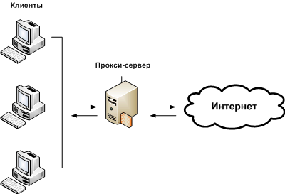
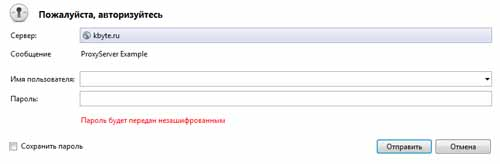

# Разработка прокси-сервера на C#

Прокси-сервера позволяют организовывать передачу данных между клиентами, другими серверами и сетевыми службами.

Прокси-сервера можно использовать для распределения доступа в Интернет в локальных сетях, для учета и обработки трафика, для отладки сетевых приложений, да и много еще для чего.

В этой статье пойдет речь о создании собственного **HTTP** прокси-сервера при помощи языка программирования **C#**, с использованием сокетов.

## Введение

Прокси-сервера бывают прямые (**forward**) и обратные (**reverse**).

Прямые прокси-сервера являются связующим звеном между клиентом и другими серверами, и напрямую передают запросы клиента в сеть и обратно клиенту.

Обратные прокси-сервера используются для распределения нагрузки в сети и позволяют ретранслировать запросы клиента на множество серверов в рамках одной сети. 

Когда все клиентские запросы и ответы на них проходят через прокси-сервер, это дает большие возможности по обработке и анализу трафика.

Можно подменять трафик, удалять потенциально опасное содержимое, или напротив, добавлять такое содержимое, блокировать запросы к нежелательным ресурсам.

Можно сжимать данные, или сохранять результаты запросов в память (кешировать) для экономии трафика.

При помощи прокси-сервера, можно вести учет объемов передаваемых данных, чтобы знать, кому предъявлять счет за перерасход ценных мегабайт или пинать за падение скорости сетевого соединения.

Используя прокси-сервер на локальном компьютере, можно производить отладку сетевых приложений или сайтов.

В Интернете можно использовать прокси-сервер для реализации анонимного доступа к сайтам.

Работают прокси-сервера достаточно просто.

Прокси-сервер, по сути это обычная программка, которая прослушивает определенный порт или несколько портов, и производит некие действия, в зависимости от полученных команд.

Например, если пользователь использует прокси-сервер для интернет-серфинга (просмотра интернет-страниц), то браузер пользователя передает HTTP-запрос прокси-серверу, а прокси-сервер передает этот запрос в Интернет, получает ответ и возвращает обратно браузеру пользователя.



В Интернете существует множество протоколов, но наиболее популярный из них – **HTTP**.

Прокси-сервера могут работать с одним или несколькими видами протоколов, но в этой статье мы займемся разработкой прямого **HTTP** прокси-сервера.

## Прокси-сервер – это просто!

Для создания прокси-сервера лучше всего использовать проект типа «**Консольное приложение Windows**».

Проект можно назвать, например «**ProxyServer**» (заметьте, очень оригинальное название).

Как я уже говорил, прокси-сервер должен прослушивать определенный порт.

Для прослушивания порта можно использовать стандартный класс **.NET Framework**, с вполне логичным названием, `TcpListener`.

При инициализации, класс `TcpListener` принимает два параметра: IP-адрес и порт, который нужно прослушивать.

На локальной машине IP-адрес будет `127.0.0.1`, в качества порта можно использовать любой свободный, у меня это будет порт `8888`.

```c#
TcpListener myTCP = new TcpListener(IPAddress.Parse("127.0.0.1"), 8888);
```

> [!NOTE]
> Для использования класс `TcpListener` потребуется импортировать пространства имен `System.Net` и `System.Net.Sockets`.

Чтобы запустить процесс прослушивания, нужно вызвать метод `Start`.

```c#
myTCP.Start();
```

Правда, после этого выполнение программы скорей всего завершится, ведь у нас консольное приложение.

Чтобы этого не произошло, нужно создать бесконечный цикл.

Программа не зависнет и не будет нагружать процессор, в отличие, например, от приложений типа **Windows Forms**.

```c#
while (true)
{
}
```

В теле цикла у нас будет размещен основной код, который будет принимать запросы от клиента и обрабатывать их.

Для определения наличия в очереди запросов служит функция `Pending` класса `TcpListener`.

```c#
if (myTCP.Pending())
{
 // запрос есть
}
```

Если запрос есть, то можно создать сокет, через который будет получено содержимое запроса и, в последующем, отправлен обратный ответ.

```c#
using (Socket myClient = myTCP.AcceptSocket())
{
}
```

> [!NOTE]
> Для создания сокета я использовал конструкцию `using`, весь последующий код будет находиться именно в этом блоке.

Чтобы прочитать запрос клиента, сокет необходимо открыть.

```c#
if (myClient.Connected)
{
}
```

Теперь, можно получить ответ в виде массива байт.

Массив байт необходимо использовать, т.к. в запросах могут содержаться бинарные данные, чтобы не нарушить их целостность.

В процессе разработки приложения потребуется ни один раз получать данные из открытого сокета, поэтому имеет смысл сделать отдельную функцию для этого.

Функция будет принимать экземпляр сокета и возвращать полученный ответ в виде массива байт.

```c#
private static byte[] ReadToEnd(Socket mySocket)
{
  byte[] b = new byte[mySocket.ReceiveBufferSize];
  int len = 0;

  using (MemoryStream m = new MemoryStream())
  {
    while (mySocket.Poll(1000000, SelectMode.SelectRead) && (len=mySocket.Receive(b, mySocket.ReceiveBufferSize, SocketFlags.None)) > 0)
    {
      m.Write(b, 0, len);
    }

    return m.ToArray();
  }
}
```

> [!NOTE]
> Для использования класса `MemoryStream` потребуется импортировать пространство именно `System.IO`.

Используя функцию `ReadToEnd` можно получить содержимое запроса клиента.

```c#
byte[] httpRequest = ReadToEnd(myClient);
```

Затем нужно перенаправить запрос на указанный сервер.

Информация о том, на какой именно сервер нужно направить запрос находится в HTTP-заголовках запроса.

HTTP-заголовки представляют из себя текст строго определенного формата, который отделяется от основного содержимого первым вхождением двух символов перевода строки (`\r\n\r\n`, или `CR LF CR LF`, или `13 10 13 10`).

Нас интересуют не все заголовки, а только один – `Host`, который можно найти при помощи регулярных выражений.

Поскольку запрос клиента хранится в массиве байт, а регулярные выражения работают только с текстом, данные нужно преобразовать в текст при помощи функции `GetString` класса `System.Text.Encoding`.

Но прежде чем искать хост, нужно учесть один нюанс.

По умолчанию, все HTTP-запросы идут на `80` порт, который обычно опускается в параметре `Host`.

Однако, если запрос будет делаться на отличный от `80` порт, то номер порта будет указан после хоста, через двоеточие (`:`).

Нам потребуется направлять запрос на тот порт, который указан в запросе, иначе удаленный сервер его просто не примет.

Помимо этого, нам нужно будет преобразовать хост в IP-адрес, а если в хосте будет находиться номер порта, то это приведет к возникновению исключения.

Поэтому, шаблон регулярного выражения должен позволять отдельно выделять хост и порт.

```c#
Regex myReg = new Regex(@"Host: (((?<host>.+?):(?<port>\d+?))|(?<host>.+?))\s+", RegexOptions.Multiline | RegexOptions.IgnoreCase);
Match m = myReg.Match(System.Text.Encoding.ASCII.GetString(httpRequest))
string host = m.Groups["host"].Value;
int port = 0;

if (!int.TryParse(m.Groups["port"].Value, out port)) { port = 80; }
```

> [!NOTE]
> Для работы с регулярными выражениями потребуется импортировать пространство имен `System.Text.RegularExpressions`.

Получить IP-адрес по хосту можно при помощи класса `Dns`.

```c#
IPHostEntry myIPHostEntry = Dns.GetHostEntry(host);
```

Затем, на основе полученного IP-адреса и номера порта можно создать сетевую точку доступа.

```c#
IPEndPoint myIPEndPoint = new IPEndPoint(myIPHostEntry.AddressList[0], port);
```

И собственно, открыть еще один сокет, который направит полученный от клиента запрос на удаленный сервер.

```c#
using (Socket myRerouting = new Socket(AddressFamily.InterNetwork, SocketType.Stream, ProtocolType.Tcp))
{
  myRerouting.Connect(myIPEndPoint);

  if (myRerouting.Send(httpRequest, httpRequest.Length, SocketFlags.None) != httpRequest.Length)
  {
    Console.WriteLine("При отправке данных удаленному серверу произошла ошибка...");
  }
  else
  {
    // здесь будет код получения ответа от удаленного сервера
  }
}
```

Ответ сервера можно получить при помощи нашей функции ReadToEnd.

1
byte[] httpResponse = ReadToEnd(myRerouting);
И перенаправить его клиенту.

1
myClient.Send(httpResponse, httpResponse.Length, SocketFlags.None);
Всё, прокси-сервер готов! Чтобы проверить, как он работает, и работает ли вообще, достаточно запустить созданное приложение (лучше в режиме отладки, F5), в настройках интернет-обозревателя указать адрес прокси-сервера (127.0.0.1) и номер порта (8888), и открыть какую-нибудь интернет-страничку. Если страничка загрузится, значит программа работает.

> [!NOTE]
> Перед использованием программы, убедитесь, что ваш брандмауэр (файрвол или антивирус) не блокирует прокси-сервер и/или прослушиваемый порт.

> [!NOTE]
> Данный прокси-сервер умеет работать только с протоколом **HTTP**, получить доступ к сайтам по протоколу **HTTPS** не получится.

Конечно, это довольно простой прокси-сервер, в котором даже нет обработчика ошибок, не говоря уже о том, что он будет захлебываться при большом количестве запросов.

Если вам нужно что-то большее, переходите к следующей части статьи.

## Улучшение прокси-сервера

### Многопоточность

В созданном нами прокси-сервере запросы обрабатываются последовательно и, при большом количестве запросов, скорость сетевого соединения для клиентов будет казаться медленной.

Чтобы исключить появление таких необоснованных лагов нужно реализовать многопоточность.

Проще всего для этого использовать класс `Thread` (а не асинхронные сокеты).

Для этого достаточно поместить тело условия проверки очереди запросов (`myTCP.Pending`) в отдельный метод, например `ExecuteRequest`, который будет принимать сокет (`myClient`).

```c#
private static void ExecuteRequest(object arg)
{
  Socket myClient = (Socket)arg;
  if (myClient.Connected)
  {
    byte[] httpRequest = ReadToEnd(myClient);
    Regex myReg = new Regex(@"Host: (((?<host>.+?):(?<port>\d+?))|(?<host>.+?))\s+", RegexOptions.Multiline | RegexOptions.IgnoreCase);
    Match m = myReg.Match(System.Text.Encoding.ASCII.GetString(httpRequest));
    string host = m.Groups["host"].Value;
    int port = 0;

    if (!int.TryParse(m.Groups["port"].Value, out port)) { port = 80; }

    IPHostEntry myIPHostEntry = Dns.GetHostEntry(host);
    IPEndPoint myIPEndPoint = new IPEndPoint(myIPHostEntry.AddressList[0], port);

    using (Socket myRerouting = new Socket(AddressFamily.InterNetwork, SocketType.Stream, ProtocolType.Tcp))
    {
      myRerouting.Connect(myIPEndPoint);

      if (myRerouting.Send(httpRequest, httpRequest.Length, SocketFlags.None) != httpRequest.Length)
      {
        Console.WriteLine("При отправке данных удаленному серверу произошла ошибка...");
      }
      else
      {
        byte[] httpResponse = ReadToEnd(myRerouting);
        myClient.Send(httpResponse, httpResponse.Length, SocketFlags.None);
      }
    }
  }
}
```

И запускать каждый запрос в новом потоке.

```c#
while (true)
{
  if (myTCP.Pending())
  {
    Thread t = new Thread(ExecuteRequest);
    t.IsBackground = true;
    t.Start(myTCP.AcceptSocket());
  }
}
```

> [!NOTE]
> Для работы с классом `Thread` необходимо импортировать пространство имен `System.Threading`.

Теперь программа сможет обрабатывать большее число запросов за короткий промежуток времени.

### Объектное представление HTTP

Для упрощения обработки запросов клиентов и ответов удаленных серверов, можно сделать дополнительный набор классов.

Каждый **HTTP** запрос состоит из заголовков и содержимого.

Основной класс, который мы сделаем, будет отделять заголовки от содержимого и предоставлять хелпер-функции для упрощенной работы с данными.

Назовем этот класс `Parser`.

```c#
public class Parser
{
}
```

У класса будет три группы свойств. Первая группа – общая для протокола **HTTP**.

```c#
public byte[] Source { get; set; }
public string HTTPVersion { get; set; }
```

Вторая группа – для HTTP-запросов.

```c#
public string Method { get; set; }

public string Path { get; set; }
```

А третья – для HTTP-ответов.

```c#
public int StatusCode { get; set; }
public string StatusMessage { get; set; }
```

Класс будет иметь один конструктор, который должен принимать массив байт, содержащий либо запрос клиента, либо ответ удаленного сервера.

```c#
public Parser(byte[] source)
{
  this.Source = source;
}
```

Все бы хорошо, но заголовки имеют текстовой формат, а следовательно полученные данные нужно преобразовать в текст.

Для этого можно сделать отдельную функцию, чтобы в будущем иметь больший контроль над преобразованием данных в текст.

```c#
public string GetSourceAsString()
{
 return Encoding.ASCII.GetString(_Source);
}
```

В конструкторе будет происходить обработка заголовков и заполнение, на основе полученных данных, свойств текущего экземпляра класса.

В первой строке HTTP-заголовков содержится информация о запросе, либо об ответе.

Зная это, можно выделить из текста первую строку.

```c#
string sourceString = this.GetSourceAsString();
string httpInfo = sourceString.Substring(0, sourceString.IndexOf("\r\n"));
```

У HTTP-запросов первое слово – это тип (метод) запроса, который чаще имеет значение **GET**, либо **POST**.
Затем идет адрес страницы, на который выполняется запрос.
И в самом конце указывается версия протокола **HTTP**. Например:

```http
GET http://kbyte.ru/ HTTP/1.0
```

Проверить является строка HTTP-запросом и выделить необходимые данные можно при помощи регулярных выражений.

```c#
Regex myReg = new Regex(@"(?<method>.+)\s+(?<path>.+)\s+HTTP/(?<version>[\d\.]+)", RegexOptions.Multiline);
```

Если шаблон регулярного выражения сработает, то можно в текущий экземпляр класса поместить найденную информацию о запросе.

```c#
if (myReg.IsMatch(httpInfo))
{
  Match m = myReg.Match(httpInfo);
  This.Method = m.Groups["method"].Value.ToUpper();
  this.Path = m.Groups["path"].Value;
  this.HTTPVersion = m.Groups["version"].Value;
}
```

А если шаблон не сработает, то с большой долей вероятности можно сказать, что это HTTP-ответ.

В ответах первое слово указывает на протокол – **HTTP**, затем идет версия протокола, числовой код состояния сервера и текстовое пояснение к коду состояния.

Например:

```http
HTTP/1.1 200 OK
```

Для обработки HTTP-ответов нужен другой шаблон регулярного выражения.

```c#
else
{
  myReg = new Regex(@"HTTP/(?<version>[\d\.]+)\s+(?<status>\d+)\s*(?<msg>.*)");
  Match m = myReg.Match(httpInfo);
  int.TryParse(m.Groups["status"].Value, out this.StatusCode);
  this.StatusMessage = m.Groups["msg"].Value;
  this.HTTPVersion = m.Groups["version"].Value;
}
```

Затем можно получить сами заголовки и их значения.

Напомню, что заголовками считается весь текст до первого вхождения парных символов перевода каретки, позицию которых можно найти и записать в целочисленную переменную доступную на уровне всего класса (пригодится в будущем).

```c#
private int _HeadersTail = -1;
```

```c#
_HeadersTail = sourceString.IndexOf("\r\n\r\n");

if (_HeadersTail != -1)
{
  sourceString = sourceString.Substring(sourceString.IndexOf("\r\n") + 2, _HeadersTail - sourceString.IndexOf("\r\n") - 2);
}
```

> [!NOTE]
> Переменная `_HeadersTail` должна находиться за пределами конструктора в классе `Parser` (например, сразу в начале кода класса (`class Parser { private int _HeadersTail = -1; public Parser() {} }`). Остальной код указывается в конструкторе класса `Parser`.

Отделив заголовки от содержимого, можно их разбить на пару ключ-значение при помощи регулярных выражений.

Чтобы в будущем было удобней работать с классом и заголовками, лучше создать для некоторых типов ключей отдельные классы.

Базовый класс – `ItemBase`, будет использоваться по умолчанию для хранения строковых значений параметров.

```c#
public class ItemBase
{
  public string Source { get; set; }

  public ItemBase(string source)
  {
    this.Source = source;
  }
}
```

Если вы помните, в первой части статьи нам приходилось парсить хост и номер порта, теперь это можно сделать в отдельном классе (`ItemHost`), у которого будет два свойства – `Host` и `Port`, а процесс поиска значений для этих свойств будет производиться в конструкторе класса.

```c#
public class ItemHost : ItemBase
{
  public string Host { get; set; }
  public int Port { get; set; }

  public ItemHost(string source) : base(source)
  {
    Regex myReg = new Regex(@"^(((?<host>.+?):(?<port>\d+?))|(?<host>.+?))$");
    Match m = myReg.Match(source);
    this.Host = m.Groups["host"].Value;
    if (!int.TryParse(m.Groups["port"].Value, out this.Port)) this.Port = 80;
  }
}
```

Еще один ключ, который потребуется для анализа полученного от удаленного сервера содержимого и его модификации – `Contet-Type`.

Этот заголовок содержит информацию о типе содержимого, а также кодировку.

У класса реализующего этот заголовок будет два свойства: `Value` (тип содержимого) и `Charset` (кодировка).

Обработка данных и заполнение свойств, будет производиться в конструкторе.

```c#
public class ItemContentType : ItemBase
{

  public string Value { get; set; }
  public string Charset { get; set; }

  public ItemContentType(string source) : base(source)
  {
    if (String.IsNullOrEmpty(source)) return;

    // ищем в источнике первое вхождение точки с запятой
    int typeTail = source.IndexOf(";");

    if (typeTail == -1)
    { // все содержимое источника является информацией о типа
      this.Value = source.Trim().ToLower();
      return; // других параметров нет, выходим
    }

    this.Value = source.Substring(0, typeTail).Trim().ToLower();

    // парсим параметры
    string p = source.Substring(typeTail + 1, source.Length - typeTail - 1);
    Regex myReg = new Regex(@"(?<key>.+?)=((""(?<value>.+?)"")|((?<value>[^\;]+)))[\;]{0,1}", RegexOptions.Singleline);
    MatchCollection mc = myReg.Matches(p);

    foreach (Match m in mc)
    {
      if (m.Groups["key"].Value.Trim().ToLower() == "charset")
      {
        this.Charset = m.Groups["value"].Value;
      }
    }
  }
}
```

Теперь в наш основной класс, `Parser`, можно добавить свойство, содержащее именованную коллекцию `ItemBase`.

```c#
public Dictionary<string, ItemBase> Items { get; set; }
```

И, вернувшись к коду конструктора класса Parser, при помощи регулярных выражений, заполнить коллекцию HTTP-заголовками.

```c#
this.Items = new Dictionary<string, ItemBase>(StringComparer.CurrentCultureIgnoreCase);
myReg = new Regex(@"^(?<key>[^\x3A]+)\:\s{1}(?<value>.+)$", RegexOptions.Multiline);
MatchCollection mc = myReg.Matches(sourceString);
foreach (Match mm in mc)
{
  string key = mm.Groups["key"].Value;

  if (!this.Items.ContainsKey(key))
  {
    // если указанного заголовка нет в коллекции, добавляем его
    // в зависимости от типа
    if (key.Trim().ToLower() == "host")
    {
      this.Items.Add (key, new ItemHost(mm.Groups["value"].Value.Trim("\r\n ".ToCharArray())));
    }
    else if (key.Trim().ToLower() == "content-type")
    {
      this.Items.Add (key, new ItemContentType(mm.Groups["value"].Value.Trim("\r\n ".ToCharArray())));
    }
    else
    {
      this.Items.AddItem(key, new ItemBase(mm.Groups["value"].Value.Trim("\r\n ".ToCharArray())));
    }
  }
}
```

Вот и все, основной класс почти готов. Для еще большего упрощения работы с ним, можно добавить несколько вспомогательных функций и свойств.

Пара свойств - `Host` и `Port`, которые позволят легко получать доступ к имени хоста и номеру порта, содержащихся в заголовке с именем `Host`.

```c#
public string Host
{
  get
  {
    if (!this.Items.ContainsKey("Host")) return String.Empty;

    return ((ItemHost)this.Items["Host"]).Host;
  }
}

public int Port
{
  get
  {
    if (!this.Items.ContainsKey("Host")) return 80;

    return ((ItemHost)this.Items["Host"]).Port;
  }
}
```

Одна из хелпер-функций будет возвращать содержимое запроса/ответа.

Если помните, на уровне класса `Parser` мы сделали переменную с именем `_HeadersTail`, которая содержит границу конца HTTP-заголовков, по которой теперь можно легко выделить содержимое.

Но здесь нужно учитывать, что данные могут быть сжаты, и без декомпрессии обработать их не получится.

Информация о сжатии находится в заголовке `Content-Encoding`.

Произвести декомпрессию можно при помощи стандартных методов **.NET Framework**.

```c#
public byte[] GetBody()
{
  // хвоста нет, значит тела тоже нет
  if (_HeadersTail == -1) return null;

  // выделяем тело, начиная с конца хвоста
  byte[] result = new byte[this.Source.Length -_HeadersTail - 4];
  Buffer.BlockCopy(this.Source, _HeadersTail + 4, result, 0, result.Length);

  // тело может быть сжато, проверяем так это или нет
  if (this.Items != null && this.Items.ContainsKey("Content-Encoding") && this.Items["Content-Encoding"].Source.ToLower() == "gzip")
  {
    // если данные сжаты, то разархивируем их
    GZipStream myGzip = new GZipStream(new MemoryStream(result), CompressionMode.Decompress);
    using (MemoryStream m = new MemoryStream())
    {
      byte[] buffer = new byte[512];
      int len = 0;

      while ((len = myGzip.Read(buffer, 0, buffer.Length)) > 0)
      {
        m.Write(buffer, 0, len);
      }

      result = m.ToArray();
    }
  }

  // возвращаем результат
  return result;
}
```

> [!NOTE]
> Для работы со сжатыми данными необходимо импортировать пространство имен `System.IO.Compression`.

Как видите, функция `GetBody` возвращает массив байт, что может быть неудобно, если содержимое имеет текстовой тип данных.

Но нам ничто не мешает написать дополнительную функцию для текстовых данных.

Эта функция будет использовать первую функцию (`GetBody`) для получения содержимого, и преобразовывать полученный массив байт в текст.

```c#
public string GetBodyAsString()
{
  Encoding e = Encoding.UTF8;

  // если есть тип содержимого, то может есть и кодировка
  if (this.Items != null && this.Items.ContainsKey("Content-Type") && !String.IsNullOrEmpty(((ItemContentType) this.Items["Content-Type"]).Charset))
  {
     // кодировка есть, используем её при декодировании содержимого
     try
     {
       e = Encoding.GetEncoding(((ItemContentType)this.Items["Content-Type"]).Charset);
     }
     catch { }
  }

  return e.GetString(GetBody());
}
```

Если нам потребуется изменять содержимое, то проще всего это делать с оригинальными данными, т.е. теми данными, которые находятся в текущем экземпляре класса `Parser`.

Но следует учитывать, что при изменении содержимого может потребоваться, также изменить значения некоторых заголовков, главным образом `Content-Length`, который содержит информацию об объме передаваемых данных.

Поэтому, функция для изменения содержимого должна не только найти в оригинальных данных текст и заменить его, но и обновить значения заголовка `Content-Length`.

```c#
public void SetStringBody(string newBody)
{
  if (this.StatusCode <= 0)
  {
    throw new Exception("Можно изменять только содержимое, полученное в ответ от удаленного сервера."); 
  }

  Encoding e = Encoding.UTF8;
  string result = String.Format("HTTP/{0} {1} {2}", this.HTTPVersion, this.StatusCode, this.StatusMessage);

  foreach (string k in this.Items.Keys)
  {
    ItemBase itm = this.Items[k];
    if (!String.IsNullOrEmpty(result)) result += "\r\n";
    if (k.ToLower() == "content-length")
    {
      // информация о размере содержимого, меняем
      result += String.Format("{0}: {1}", k, newBody.Length);
    }
    else if (k.ToLower() == "content-encoding" && itm.Source.ToLower() == "gzip")
    {
      // если оригинальное содержимое сжато, то пропускаем этот заголовок, т.к. у нас обратного сжатия нет (но можно сделать, если нужно)
    }
    else
    {
      // другие заголовки оставляем без изменений
      result += String.Format("{0}: {1}", k, itm.Source);

      // если это тип содержимого, то смотрим, может есть информация о кодировке
      if (k.ToLower() == "content-type" && !String.IsNullOrEmpty(((ItemContentType)this.Items["Content-Type"]).Charset))
      {
        // кодировка есть, используем её при кодировании содержимого
        try
        {
          e = Encoding.GetEncoding(((ItemContentType)this.Items["Content-Type"]).Charset);
        }
        catch { }
      }
    }
  }

  result += "\r\n\r\n";

  // добавляем тело
  result += newBody;

  // переносим в источник
  this.Source = e.GetBytes(result);
}
```

Теперь код перенаправления запросов клиента будет более простым и понятным.

```c#
private static void ExecuteRequest(object arg)
{
  using (Socket myClient = (Socket)arg)
  {
    if (myClient.Connected)
    {
      byte[] httpRequest = ReadToEnd(myClient);
      Parser http = new Parser(httpRequest);

      if (http.Items == null || http.Items.Count <= 0 || !http.Items.ContainsKey("Host"))
      {
        Console.WriteLine("Получен запрос {0} байт, заголовки не найдены.", httpRequest.Length);
      }
      else
      {
        Console.WriteLine("Получен запрос {0} байт, метод {1}, хост {2}:{3}", httpRequest.Length, http.Method, http.Host, http.Port);

        IPHostEntry myIPHostEntry = Dns.GetHostEntry(http.Host);

        if (myIPHostEntry == null || myIPHostEntry.AddressList == null || myIPHostEntry.AddressList.Length <= 0)
        {
          Console.WriteLine("Не удалось определить IP-адрес по хосту {0}.", http.Host);
        }
        else
        {
          IPEndPoint myIPEndPoint = new IPEndPoint(myIPHostEntry.AddressList[0], http.Port);

          using (Socket myRerouting = new Socket(AddressFamily.InterNetwork, SocketType.Stream, ProtocolType.Tcp))
          {
            myRerouting.Connect(myIPEndPoint);

            if (myRerouting.Send(httpRequest, httpRequest.Length, SocketFlags.None) != httpRequest.Length)
            {
              Console.WriteLine("При отправке данных удаленному серверу произошла ошибка...");
            }
            else
            {
              byte[] httpResponse = ReadToEnd(myRerouting);
              myClient.Send(httpResponse, httpResponse.Length, SocketFlags.None);
            }
          }
        }
      }

      myClient.Close();
    }
  }
}
```

И самое главное, теперь можно без проблем расширить функционал прокси-сервера.

### Изменение содержимого

Наш прокси-сервер делает обычное перенаправление запросов клиента и передает полученный ответ без изменений.

Иногда сайты могут возвращать ошибки, например: «Страница не найдена», «Сервер не доступен» и т.п.

Мы можем все это дело обрабатывать и отдавать клиенту информацию об ошибках в отличном от полученного виде.

Для этого нужно передать ответ удаленного сервера в созданный нами HTTP-парсер (экземпляр класса `Parser`) и посмотреть какой код состояния он вернул (свойства `StatusCode`).

```c#
Parser httpResponse = new Parser(ReadToEnd(myRerouting));

switch (httpResponse.StatusCode)
{
  case 404:
    httpResponse.SetStringBody("<h1>Ай-ай-ай! Страница не найден! Совсем не найден!</h1>");
    break;

  case 500:
    httpResponse.SetStringBody("<div style='color:red'>С прискорбием сообщаю, что сервер вернул совершенно необоснованную и абсолютно не понятную ошибку.</div>");
    break;

  default:
    break;
}

// отправляем ответ клиенту
myClient.Send(httpResponse.Source, httpResponse.Source.Length, SocketFlags.None);
```

Таким образам, если удаленный сервер вернет ошибку с кодом `404` (страница не найдена) или `500` (общая ошибка сервера), то наша программа передаст клиенту наш текст.

В остальных случаях, программа оставит полученные данные без изменений.


Также  можно дополнять оригинальные данные или изменять их частично.

Например, можно добавить к заголовку страницы слово «ProxyServer».

```c#
// копируем оригинальное содержимое
string body = httpResponse.GetBodyAsString();

// меняем заголовок страницы
body = Regex.Replace(body, "<title>(?<title>.*?)</title>", "<title>ProxyServer - $1</title>");

// вставляем измененное содержимое обратно
httpResponse.SetStringBody(body);

// отправляем клиенту
myClient.Send(httpResponse.Source, httpResponse.Source.Length, SocketFlags.None);
```


### Блокировка запросов

Прокси-сервер можно использовать для ограничения доступа к различным сайтам.

Например, к социальным сетям, таким как: «Одноклассники», «Вконтакте», «Facebook» и т.п.

Реализовать это можно путем создания черного списка доменных имен и проверки свойства `Host` экземпляра класса `Parser`, созданного на основе данных, полученных от клиента.

```c#
private static string[] _BlackList = { "vkontakte.ru", "vk.com", "odnoklassniki.ru", "facebook.com" };

if (_BlackList != null && Array.IndexOf(_BlackList, http.Host.ToLower()) != -1)
{
  byte[] response = Encoding.ASCII.GetBytes("HTTP/1.1 403 Forbidden\r\nContent-Type: text/html\r\nContent-Length: 19\r\n\r\nDostup zapreschen!");
  myClient.Send(response, response.Length, SocketFlags.None);
  return;
}
```

В итоге, если клиент обратится к сайту с доменом `vkontakte.ru`, `vk.com`, `odnoklassniki.ru` или `facebook.com`, в его браузере появится сообщение «Dostup zapreschen!».

### Авторизация

Для ограничения доступа к прокси-серверу можно реализовать механизм авторизации.

Браузеры передают имя пользователя и пароль в HTTP-заголовке `Authorization`.

Данные кодированы в **Base64**, логин отделен от пароля символом двоеточия (`:`).

```http
имя пользователя:пароль
```

Мы можем проверять, если заголовка с именем `Authorization` в запросе клиента нет, либо если указан неверный логин или пароль, то выдавать клиенту сообщение об ошибке с кодом `401` (прокси-сервер требует авторизацию).

Чтобы браузер запросил у пользователя логин и пароль, помимо всего прочего, необходимо передать клиенту HTTP-заголовок `WWW-Authenticate`, который будет содержать информацию о методе аутентификации и дополнительное пояснение к этому.

```c#
bool allowAccess = true;

if (!http.Items.ContainsKey("Authorization"))
{
  // логин и пароль не указан
  allowAccess = false;
}
else
{
  // указан логин и пароль, проверяем
  string auth = Encoding.UTF8.GetString(Convert.FromBase64String(http.Items["Authorization"].Source.Replace("Basic ", "")));
  string login = auth.Split(":".ToCharArray())[0];
  string pwd = auth.Split(":".ToCharArray())[1];
  allowAccess = !(login != "test" || pwd != "123");
}

if (!allowAccess)
{
  // доступ запрещен
  byte[] response = Encoding.ASCII.GetBytes("HTTP/1.1 401 Unauthorized\r\nWWW-Authenticate: Basic realm=\"ProxyServer Example\"");
  myClient.Send(response, response.Length, SocketFlags.None);
  return;
}
```

Теперь, при попытке доступа к сайтам, в браузере клиента будет появляться стандартное окошко для ввода имени пользователя и пароля.



## Послесловие

Созданную программу можно разместить на сервере, как в локальной сети, так и в Интернет.

Зная адрес сервера и номер порта, клиенты смогут подключаться и бороздить просторы Всемирной паутины через прокси-сервер по протоколу **HTTP**.

При желании, в прокси-сервере можно вести учет исходящего и входящего трафика, кешировать данные, более тонко ограничивать доступ к сайтам, и управлять содержимым.

Варианты возможного функционала ограничиваются, пожалуй, лишь вашей фантазией.

Я неспроста акцентирую внимание на протоколе **HTTP**, ибо безопасные соединения осуществить в созданном нами прокси-сервере не получится.

Работа с протоколом **HTTPS** – это тема отдельной статьи, но если вы захотите реализовать поддержку этого протокола самостоятельно, то я рекомендую при переадресации запросов клиента использовать классы `HttpWebRequest` и `HttpWebResponse`, а не сокеты (в дополнение к сокетам).

В примере, который вы можете скачать ниже, реализация прокси-сервера немного отличается.

Так, например, для вывода ошибок я использовал html-шаблоны, которые хранятся в файлах и их можно легко изменять.

Аналогично, хранится в файле список доменов, к которым запрещен доступ.

Исходный код примера, как и в статье, выполнен на **C#**, однако простая версия прокси-сервера также доступна и на языке **Visual Basic .NET**.

Если у вас возникнут какие-либо вопросы, обращайтесь на форум.

**:floppy_disk: [Скачать пример к статье](assets/ProxyServer.zip)**

---
Алексей Немиро  
2011-09-12
