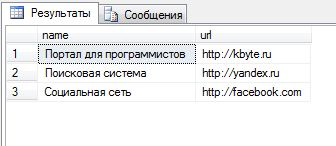
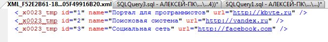
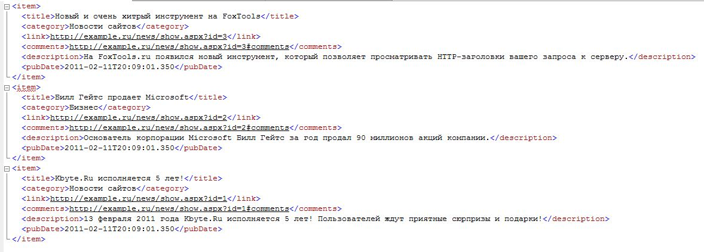
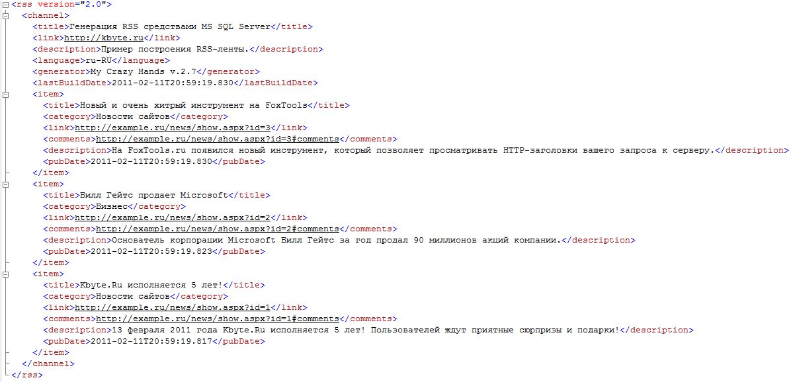

# Генерация RSS средствами MS SQL Server

**RSS** уже давно является неотъемлемой частью современного интернета, и, пожалуй, плох тот сайт, который не имеет своей ленты новостей в этом формате.

**RSS** по своей сути является обычным **XML**, со строго определенной структурой и стандартами.

**SQL Server** уже давно поддерживает работу с **XML**, а если так, то программистам вовсе необязательно генерировать RSS-ленты средствами используемых на сайтах языков программирования и технологий, поскольку это можно сделать прямо в базе дынных.

**RSS** - это формат семейства **XML** предназначенный для описания лент новостей, анонсов, статей и т.п.

За счет строго определенной структуры данных, RSS-ленты легко можно прочитать при помощи программ-агрегаторов, либо через специализированные сайты.

На сегодняшний день все популярные интернет-обозреватели имеют встроенную читалку RSS-лент.

Впервые идея создания подобного механизма предоставления информации возникла еще в 1995 году, но фактическую реализацию получала лишь в 1999 году компанией **Netscape**.

В те же годы технология **RSS** была разделена на два разных направления:

* **RDF Site Summary (RSS 0.9/1.0)** - формат основанный на **XML** и **RDF**, он не получил широкого распространения из-за своей сложности.
* **Really Simple Syndication (RSS 2.0)** – собственно, на данный момент это наиболее популярный формат предоставления информации и именно о нем будет идти речь в этой статье.

Позже, в 2006 году в качестве альтернативы **RSS**, появился формат **Atom**, основное преимущество которого заключатся в том, что помимо чтения информации, её также можно изменять и удалять.

На данный момент **Atom** активно используется в продуктах компании **Google**.

В рамках этой статьи я не буду рассказывать о спецификации формата **RSS 2.0**, он достаточно прост и приведенных примеров вполне хватит для создания полноценной ленты новостей.

Но если вы захотите познакомиться с **RSS 2.0** поближе, то подробную спецификацию можно найти на сайте: http://cyber.law.harvard.edu/rss/rss.html

## XML и SQL Server

### Чтение XML

**SQL Server**, еще с 2000 года, имеет набор стандартных средств для работы с **XML**. В частности, в базе данных можно хранить данные типа **XML**, создавать их налету и читать.

Поскольку **XML** как таковой является строкой, то для того чтобы **SQL Server** мог работать с **XML** как с набором данных, нужно ему об этом рассказать.

Сделать это можно при помощи системной хранимой процедуры `sp_xml_preparedocument`.

Процедура `sp_xml_preparedocument` создает представление указанного XML-документа (по сути, таблица) и передает его дескриптор (идентификатор, числовой код).

Последующая работа с **XML** происходит именно через дескриптор, посредствам функции `OPENXML`.

После завершения работы, документ можно удалить при помощи процедуры `sp_xml_removedocument`, хотя это делать вовсе и не обязательно, поскольку данные и так удалятся по завершению работы текущей сессии.

Чтобы было более понятно, о чем идет речь, давайте рассмотрим простой пример чтения **XML**.

```sql
DECLARE @h int;
DECLARE @data nvarchar(max);

SET @data = 
'<www>
  <site name="Портал для программистов" url="http://kbyte.ru" />
  <site name="Поисковая система" url="http://yandex.ru" />
  <site name="Социальная сеть" url="http://facebook.com" />
</www>';

exec sp_xml_preparedocument @h OUTPUT, @data;

SELECT * FROM OPENXML (@h, '/www/site')
WITH ([name] nvarchar(50), [url] nvarchar(100));

exec sp_xml_removedocument @h;
```

Как видите, у нас есть две переменные.

Переменная `@h` имеет числовой тип данных, она предназначена для хранения ссылки на дескриптор представления **XML**.

Переменная `@data` имеет строкой тип данных, которая служит для передачи **XML**.

Системная процедура `sp_xml_preparedocument` создает на основе указанных в переменной `@data` данных представление **XML** и передает в переменную `@h` ссылку на это представление.

Затем, при помощи инструкции `SELECT FROM` выводятся данные XML-документа, сформированные в функции `OPENXML`.

Первый параметр функции `OPENXML` указывает ссылку на дескриптор документа **XML**, второй параметр указывает ветку, из которой нужно провести выборку данных.

Так, в приведенном примере, берутся все элементы `site`, относящиеся к элементу `www`.

Далее, оператор `WITH` указывает имена атрибутов и выходящий тип данных, которые будут переданы в таблицу.

У нас выводятся все атрибуты: `name` типа `nvarchar(50)`, `url` типа `nvarchar(100)`.

Если, например, убрать `url`, то в выдаче просто не будет такой колонки.

Если указать неверный тип данных, то может произойти ошибка.

Если указать несуществующее имя, то в выдаче поле будет иметь значение `NULL`.

Функция `OPENXML` также может принимать и третий параметр – `flags`, который указывает на тип сопоставления, по умолчанию он имеет нулевое значение – сопоставление по атрибутам.

Именно поэтому, в указанном выше примере данные выводятся из XML-атрибутов, а не элементов.

Параметр `flasg` может принимать следующие значения:

* `0` – значение по умолчанию, как уже было сказано, будет использоваться атрибутная модель сопоставления
* `1` – приоритетно используется атрибутная модель, а сопоставление с использованием элементов на втором плане
* `2` – сопоставление с использованием элементов
* `8` – позволят выбрать метод и приоритет сопоставления

Т.е. если требуется вывести данные из элементов, то нужно использовать опцию `2`, как показано в следующем примере.

```sql
DECLARE @h int;
DECLARE @data nvarchar(max);

SET @data = 
'<www>
  <site>
    <name>Портал для программистов</name>
    <url>http://kbyte.ru</url>
  </site>
  <site>
    <name>Поисковая система</name>
    <url>http://yandex.ru</url>
  </site>
  <site>
    <name>Социальная сеть</name>
    <url>http://facebook.com</url>
  </site>
</www>';

exec sp_xml_preparedocument @h OUTPUT, @data;

SELECT * FROM OPENXML (@h, '/www/site', 2)
WITH ([name] nvarchar(50), [url] nvarchar(100));

exec sp_xml_removedocument @h;
```



Как видите, все относительно просто, хотя может быть и еще проще.

Начиная с **SQL Server 2005** появился тип данных **XML**, который позволяет обходиться без всего выше описанного.

Тип данных **XML** имеет встроенные методы, которые дают возможность работать с **XML** без создания дескрипторов.

```sql
DECLARE @data xml;

SET @data =
'<www>
  <site name="Портал для программистов" url="http://kbyte.ru" />
  <site name="Поисковая система" url="http://yandex.ru" />
  <site name="Социальная сеть" url="http://facebook.com" />
</www>';

SELECT
n.value('@name', 'nvarchar(50)') AS name,
n.value('@url', 'nvarchar(100)') AS url
FROM @data.nodes('/www/site') AS node(n)
```

В этом примере данные берутся напрямую из указанного документа при помощи метода `nodes` и каждая пачка данных передается в поле `n` (имя может быть любым) типа `node`.

Значение из конкретного атрибута берется при помощи функции `value`, которая принимает два параметра.

Первый параметр указывает имя XML-сущности, в данном случае, символ «собака» (`@`) говорит о том, что нужно получить значение из атрибута.

Использовать атрибуты достаточно просто, именно поэтому они фигурируют во всех примерах данной статьи.

Работа с элементами может показаться несколько сложной для понимания.

```sql
DECLARE @data xml;
SET @data = 
'<www>
  <site>
    <name>Портал для программистов</name>
    <url>http://kbyte.ru</url>
  </site>
  <site>
    <name>Поисковая система</name>
    <url>http://yandex.ru</url>
  </site>
  <site>
    <name>Социальная сеть</name>
    <url>http://facebook.com</url>
  </site>
</www>';

SELECT 
n.value('name[1]', 'nvarchar(50)') AS name,
n.value('url[1]', 'nvarchar(50)') AS url
FROM @data.nodes('/www/site') AS node(n)
```

В пример, каждый элемент `site` теоретически может иметь множество вложенных элементов `name` и `url`, т.е. фактически каждый из этих элементов является массивом.

Именно поэтому в квадратных скобках указывается индекс элемента, в нашем случае это единица (отсчет начинается с `1`).

Тип данных **XML** имеет та же и другие методы, такие как `query`, `exist`, `modify`, но в рамках данной статьи я их рассматривать не буду, если у вас возникнет потребность в использовании этих методов, вам всегда помогут на [форуме для программистов](http://kbyte.ru/ru/Forums?id=0).

### Выдача XML

Создавать **XML** гораздо проще чем, читать.

Во-первых, можно сгенерировать **XML** в обычной строковой переменной, как показано в следующем примере.

Собственно, так можно сделать не только в **SQL Server**, но и в других СУБД.

```sql
-- временная таблица, чтобы было на чем показывать пример
CREATE TABLE #tmp (id int identity, name nvarchar(50), url nvarchar(100));

INSERT INTO #tmp
SELECT 'Портал для программистов', 'http://kbyte.ru';
INSERT INTO #tmp
SELECT 'Поисковая система', 'http://yandex.ru';
INSERT INTO #tmp
SELECT 'Социальная сеть', 'http://facebook.com';

-- основная часть примера

DECLARE @xml AS nvarchar(1000);
SET @xml = '<www>';
SELECT @xml = @xml + '<site name="' + name + '" url="' + url + '" />' FROM #tmp;
SET @xml = @xml + '<www>';

SELECT @xml;

-- удаляем временную таблицу
DROP TABLE #tmp;
```

Во-вторых, в **SQL Server 2005** появились средства, которые позволяют буквально парой дополнительных команд превратить любую таблицу в **XML**.

Для выдачи результатов в XML-формате, в инструкции `SELECT FROM` нужно использовать команду `FOR XML`.

Эта команда умеет генерировать **XML** в нескольких режимах: `RAW`, `AUTO`, `EXPLICIT` и `PATH`.

```sql
SELECT * FROM #tmp FOR XML AUTO;
```



Режим `RAW` и `AUTO` самые простые.

`RAW` создает для каждой строки данных XML-элемент, по умолчанию, с именем `row`, где в качестве атрибутов выступают колонки таблицы.

Режим `AUTO` генерирует **XML** в зависимости от представленных данных, в нашем случае получается результат совсем далекий от ожидаемого.

Более гибкие и, соответственно, сложные режимы это `EXPLICIT` и `PATH`.

```sql
-- временная таблица, чтобы было на чем показывать пример
CREATE TABLE #tmp (id int identity, name nvarchar(50), url nvarchar(100));

INSERT INTO #tmp
SELECT 'Портал для программистов', 'http://kbyte.ru';
INSERT INTO #tmp
SELECT 'Поисковая система', 'http://yandex.ru';
INSERT INTO #tmp
SELECT 'Социальная сеть', 'http://facebook.com';

-- основная часть примера
SELECT name, url FROM #tmp FOR XML PATH('site'), ROOT('www');

-- удаляем временную таблицу
DROP TABLE #tmp;
```


В этом примере используется режим `PATH`, первый, и единственный обязательный, параметр которого содержит имя основного элемента - `site`, в который будут вложены значения полей таблицы.

Директива `ROOT` указывает имя родительской ветки – `www`.

Если требуется изменить имена элементов **XML**, то это можно сделать стандартными средствами **SQL**, т.е. путем создания алиасов (синонимов).

Символ «собаки» (`@`) в имени алиса превратит колонку в выдаче в XML-атрибут.

```sql
SELECT name AS 'the_name', url AS '@address' FROM #tmp FOR XML PATH('site'), ROOT('www');
```

## RSS 2.0 и SQL Server

Итак, мы добрались до самой главной части статьи, т.е. к построению данных в формате **RSS 2.0**.

Прежде чем продолжить, я сделаю небольшую табличку новостей, для наглядности.

```sql
CREATE TABLE news (id_news int identity, title nvarchar(255), category nvarchar(100), main_text nvarchar(max), date_created datetime);

INSERT INTO news
SELECT 'Kbyte.Ru исполняется 5 лет!', 'Новости сайтов', '13 февраля 2011 года Kbyte.Ru исполняется 5 лет! Пользователей ждут приятные сюрпризы и подарки!', GETDATE();
INSERT INTO news
SELECT 'Билл Гейтс продает Microsoft', 'Бизнес', 'Основатель корпорации Microsoft Билл Гейтс за год продал 90 миллионов акций компании.', GETDATE();
INSERT INTO news
SELECT 'Новый и очень хитрый инструмент на FoxTools', 'Новости сайтов', 'На FoxTools.ru появился новый инструмент, который позволяет просматривать HTTP-заголовки вашего запроса к серверу.', GETDATE();
```

На основе полученных знаний по работе с **XML** в **SQL Server**, для формирования **RSS 2.0** может получиться следующий код:

```sql
SELECT
-- выбираем только 10 последних новостей
TOP 10
-- я специально сделал так, на случай,
-- если у вас будут колонки называть по-другому
-- если имена совпадают с RSS (как у меня), то делать алиасы смысла нет
title AS title,
category AS category,
-- формируем ссылку на новость, примерно так
('http://example.ru/news/show.aspx?id=' + CAST(id_news AS nvarchar)) AS link, 
('http://example.ru/news/show.aspx?id=' + CAST(id_news AS nvarchar) + '#comments') AS comments,
main_text AS description,
-- дата должна быть в формате RFC822
CONVERT(varchar, date_created, 126) AS pubDate
FROM news
-- сортировка по дате 
ORDER BY date_created DESC
-- каждый блок rss должен находиться в элементе item
FOR XML PATH('item');
```



В результате выполнения этого кода получается какой-то недоделанный **RSS**.

Это связано с тем, что **RSS** создает из двух логических частей.

Первая часть содержит общую информацию об RSS-канале, а вторая часть – это тело ленты, т.е. сами новости, собственно, то, что мы с вами и получили.

В данной ситуации нужно делать несколько вложенных запросов, каждый из которых будет возвращать **XML**, которые в итоге сформируют документ в нужном формате.

```sql
-- получаем дату обновления ленты
DECLARE @lastBuildDate nvarchar(50);
SELECT TOP 1 @lastBuildDate = CONVERT(varchar, date_created, 126) FROM news ORDER BY date_created DESC;

--
SELECT 
-- добавляем номер версии в родительский элемент rss
'2.0' AS '@version',
(SELECT 
-- формируем статичную шапку RSS в соответствии со стандартами
-- здесь указаны лишь часто используемые элементы
'Генерация RSS средствами MS SQL Server' AS 'title',
'http://kbyte.ru' AS 'link',
'Пример построения RSS-ленты.' AS 'description',
'ru-RU' AS 'language',
'My Crazy Hands v.2.7' AS 'generator',
-- дату обновления можно получить отдельным вложенным запросом,
-- без использования переменной, как в моём случае
@lastBuildDate AS 'lastBuildDate',

-- формируем тело ленты и передаем в переменную @rss.
-- этот код ничем не отличается о ранее показанного,
-- просто тут уделаны все комментарии
(SELECT TOP 10 title AS title, category AS category,
('http://example.ru/news/show.aspx?id=' + CAST(id_news AS nvarchar)) AS link, 
('http://example.ru/news/show.aspx?id=' + CAST(id_news AS nvarchar) + '#comments') AS comments,
main_text AS description, CONVERT(varchar, date_created, 126) AS pubDate
FROM news ORDER BY date_created DESC 
-- тут добавлена директива TYPE, 
-- благодаря ей вложенный запрос возвращает данные 
-- в формате XML, а не строковом
FOR XML PATH('item'), TYPE)
FOR XML PATH('channel'), TYPE)
FOR XML PATH('rss');
```

Здесь создано целых три вложенных запроса.

Самый нижний формирует тело RSS-ленты.

Второй запрос создает ветку `channel`.

Третий - основную ветку `rss`.

В принципе, здесь можно было бы обойтись без третьего запроса, но дело в том, что в элемент `rss` нужно добавить атрибут с указанием версии **RSS**, чтобы у пользователей не возникало проблем при работе с RSS-каналом.

Все вложенные запросы, благодаря директиве `TYPE`, возвращают данные в формате **XML**.

Попробуйте убрать эту директиву и увидите, что вместо **XML** будет обычный текст, с заэнкоденными xml-сущностями.



Вот собственно и все.

В итоге на сайте будет всего несколько строчек кода, который будет делать запрос к **SQL Server** и выдавать пользователю в браузер готовую RSS-ленту.

По всем вопросам обращайтесь в комментарии (Kbyte.Ru), либо на форум.

---
Алексей Немиро  
2011-02-11
