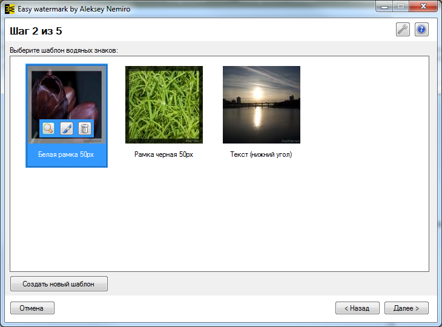

# EasyWatermark

EasyWatermark is a Windows application designed for applying watermarks to photographs and images.

The program is written in Windows Forms, C# and consists of two parts:

* EasyWatermark - GUI application
* EasyWatermarkLib - .NET library for developers

I planned to create a new major version of the project, but unfortunately, over time, work on the project was stopped because I lost interest in watermarks.

I started publishing fewer photos mostly either for [commercial use](https://www.shutterstock.com/ru/g/aleksey-nemiro?rid=262891076) or under a [CC0 license](https://pixabay.com/ru/users/alekseynemiro-2293495/).

> [!WARNING]
> Author does NOT guarantee the functionality of the presented binary files.
> Author is NOT responsible for any damage that may occur when running or using the presented binary files.

**:floppy_disk: [Download EasyWatermark v.1.30.11.2011 - full (1.26 MB)](EasyWatermark.v1.30.11.2011.zip)**  
**:floppy_disk: [Download EasyWatermark v.1.30.11.2011 - light (651 KB)](EasyWatermark.v1.30.11.2011.light.zip)**  
**:floppy_disk: [Download EasyWatermarkLib v.1.30.11.2011 (22 KB)](EasyWatermarkLib.v1.10.10.2011.zip)**

**:earth_africa: [Open homepage in WebArchive](https://web.archive.org/web/20121213175615/http://easywatermark.ru/)**

