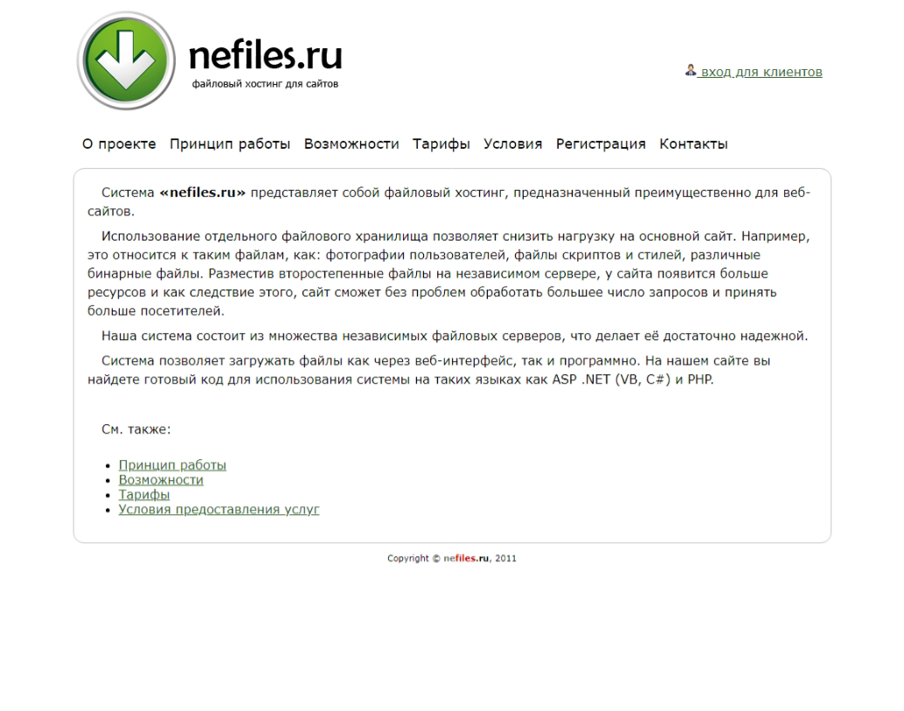

# nefiles.ru

nefiles.ru is a file storage system.

The project consisted of several parts:

* Home page - ASP.NET WebForms, VB
* Dashboard - ASP.NET WebForms, VB
* Web API - ASP.NET MVC (WebPages), VB
* Storage - ASP.NET MVC (WebPages), VB
* .NET library - C#

SQL Server DBMS was used to store metadata.

The system worked as follows:

1. Client requests an available file server.
2. Client uploads the file to an available server.

The files were located on the file system.

Each server could have a certain number of top-level folders for storing files.

Each folder could store a certain number of files.

The maximum number of folders and files could be configured.

The file system may have restrictions on the number of objects.
Previously, I solved this problem by creating a large nest of folders.
But in this project I decided to keep it simple and used only two levels (server / folder).

I had a hundred servers. Although physically it was one server.
If the need arose, the storage could easily be divided into many physical servers without disrupting the system.

I have used this file-hosting service in all my own projects.

The project was quite flexible, I also used this solution in work tasks under other brands.

**:earth_africa: [Open in WebArchive](https://web.archive.org/web/20120503194836/http://nefiles.ru/)**

