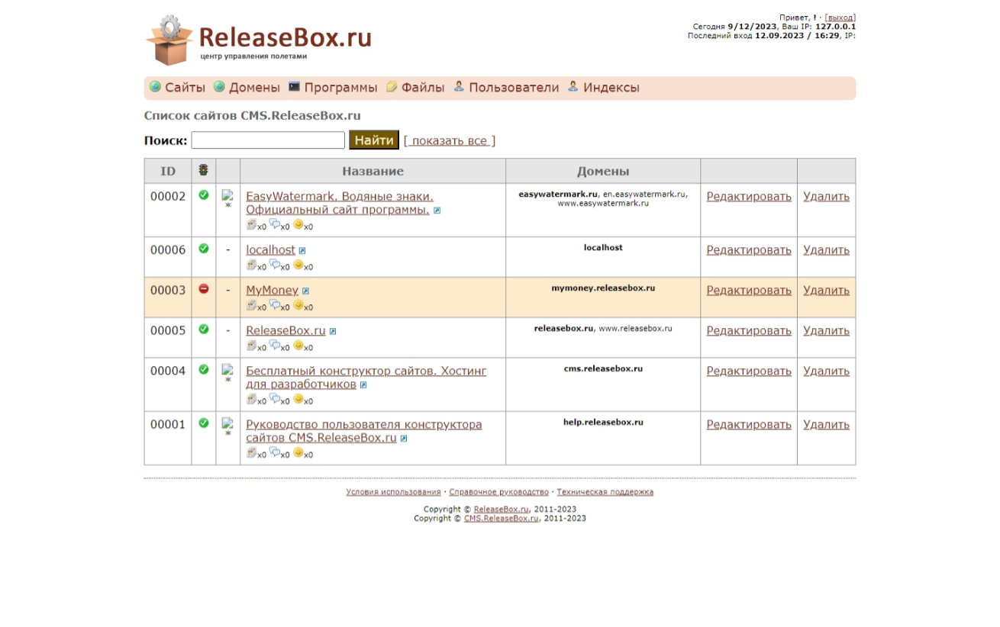
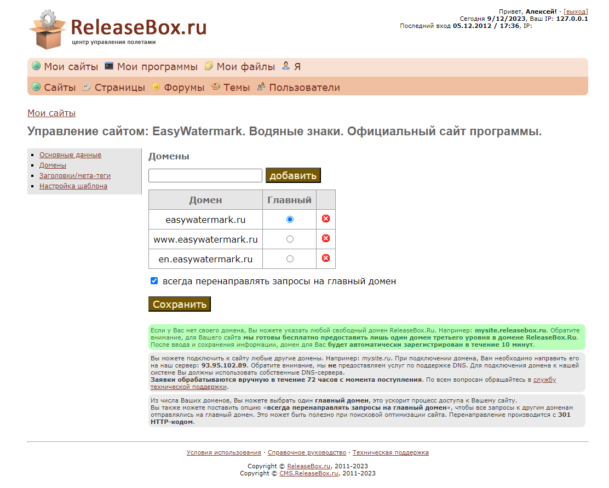
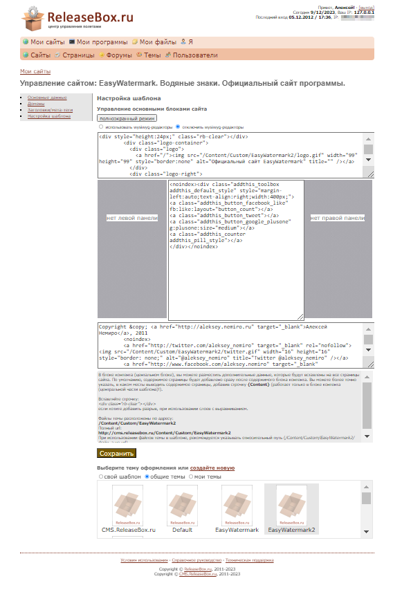

# ReleaseBox.ru

To quickly create websites for my own program, I developed the ReleaseBox.ru system.

The project was implemented in ASP.NET MVC (WebPages), C#, and SQL Server.

To manage files, I used a component created using Silverlight technology.

The project consisted of the following parts:

* Admin dashboard
* User dashboard
* Entry point - for user sites
* Unified login system - single entry point from any user domains

The following features were available to users:

* Placing own files using file storage [nefiles.ru](nefiles.md).
* Custom themes.
* Forum.
* Pages - creating an unlimited number of pages.
* Own domain names - the user could use any custom domain.
* User management.
* Integration with payment systems - the project did not play the role of an intermediary, the user could use his own configuration free of charge.

I planned to make this project publicly available and free for developers, but I got distracted by other projects and never brought the idea to completion.
However, I have successfully used ReleaseBox.ru for my own projects.

The home page for the [EasyWatermark](easywatermark.md) program was made using ReleaseBox.ru:

**:earth_africa: [Open EasyWatermark homepage in WebArchive](https://web.archive.org/web/20121213175615/http://easywatermark.ru/)**

