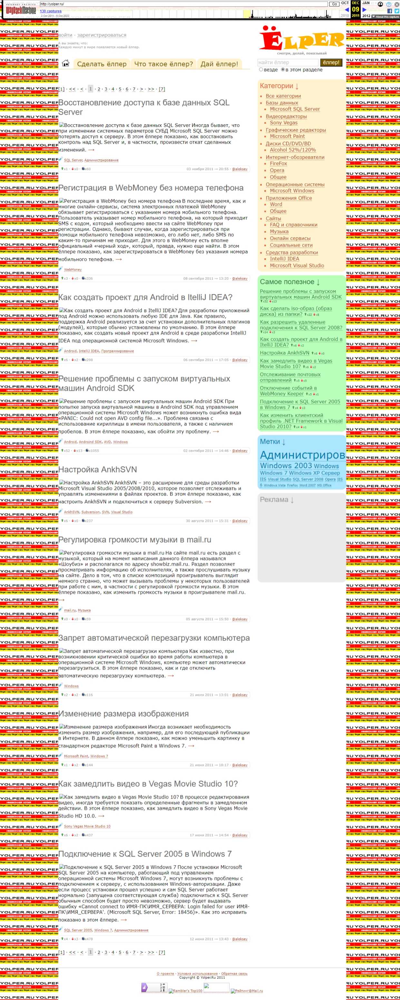

# Yolper.Ru

This is a website designed to provide simple instructions on various topics.

The project was created using ASP.NET WebForms, Visual Basic .NET, and SQL Server.

The project had the following features:

* Admin dashboard
* Registration of users and postings of user content
* Commenting service
* RSS

**:earth_africa: [Open in WebArchive](https://web.archive.org/web/20111209182245/yolper.ru)**

The project included one of my first implementations of anti-theft protection.
You can see this in the web archive and in the screenshot below.

