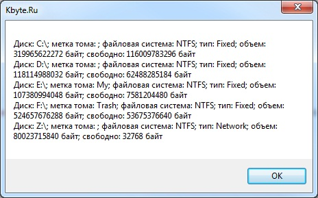

# Работа с файлами в C#

> Платформа **.NET Framework** имеет мощные средства для работы с файловой системой и позволяет достаточно легко манипулировать файлами и папками, создавать, удалять и модифицировать их.
> В этой статье речь пойдет об основах работы с файлами и папками на языке **C#**.

## Введение

Классы работы с файловой системой находятся в пространстве имен `System.IO` (сборка `mscorlib.dll`).

`IO` – сокращение от английского **Input/Output** (ввод/вывод, запись/чтение).

Пространство имен `System.IO` содержит классы для работы с каталогами и дисками, такие как: `DriveInfo`, `Directory`, `DirectoryInfo`.
Классы для работы с файлами: `File`, `FileInfo`.
Класс для работы с путями: `Path`.

Помимо этого `System.IO` содержит основные классы для работы с потоками: `Stream`, `FileStream`, `StreamReader`, `StreamWriter`, `StringReader`, `StringWriter`, `TextReader`, `TextWriter`, `BinaryReader`, `BinaryWriter` и `MemoryStream`.

В той или иной степени, в процессе своей программистской деятельности, вам придется использовать все перечисленные классы.

Но не стоит пугаться, для облегчения жизни программистов в **.NET Framework** есть специальные статичные классы, такие как `File` и `Directory`, которые имеют готовые, часто используемые функции и методы манипуляций с каталогами и файлами.

Для использования всех перечисленных классов, в проект необходимо импортировать пространство имен `System.IO`, чтобы не писать полный (длинный) путь к каждому классу.

```c#
using System.IO;
```

В этой статье я буду показывать примеры с использованием проекта типа **Windows Forms**, чтобы иметь возможность более наглядно демонстрировать результаты работы приведенных кодов.

Принцип работы с файлами и папками в разных типах проектов **.NET Framework** ничем не отличается.

## Пути

Класс `Path` позволяет формировать пути к каталогам и файлам, имеет методы для анализа имен файлов. Это очень удобный и полезный класс.

Класс `Path` работает исключительно с путями (со строками) и не производит ни каких реальных манипуляций с файлами и папками, он лишь позволяет получить все необходимое для осуществления этих действий.

Чаще всего, вам скорей всего, придется использовать функцию `Combine`, которая позволяет объединить фрагменты путей в один путь.

Например, у вас есть путь к каталогу и отдельно имя файла (или другого каталога), и вам необходимо объединить их в один путь.

Однако путь к каталогу может в конце содержать слеш, а может и не содержать, и что еще хуже, если слеш есть, то он может быть прямым (`/`) или обратным (`\`).

Все это конечно можно проверить, как показано в следующем примере:

```c#
string a = @"C:\Папка"; // или - C:\Папка\
string b = "файл.exe";

// формируем путь
string p = a;

if (!a.EndsWith("\\") && !a.EndsWith("/"))
{ // в пути "a" нет слеша, нужно добавить
  p += "\\";
}

p += b;

MessageBox.Show(String.Format("Фрагмент 1: {0}\r\nФрагмент 2: {1}\r\nРезультат объединения фрагментов: {2}", a, b, p));
```


Функция `Combine` позволяет проделать все тоже самое, но без лишнего кода.

```c#
string a = @"C:\Папка";
string b = "файл.exe";
string p = Path.Combine(a, b);

MessageBox.Show(String.Format("Фрагмент 1: {0}\r\nФрагмент 2: {1}\r\nРезультат объединения фрагментов: {2}", a, b, p));
```

В **.NET Framework 3.5** функция `Combine` может объединить лишь два фрагмента пути, а в **.NET Framework 4** количество фрагментов уже ничем не ограничивается.

```c#
string a = @"C:\Папка";
string b = "Мамка";
string c = "Ребенок.wav";
p = Path.Combine(a, b, c);

MessageBox.Show(String.Format("Фрагмент 1: {0}\r\nФрагмент 2: {1}\r\nФрагмент 3: {2}\r\nРезультат объединения фрагментов: {3}", a, b, c, p));
```

В ранних версиях **.NET Framework** такой функции вообще не было и программистам приходилось решать проблемы объединения путей самостоятельно.


Помимо этого класс `Path` имеет функции для отделения каталогов от файлов в указанном пути.

Например, у вас есть путь `C:\Каталог 1\Каталог 2\Каталог 3\Файл.exe` и вам необходимо из этого пути получить каталог и только каталог, в котором находится `Файл.exe`, т.е. `C:\Каталог 1\Каталог 2\Каталог 3`. Сделать это можно при помощи функции `GetDirectoryName`.

```c#
string a = @"C:\Каталог 1\Каталог 2\Каталог 3\Файл.exe";
string p = Path.GetDirectoryName(a);

MessageBox.Show(p);
```

А если вам необходимо получить только имя файла – `Файл.exe`, то в этом поможет функция `GetFileName`.

```c#
string a = @"C:\Каталог 1\Каталог 2\Каталог 3\Файл.exe";
string p = Path.GetFileName(a);

MessageBox.Show(p);
```

Примечательно, что функция `GetFileName` возвращает последний элемент указанного пути, который вовсе не обязан быть файлом.

Так что, если вы хотите получить имя последнего каталога пути, для этого тоже можно использовать функцию `GetFileName`.

```c#
string a = @"C:\Каталог 1\Каталог 2\Каталог 3\Файл.exe";
string b = Path.GetDirectoryName(a); // получаем путь без имени файла
string p = Path.GetFileName(b); // имя последнего каталога в пути

MessageBox.Show(p); // Каталог 3
```

Аналогично дела обстоят и с функцией `GetDirectoryName`, которая фактически возвращает путь, просто отсекая последний элемент.

При анализе имен файлов, можно пойти еще дальше и получить отдельно имя файла и расширение при помощи функций `GetExtension` и, соответственно, `GetFileNameWithoutExtension`.

```c#
string a = @"C:\Каталог 1\Каталог 2\Каталог 3\Файл.exe";
string fileName = Path.GetFileNameWithoutExtension(a);
string fileExtension = Path.GetExtension(a);

MessageBox.Show(String.Format("Путь: {0}\r\nИмя файла: {1}\r\nТип файла: {2}", a, fileName, fileExtension));
```

Каждый файл, как правило, имеет расширение (`.exe`, `.txt`, `.doc` и т.п.), по наличию которого в пути можно определить, является файл файлом или это каталог.

Для этого можно использовать функцию `HasExtension`, которая возвращает true, если в последнем элементе пути есть что-то похожее на расширение файла, в противном случае функция вернет `false`.

```c#
string a = @"C:\Каталог 1\Каталог 2\Каталог 3\Файл.exe";

if (Path.HasExtension(a))
{
  MessageBox.Show("Есть расширение, скорей всего это файл.");
}
else
{
  MessageBox.Show("Нет расширения, возможно это не файл.");
}
```

Но вообще, проверять таким способом, является путь путем к файлу или к каталогу, крайне ненадежно.

Для определения того, чем является объект можно использовать метод `GetAttributes` класса `File`, который для директорий всегда возвращает значение `FileAttributes.Directory`.

```c#
MessageBox.Show(File.GetAttributes(@"C:\Windows").ToString());
MessageBox.Show(File.GetAttributes(@"C:\Windows\notepad.exe").ToString());
```

Продолжая тему работы с расширениями файлов, класс `Path` также имеет функцию, которая позволяет изменить расширение – `ChangeExtension`, но только в пути (строке), а не физически.

Реальное изменение расширения файла можно произвести при помощи функции `Move` класса `File`, используя полученный при помощи функции `ChangeExtension` путь.

```c#
string a = @"C:\Каталог 1\Каталог 2\Каталог 3\Файл.exe";

MessageBox.Show(Path.ChangeExtension(a, ".cmd"));
```

Довольно часто возникает необходимость создавать временные файлы, для этого в **Windows** существует специальный каталог – `Temp`, путь к которому можно получить при помощи функции `GetTempPath`.

```c#
MessageBox.Show(String.Format("Путь к временному каталогу: {0}", Path.GetTempPath()));
```

Для программистов, которым лень самостоятельно придумывать имена для временных файлов, существует функция `GetTempFileName`, которая генерирует случайное имя файла и возвращает его путь.

```c#
MessageBox.Show(String.Format("Путь к вашему временному файлу: {0}", Path.GetTempFileName()));
```

Функция `GetTempFileName` возвращает путь к файлу в папке `Temp` с расширением `.tmp`.

Если вам необходимо сгенерировать случайное имя файла для использования в других каталогах, то в этом поможет другая функция – `GetRandomFileName`, которая возвращает только имя файла, без каталога.

```c#
MessageBox.Show(String.Format("Случайное имя файла: {0}", Path.GetRandomFileName()));
```

Помимо этого класс `Path` имеет функции для получения списка символов, которые запрещено использовать в именах файлов – `GetInvalidFileNameChars`, и в путях – `GetInvalidPathChars`.

Эти функции можно использовать для проверки ввода пользователем имен файлов и папок.

```c#
string badFileName = "Плохое|Хорошее имя файла.txt";
string goodFileName = "Хорошее имя файла.txt";

if (badFileName.IndexOfAny(Path.GetInvalidFileNameChars()) != -1)
{
  MessageBox.Show(String.Format("Имя файла \"{0}\" содержит недопустимые символы!", badFileName));
}
if (goodFileName.IndexOfAny(Path.GetInvalidFileNameChars()) != -1)
{
  MessageBox.Show(String.Format("Имя файла \"{0}\" содержит недопустимые символы!", goodFileName));
}
```

## Диски

Для работы с дисками предназначен класс `DriveInfo`.

Этот класс имеет всего один статичный метод – `GetDrives`, который возвращает массив дисков компьютера.

Каждый элемент массива является экземпляром класса `DriveInfo`.

```c#
StringBuilder driveList = new StringBuilder();

foreach (DriveInfo d in DriveInfo.GetDrives())
{
  if (d.IsReady) driveList.AppendLine(String.Format("Диск: {0}; метка тома: {1}; файловая система: {2}; тип: {3}; объем: {4} байт; свободно: {5} байт", d.Name, d.VolumeLabel, d.DriveFormat, d.DriveType, d.TotalSize, d.AvailableFreeSpace));
}

MessageBox.Show(driveList.ToString());
```

> [!NOTE]
> Класс `StringBuilder` принадлежит пространству имен `System.Text`, при необходимости, импортируйте его в проект.



Каждый экземпляр устройства `DriveInfo` позволяет получить дополнительную информацию о нем.

Вы можете самостоятельно создать экземпляр класса для любого доступного диска в системе.

```c#
DriveInfo d = new DriveInfo("C:");
```

Прежде чем начинать работать с каким-либо диском, необходимо проверить его доступность. Для этого предназначено свойство `IsReady`.

```c#
DriveInfo d = new DriveInfo("C:");

if (d.IsReady)
{
  MessageBox.Show("Диск готов к работе!");
}
else
{
  MessageBox.Show("Диск недоступен!");
}
```

Обратите внимание, если у вас в системе есть сетевые диски, получение информации о них может занять значительное время, на протяжении которого ваша программа может быть недоступна для пользователя (подвиснет).

Если устройство не готово к работе (например, у вас есть **CD-ROM**, но в нем нет диска), при попытке получить детальную информацию о диске произойдет исключение (ошибка).

Класс `DriveInfo` очень простой.

Букву диска можно получить в свойстве `Name`.

Свойство `VolumeLabel` содержит метку тома.

Получить информацию о файловой системе можно в свойстве `DriveFormat`.

Фактический объем диска и оставшееся свободное пространство находятся в свойствах `TotalSize` и `AvailableFreeSpace`.

Тип устройства можно узнать в свойстве `DriveType`.

Букву диска (`Name`) и его тип (`DriveType`) можно получить, даже если диск не готов к работе. Например:

```c#
StringBuilder driveList = new StringBuilder();

foreach (DriveInfo d in DriveInfo.GetDrives())
{
  driveList.AppendLine(String.Format("Диск: {0}; тип: {1}; ", d.Name, d.DriveType));
}

MessageBox.Show(driveList.ToString());
```


Отформатировать диск при помощи класса `DriveInfo` не получится. Этот класс предоставляет только информацию о конкретном устройстве.

## Каталоги

Работа с каталогами в **.NET Framework** осуществляется при помощи двух классов.

Основной класс – `DirectoryInfo`, он не имеет статичных методов и предназначен для работы с конкретными каталогами.

Второй класс – `Directory`, является вспомогательным и содержит часто используемые статичные методы, функционал которых, по сути, реализован через класс `DirectoryInfo`.

Класс `DirectoryInfo` при инициализации принимает путь к каталогу, который он реализует.
Причем можно указывать путь как к реально существующему каталогу, так и к каталогу, который еще не создан.

```c#
DirectoryInfo d = new DirectoryInfo("C:\\Новая папка");
```

Собственно, проверить существование каталога можно при помощи свойства `Exists`.

```c#
DirectoryInfo d = new DirectoryInfo("C:\\Новая папка");

if (d.Exists)
{
  MessageBox.Show("Каталог существует!");
}
else
{
  MessageBox.Show("Такого каталога еще нет!");
}
```

Если каталога нет, то его можно создать при помощи метода `Create`.

```c#
d.Create();
```

Метод `Create` может также принимать параметры безопасности создаваемого каталога.

Например, можно текущему пользователю разрешить полный доступ к каталогу, а гостю – только для чтения.

```c#
DirectoryInfo d = new DirectoryInfo("C:\\Новая папка");

DirectorySecurity ds = new DirectorySecurity();
IdentityReference u = new NTAccount(SystemInformation.UserDomainName, SystemInformation.UserName);

ds.SetOwner(u);// владелец - текущий пользователь

FileSystemAccessRule permissions = new FileSystemAccessRule(u, FileSystemRights.FullControl, AccessControlType.Allow);
ds.AddAccessRule(permissions);// полный доступ текущему пользователю

IdentityReference u2 = new NTAccount(SystemInformation.UserDomainName, "Гость");
FileSystemAccessRule permissions2 = new FileSystemAccessRule(u2, FileSystemRights.Read | FileSystemRights.ListDirectory, AccessControlType.Allow);
ds.AddAccessRule(permissions2);// гостю доступ только для чтения 

d.Create(ds);
```

> [!NOTE]
> Для проверки работы этого фрагмента кода может потребоваться импортировать пространства имен `System.Security.AccessControl` и `System.Security.Principal`.
> Также убедитесь в том, что имя гостевой учетной запись указано верно.
> В моем случае имя гостевой учетной записи – **Гость**.


Установить разрешения для уже существующей директории можно при помощи метода `SetAccessControl`.

Примечательно, что метод `Create` может создавать не только одну папку, но и все недостающие папки, указанные в пути.

Например, если путь `C:\Папка 1\Папка 2\Папка 3` и ни один из этих каталогов не существует, то будут созданы все три папки.

В существующую директорию можно запросто добавить новые папки методом `CreateSubdirectory`.

```c#
DirectoryInfo d = new DirectoryInfo(@"C:\Новая папка");

d.CreateSubdirectory("тест");
d.CreateSubdirectory("еще тест");
d.CreateSubdirectory("и еще тест");
```

Иногда возникает необходимость получить полный путь к каталогу. Для этого можно использовать свойство `FullName`.

Чтобы получить только имя текущего каталога, достаточно посмотреть в свойство `Name`.

Помимо этого, экземпляр каталога содержит ссылку на родительскую директорию в свойстве `Parent`, а также ссылку на коневую папку – `Root`.

Ссылки являются экземплярами класса `DirectoryInfo`, что дает возможность манипулировать этими каталогами.

```c#
DirectoryInfo d = new DirectoryInfo(@"C:\Новая папка\Просто папка");

MessageBox.Show(String.Format("Полный путь: {0}\r\nТекущий каталог: {1}\r\nРодитель: {2}\r\nКорневой каталог: {3}", d.FullName, d.Name, d.Parent.Name, d.Root.Name));
```


Обычного метода для изменения имени каталога в классе `DirectoryInfo` нет.

Однако директорию можно переместить в другое место методом `MoveTo`.

Этот метод, помимо перемещения каталога за тридевять земель, вполне можно использовать для изменения имени папки.

```c#
DirectoryInfo d = new DirectoryInfo(@"C:\Новая папка");
d.MoveTo(@"C:\Старая папка");
```

Для удаления каталога предназначен метод `Delete`.

Но стоит помнить, что директорию, в которой находятся вложенные папки и/или файлы просто так удалить не получится.

Удалить можно только абсолютно пустой каталог, в противном случае произойдет исключение (ошибка).

В **.NET Framework 4.0** метод `Delete` имеет дополнительный параметр, который позволяет рекурсивно удалить все вложенные в папку объекты.

```c#
DirectoryInfo d = new DirectoryInfo(@"C:\Новая папка");
d.Delete(true);
```

Получить список вложенных каталогов и файлов можно при помощи функций `GetDirectories` и `GetFiles`.

Функция `GetDirectories` возвращает массив `DirectoryInfo`, каждый элемент которого реализует вложенную папку.

Аналогично функция `GetFiles` возвращает массив файлов, где каждый элемент является экземпляром класса `FileInfo`, о котором пойдет речь в следующей части статьи.

Обе функции могут выводить как все файлы/каталоги, так и производить выборку определенных объектов по шаблону.

Например, можно вывести список файлов с расширением `.cmd`, находящихся в папке `C:\Windows\System32\`, указав шаблон поиска `*.cmd`.

```c#
DirectoryInfo d = new DirectoryInfo(@"C:\Windows\System32");
StringBuilder fileList = new StringBuilder();

foreach (FileInfo f in d.GetFiles("*.cmd"))
{
 fileList.AppendLine(f.Name);
}

MessageBox.Show(fileList.ToString());
```


Помимо этого, класс `DirectoryInfo` содержит свойства для определения даты создания каталога – `CreationTime`, даты последнего доступа к каталогу – `LastAccessTime` и дату последней модификации каталога - `LastWriteTime`.

Получить список разрешения для директории можно при помощи функции `GetAccessControl`, которая возвращает объект типа `DirectorySecurity`.

```c#
DirectoryInfo d = new DirectoryInfo(@"C:\Новая папка");
StringBuilder result = new StringBuilder();
DirectorySecurity ds = d.GetAccessControl();

foreach (FileSystemAccessRule permissions in ds.GetAccessRules(true, true, typeof(NTAccount)))
{
  result.AppendLine(String.Format("Пользователь: {0}", permissions.IdentityReference.Translate(typeof(NTAccount)).Value));
  result.AppendLine(String.Format("Права: {0}", permissions.FileSystemRights.ToString()));
  result.AppendLine();
}

MessageBox.Show(result.ToString());
```


Что касается вспомогательного класса `Directory`, то он годится для выполнения простых операций над директориями, хотя в принципе имеет все те же возможности, что и класс `DirectoryInfo`.

Класс `Directory` удобно использовать для проверки существования каталога, если больше никаких действий над этим каталогом проводить не требуется.

```c#
if (Directory.Exists(@"C:\Новая папка")) MessageBox.Show("Каталог существует!");
```

При помощи этого класса можно легко создать новую папку методом `CreateDirectory`, переместить методом `Move` или удалить - `Delete`.

```c#
Directory.CreateDirectory(@"C:\Новая папка")
Directory.Move(@"C:\Новая папка", @"C:\Старая папка");
Directory.Delete(@"C:\Старая папка", true);
```

Если же требуется выполнять множество операций над определенным каталогом, то лучше использовать для этого класс `DirectoryInfo`, поскольку каждая функция класса `Directory` выполняет все операции именно создавая экземпляры `DirectoryInfo`.

Представьте, сколько раз будет инициализироваться класс `DirectoryInfo`, если постоянно дергать методы `Directory` для одного и того же каталога.

Может получиться пустая трата ресурсов, хотя конечно, в большинстве случаев очевидных негативных последствий для производительности от этого не будет.

## Файлы

Для работы с файлами предназначены классы `FileInfo` и `File`.

Класс `FileInfo` – основной, у него нет статичных методов, в отличие от вспомогательного класса `File`, который кроме таковых ничего больше не имеет.

Класс `FileInfo` очень похож на класс `DirectoryInfo`, более того у обоих классов общий родитель – `FileSystemInfo`.
Он также имеет свойство `Exists`, для проверки существования файла.
У `FileInfo` есть метод `MoveTo`, для перемещения файла, и метод `Delete` для удаления файла, и даже метод `Create` для создания файла, хотя последний в реальных условиях используется редко.

Установка прав доступа к файлу осуществляется методом `SetAccessControl`, принцип такой же, как и у папок.

Получить список разрешений можно методом `GetAccessControl`.

Но помимо этого, у класса `FileInfo` есть свойство, содержащее размер файла в байтах – `Length`, а также свойство `IsReadOnly`, которое указывает на возможность записи данных в файл.

Из других особенностей, `FileInfo` имеет ссылку на директорию, в которой находится файл – `Directory`, ссылка представляет из себя экземпляр класса `DirectoryInfo`.

Для удобства получения имени директории, существует  вспомогательное свойство `DirectoryName`.

Для записи и чтения данных, класс `FileInfo` содержит функции: `Open`, `OpenRead`, `OpenText` и `OpenWrite`.

Большинство функций возвращают `FileStream` – поток записи или чтения.

`FileStream` позволяет записывать и считывать данные из/в файла по байтам.

```c#
FileStream fs = f.Open(FileMode.OpenOrCreate, FileAccess.Write, FileShare.Read);
byte[] data = Encoding.UTF8.GetBytes("Kbyte.Ru");
fs.Write(data, 0, data.Length);
fs.Close();
```

Обратите внимание на дополнительные параметры, с которыми открывается файловый поток.

Первый параметр указывает режим открытия файла, в данном случае `FileMode.OpenOrCreate`, что означает, что файл должен быть открыт, если он существует, либо создан новый.

Если попытаться открыть не существующий файл в режиме `FileMode.Open`, то произойдет исключение.

Аналогично, при попытке открытия файла в режиме `FileMode.Create` произойдет исключение, если такой файл уже существует.

Режим `FileMode.Append` указывает на то, что файл будет дополнен новыми данными, этот режим похож на `FileMode.OpenOrCreate`, за тем лишь исключением, что файл должен быть открыт только для записи (`FileAccess.Write`).

Собственно, для чего открывается файл указано во втором параметре, в данном случае файл открывается для записи - `FileAccess.Write`.

Помимо этого можно открывать файл для чтения – (`FileAccess.Read`) и одновременно для записи чтения и записи (`FileAccess.ReadWrite`).

Следующий параметр определяет права доступа к файлу другими приложениями.

В приведенном примере стоит разрешение на чтение файла - `FileShare.Read`.

Если полностью запретить доступ к файлу (`FileShare.None`), то другие программы не смогут открыть, прочитать и тем более что-то в него записать, пока файл не будет освобожден (закрыт) вашей программой.

Работать напрямую с экземпляром класса `FileStream` не всегда удобно, я бы даже сказал совсем неудобно, особенно с текстовыми данными.
Именно поэтому в пространстве имен `System.IO` содержится множество дополнительных классов типа `Stream` для всевозможных ситуаций.

## Работа с текстовыми файлами

Для записи текстового файла удобно использовать класс `StreamWriter`, который при инициализации может принять ссылку на открытый файловой поток (`FileStream`), а также позволяет указать кодировку и, при необходимости, размер буфера записи.

```c#
using (FileStream fs = f.Open(FileMode.OpenOrCreate, FileAccess.Write, FileShare.Read))
{
  using (StreamWriter sw = new StreamWriter(fs, Encoding.UTF8))
  {
    sw.WriteLine("Kbyte.Ru");
    sw.WriteLine("Есть вопросы? Форум ждет!");
    sw.WriteLine("http://kbyte.ru/ru/Forums?id=0");
  }
}
```

Согласитесь, приведенный выше пример выглядит гораздо понятней, чем предыдущий.

Для записи данных в классе `StreamWriter` есть два основных метода: `Write` – записывает в файл определенный набор символов и `WriteLine` – записывает в файл строку текстовых данных, разделяя каждую строку символом перевода каретки.

Инструкция `using` позволяет не писать явный код для закрытия файловых потоков и делает это автоматически, что в конечном итоге позитивно отражается на объеме кода.

Для считывания текстовых данных существует отдельный класс – `StreamReader`.

```c#
FileInfo f = new FileInfo(@"C:\Новая папка\test.txt");

using (FileStream fs = f.Open(FileMode.Open, FileAccess.Read, FileShare.ReadWrite))
{
  using (StreamReader sr = new StreamReader(fs, Encoding.UTF8))
  {
    MessageBox.Show(sr.ReadToEnd());
  }
}
```


В приведенном выше примере считывается все содержимое файла функцией `ReadToEnd`.

Если попытаться вызвать эту функцию повторно, то она вернет пустую строку, даже если в файле есть какие-либо данные.

Это связано с тем, что позиция считывания потока, после вызова функции `ReadToEnd`, переходит в конец файла, и, следовательно, в конце файла уже ничего нет.

Получить позицию считывания можно в свойстве `Position` экземпляра `FileStream`.

```c#
FileInfo f = new FileInfo(@"C:\Новая папка\test.txt");

using (FileStream fs = f.Open(FileMode.Open, FileAccess.Read, FileShare.ReadWrite))
{
  using (StreamReader sr = new StreamReader(fs, Encoding.UTF8))
  {
    MessageBox.Show(String.Format("Поизиция считывания перед вызовом ReadToEnd: {0}", fs.Position));
    MessageBox.Show(sr.ReadToEnd(), "Kbyte.Ru");
    MessageBox.Show(String.Format("Поизиция считывания после вызова ReadToEnd: {0}", fs.Position));
  }
}
```


Позицию считывания можно не только получить, но издать, причем на любой стадии работы с открытым файлом.

```c#
MessageBox.Show(sr.ReadToEnd()); // считываем файл
fs.Position = 0; // переносим курсор в начало файла
MessageBox.Show(sr.ReadToEnd()); // повторно считываем файл
```

Помимо считывания всего содержимого файла, класс `StreamReader` позволяет читать файл построчно функцией `ReadLine`, а также проводить пакетное считывание методом `Read`.

Во всех случаях, позиция (`Postition`) считывания автоматически меняется.

Определить, прочитан файл до конца или нет, можно проверив свойство `EndOfStream`, которое примет значение `true`, если курсор считывания находится в конце файла.

При использовании метода `Read`, определить конец файла можно по числу считанных байт, коих в конце будет ноль.

```c#
FileInfo f = new FileInfo(@"C:\Новая папка\test.txt");

using (FileStream fs = f.Open(FileMode.Open, FileAccess.Read, FileShare.ReadWrite))
{
  using (StreamReader sr = new StreamReader(fs, Encoding.UTF8))
  {
    StringBuilder result = new StringBuilder();
    char[] buffer = new char[31]; // читаем данные по 32 символа

    while (sr.Read(buffer, 0, buffer.Length) != 0)
    {
      result.Append(buffer);//добавляем прочитанные данные в результат
      Array.Clear(buffer, 0, buffer.Length);//очищаем буфер
    }

    MessageBox.Show(result.ToString());
  }
}
```

Функция `Read` может быть полезна при обработке файлов большого размера.

## Работа с бинарными файлами

Работа с бинарными файлами практически не отличается от работы с текстовыми, за тем лишь исключением, что доступ к бинарным файлам осуществляется побайтно, ну, и естественно, используются для этого отдельные классы.

Для записи бинарных данных предназначен класс `BinaryWriter`.

Этот класс содержит всего один основной метод – `Write`, который позволяет записать в файл указанные данные.

В качестве данных может выступать все что угодно, в самом файле данные будут записаны в виде массива байт.

Этот метод принципиально такой же, как и его собрат в классе `FileStream`, хотя и немного проще в использовании, не зря же он был сделан.

```c#
FileInfo f = new FileInfo(@"C:\Новая папка\test.dat");

using (FileStream fs = f.Open(FileMode.OpenOrCreate, FileAccess.Write, FileShare.Read))
{
  using (BinaryWriter bw = new BinaryWriter(fs))
  {
    bw.Write(new byte[] { 1, 2, 3, 4, 5, 6, 7, 8, 9, 10 });
  }
}
```

В вышеуказанном примере в файл записываются десять байт от 1 до 10. Не путать с числами. Это именно байты.

Если открыть полученный файл в текстовом редакторе, то вы скорей всего в нем ничего не увидите (в лучшем случае - абракадабру), т.к. байты от 1 до 10 не являются печатными символами.

Для считывания бинарных данных, как вы уже наверное догадались, существует класс `BinaryReader`.

У этого класса есть множество методов `Read`, предназначенных для считывания разных типов данных: `ReadBoolean`, `ReadByte`, `ReadBytes`, `ReadChar`, `ReadChars`, `ReadDecimal`, `ReadDouble`, `ReadInt16`, `ReadInt32`, `ReadInt64`, `ReadSByte`, `ReadSingle`, `ReadString`, `ReadUInt16`, `ReadUInt32` и `ReadUInt64`.

Но основной метод – это `Read`. Он похож на аналогичный метод класса `StreamReader`, за тем лишь исключением, что в качестве буфера используются не массив символов (`char`), а массив байт (`byte`).

Метод `Read` на практике применяется чаще, поэтому в этой статье я ограничусь лишь примером его использования.

```c#
FileInfo f = new FileInfo(@"C:\Новая папка\test.dat");

using (FileStream fs = f.Open(FileMode.Open, FileAccess.Read, FileShare.ReadWrite))
{
  using (BinaryReader br = new BinaryReader(fs))
  {
    int bytesRead=0;
    byte[] buffer = new byte[255];
    StringBuilder result = new StringBuilder();

    while ((bytesRead = br.Read(buffer, 0, buffer.Length)) != 0)
    {
      for (int i = 0; i <= bytesRead - 1; i++)
      {
        result.AppendFormat("{0:x2} ", buffer[i]);
      }

      Array.Clear(buffer, 0, buffer.Length);
    }

    MessageBox.Show(result.ToString());
  }
}
```


В приведенном примере размер буфера считывания равен 256 байтам, хотя это много для нашего 10-байтного файла.

Размер буфера влияет на потребление приложением оперативной памяти, а также на скорость считывания файла.

Не стоит делать размер буфера слишком большим, чтобы не нагружать компьютер, но и слишком маленьким тоже делать не нужно, чтобы пользователь не умер от старости, пока ваша программа считывает весь файл.

Размер буфера следует определять из среднего размера файлов, которые будут считываться.

Программисты чаще всего используют «круглые» (исходя из двоичной системы) значения, вида: 128, 256, 512, 1024, 2048, 4096, 8192, выше используется редко.

Но вообще, размер буфера может быть любым, на ваше усмотрение, хоть 1 000 000 000 (не забывайте о переполнении).

## Вспомогательный класс File

Класс `File` позволяет делать все тоже, что и класс `FileInfo `и, как в случае с директориями, этот класс призван упростить процесс работы с файлами, правда с незначительным ущербом для производительности.

Класс `File` содержит функции и методы, позволяющие буквально одной строкой произвести запись и считывание данных из файла.

Так, метод `WriteAllText` дает возможность записать в файл текстовые данные, если файл существует, он будет перезаписан.

Метод `AppendAllText` позволяет дополнить содержимое файла указанным текстом.

```c#
File.WriteAllText(@"C:\Новая папка\test.text", "Kbyte.Ru\r\nhttp://kbyte.ru", Encoding.UTF8);
File.AppendAllText(@"C:\Новая папка\test.text", "Этот текст будет добавлен в файл методом AppendAllText", Encoding.UTF8);
```

Для записи бинарных данных, можно использовать метод `WriteAllBytes`.

```c#
File.WriteAllBytes(@"C:\Новая папка\test.dat", new byte[] { 1, 2, 3, 4, 5, 6, 7, 8, 10 });
```

И соответственно, для быстрого чтения данных предназначены методы `ReadAllText` и `ReadAllBytes`.

```c#
MessageBox.Show(File.ReadAllText(@"C:\Новая папка\test.txt", Encoding.UTF8));

byte[] buffer = File.ReadAllBytes(@"C:\Новая папка\test.dat");
StringBuilder result = new StringBuilder();

for (int i = 0; i <= buffer.Length - 1; i++)
{
  result.AppendFormat("{0:x2} ", buffer[i]);
}

MessageBox.Show(result.ToString());
```

Но как вы понимаете, для работы с файлами большого размера подобные методы не годятся.

Также класс `File` имеет различные варианты методов `Open`, как у `FileInfo`, что дает возможность не создавать экземпляр класса, представляющего файл.

Собственно, создавать `FileInfo` для получения `FileStrem` и так необязательно, поскольку конструктор `FileStrem` позволят указывать физический путь к файлу при инициализации файлового потока.

```c#
using (FileStream fs = new FileStream(@"C:\Мой файл.txt", FileMode.Open, FileAccess.Read, FileShare.ReadWrite))
{
}
```

## Послесловие

В этой статье я рассказал об основных методах работы с файлами и каталогами, коих более чем достаточно для решения повседневных задач.

Я не стал рассматривать некоторые классы потоков, такие как `MemoryStream`, `TextReader`, `TextWriter`, `StringReader` и `StringWriter`, а также базовый класс `Stream`.
Полагаю, при желании, вы и сами сможете в них разобраться, тем более что они схожи друг с другом.

Не стоит злоупотреблять вспомогательными классами `Directory` и `File`, они пригодны лишь для выполнения простых, одноразовых функций, для решения чего-то более сложного лучше работать с классами-первоисточниками.

Если у вас возникнут какие-либо вопросы, обращайтесь на [форум Kbyte.Ru](http://kbyte.ru/ru/Forums?id=0).

---
Алексей Немиро  
2012-01-14
