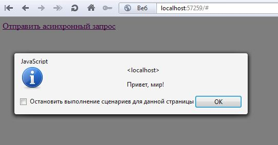
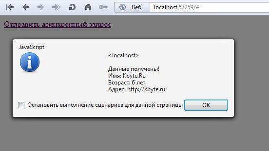
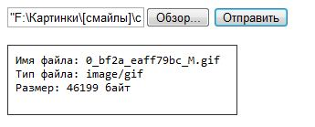
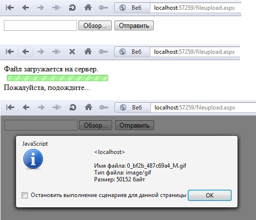
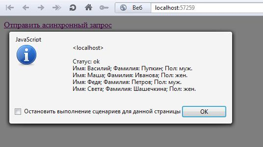

# Асинхронные запросы в JavaScript

> Современные веб-сайты сложно представить без асинхронно обновляющихся элементов.
> Даже если сайт внешне не менялся со времен прошлого столетия, ему волей-неволей, приходится использовать **AJAX**.
> Оно и понятно, ведь асинхронное обновление делает страницы сайта более удобными для пользователей.
> В этой статье вы узнаете, как отправлять простые асинхронные запросы, отправлять файлы в фоновом режиме и обрабатывать ответы сервера при помощи **jQuery**.

## Введение

**AJAX (Asynchronous JavaScript and XML)** – позволяет, посредствам **JavaScript**, выполнять запросы к серверу в фоновом режиме (асинхронно).

Отправка запросов обычно делается с использованием технологии **XMLHttpRequest**, которая реализована на уровне браузеров, и, в наше время поддерживается всеми современными интернет-обозревателями.

В недалеком прошлом, программистам приходилось создавать собственные функции и методы для выполнения асинхронных запросов.

Процесс усложнялся тем, что в разных браузерах, методы асинхронного взаимодействия с сервером отличаются, и написанный код мог работать не везде.

Сейчас же существует множество готовых JavaScript-библиотек, которые позволяют не вникать в тонкости отправки запросов в фоновом режиме, а просто отправлять их.

Самой популярной библиотекой, де-факто, является **jQuery**. Именно **jQuery** и будет главным героем данной статьи.

Чтобы эффективно работать с **AJAX**, программист должен иметь, помимо навыков работы с серверными технологиями (**PHP**, **Perl**, **ASP.NET** и т.п.), хоть какое-то представление о языке **JavaScript**, который, как известно, работает на стороне клиента.

Надеюсь, вы знакомы с особенностями и синтаксисом этого замечательного языка программирования, ибо если это не так, то вы рискуете не понять приведенные в статье фрагменты кода.

В этой статье, серверная часть будет реализована на **ASP.NET MVC** (**C#**), но принципиального значения это не имеет, и если вы не знакомы с **ASP.NET**, то эта статья в любом случае будет для вас полезна.

## Отправка асинхронных запросов

Основной метод для отправки асинхронных запросов в **jQuery** называется `ajax`.

Этот метод принимает один обязательный параметры – адрес страницы, на который требуется отправить запрос.

Например, если на сервере есть страница с именем `AjaxHelloWorld.aspx`, то код отправки запроса в фоновом режиме будет следующим:

```js
$.ajax("/AjaxHelloWorld.aspx");
```

> [!NOTE]
> Предполагается, что к странице подключена библиотека **jQuery**.
> Например: `<script src=" http://kbyte.ru/content/scripts/jquery-1.7.1.min.js" type="text/javascript"></script>`

Однако отправить запрос, это лишь полдела.

В большинстве случаев еще нужно бы получить ответ от сервера и вывести его клиенту.

Сделать это можно при помощи второго, необязательного, параметра - `settings`.

Параметр `settings` принимает параметры, с которыми будет выполняться запрос.

Чтобы получить ответ от сервера, нужно добавить параметр `success`, в котором должна быть указана ссылка на функцию **JavaScript** (имя функции), в которую будет передан успешный ответ сервера.

```html
<script language="javascript" type="text/javascript">
  function SendRequest() {
    $.ajax("/AjaxHelloWorld.aspx", { success: SendRequest_Success });
  }

  function SendRequest_Success(result) {
    alert(result);
  }
</script>

<a href="#" onclick="SendRequest(); return false;">
  Отправить асинхронный запрос
</a>
```

Как видите в примере выше, при нажатии на ссылку **Отправить асинхронный запрос** происходит вызов клиентской функции – `SendRequest`, в которой, в свою очередь производится отправка запроса на страницу `/AjaxHelloWorld.aspx`.

В случае успеха, ответ сервера передается в функцию `SendRequest_Success`.

Сервер может возвращать данные в любом текстовом формате, но в данном случае сервер возвращает обычный текст (`text/plain`), который сразу выводится пользователю в виде сообщения при помощи функции `alert`.

Собственно, на сервере код страницы `AjaxHelloWorld.aspx` может выглядеть следующим образом:

```c#
public ActionResult AjaxHelloWorld()
{
  return new ContentResult() {
    Content = "Привет, мир!", 
    ContentType = "text/plain" 
  };
}
```



Но параметр `success` обрабатывает лишь успешные ответы сервера.

Если сервер вернет ошибку, то запрос молча завершит выполнение и вызов функции, указанной в `success`, не произойдет (`SendRequest_Success`).

Для обработки ошибок предназначен отдельный параметр -  `error`.

```html
<script language="javascript" type="text/javascript">
  function SendRequest() {
    $.ajax("/AjaxHelloWorld.aspx", { success: SendRequest_Success, error: SendRequest_Error });
  }

  function SendRequest_Success(result) {
    alert(result);
  }

  function SendRequest_Error(x, status, message) {
    alert(status + ": " + message);
  }
</script>
```

Помимо этого, для более глубокого анализа ответов сервера можно использовать параметр `statusCode`, который позволяет задавать отдельные функции для обработки различных кодов состояния сервера (HTTP-кодов).

При каждом запросе сервер возвращает определенный код состояния, который представляет из себя целое трехзначное число.

При положительном ответе, сервер возвращает код `200` (`HTTP 200 OK`).
Если страница не найдена – `404`, если доступ к запрашиваемой странице ограничен – `403`, если на сервере произошла ошибка – `500`, и так далее.

Каждый из кодов состояния можно обрабатывать отдельно, если конечно возникнет подобная потребность.

```js
function StatusCodeExample() {
  $.ajax(
    "/AjaxHelloWorld.aspx",
    {
      statusCode:
      {
        200: StatusCodeExample_200,
        404: StatusCodeExample_404,
        500: StatusCodeExample_500,
      },
    }
  );
}

function StatusCodeExample_200(result) {
  alert(result);
}

function StatusCodeExample_404() {
  alert("Страница не найдена!");
}

function StatusCodeExample_500() {
  alert("Ошибка сервера!");
}
```

Для обработки любого результата выполнения асинхронного запроса можно использовать параметр `complete`.

И хотя этот метод будет вызываться, как при успешном выполнении запроса, так и при выполнении запроса с ошибкой, я специально не стал о нем писать вначале, поскольку он довольно неудобный в использовании, главным образом речь о получании содержание ответа сервера.

В функцию обратного вызова `complete` передается ссылка на объект `jqXHR` (производный от `XMLHttpRequest`), а также статус выполнения запроса.

Содержимое ответа сервера как раз таки и следует искать в `jqXHR`.

```js
function SendRequest() {
  $.ajax("/AjaxHelloWorld.aspx", { complete: SendRequest_Сomplete });
}

function SendRequest_Сomplete(x, status) {
  alert(status + ": " + x.responseText);
}
```

С получением ответов сервера вроде бы мы разобрались. Теперь немного углубимся в отправку запросов.

HTTP-запросы могут быть нескольких видов. Чаще всего в Интернете используются запросы `GET` и `POST`.

Метод `GET` предназначен для получения содержимого страниц сайта, а метод `POST` – для отправки.

Собственно, эту статью вы получили благодаря тому, что ваш браузер отправил запрос методом `GET`, а если вы захотите добавить комментарий к статье, то ваш браузер отправит его методом `POST`.

Метод `GET`, в принципе, можно использовать и для отправки данных на сайт, однако у этого метода есть существенные ограничения на объем передаваемой информации, который, ко всему прочему, зависит от особенностей конкретного браузера. Метод `POST` таких ограничений не имеет.

В **AJAX** метод `POST`, в целях повышения безопасности, часто используется не только для передачи данных на сервер, но и для их получения.

Функция `ajax` по умолчанию отправляет запросы методом `GET`.

Для изменения метода запроса, достаточно указать его в параметре `type`.

```js
$.ajax("/AjaxHelloWorld.aspx", {type: "POST" });
```

Коллекцию дополнительных параметров, которые будут переданы на сервер, можно указать в свойстве `data`.

```html
<script language="javascript" type="text/javascript">
  function SendPostRequest() {
    $.ajax(
      "/AjaxPost.aspx",
      {
        type: "POST",
        data: {
          name: "Kbyte.Ru",
          age: 6,
          url: "http://kbyte.ru",
        },
        success: SendPostRequest_Success,
      }
    );
  }

  function SendPostRequest_Success(result) {
    alert(result);
  }
</script>

<a href="#" onclick="SendPostRequest();return false;">
  Отправить асинхронный запрос
</a>
```

В приведенном примере отправляется запрос на страницу `/AjaxPost.aspx` методом `POST` с параметрами `name`, `age` и `url`.

Серверный код может быть примерно таким:

```C#
[HttpPost]
public ActionResult AjaxPost(string name, string age, string url)
{
  return new ContentResult()
  {
    Content = String.Format("Данные получены!\r\nИмя: {0}\r\nВозраст: {1} лет\r\nАдрес: {2}", name, age, url),
    ContentType = "text/html"
  };
}
```



Функция `ajax` имеет еще множество дополнительных параметров.

Так, например, для изменения времени ожидания ответа от сервера можно использовать параметр `timeout`.

Тип содержимого запроса можно установить при помощи параметра `contentType`.

Используя параметры `username` и `password` можно отправить запрос с HTTP-авторизацией.

В коллекции `headers` можно указать дополнительные HTTP-заголовки.

Аадрес страницы, можно ввести не первым параметром функции `ajax`, а добавив свойство `url` в экземпляр `settings`.

```js
$.ajax({
  url: "/AjaxHelloWorld.aspx",
  success: SendRequest_Success,
  error: SendRequest_Error,
});
```

Но все эти параметры используются редко, поэтому я детально их рассматривать в этой статье не буду, чтобы не усложнять.

Собственно, функция `ajax` не самая простая в **jQuery**, и тоже на практике используется лишь в редких случаях, где необходим более тонкий контроль над формированием и выполнением асинхронных запросов.

## Асинхронные запросы - что может быть проще

Для еще более простой отправки асинхронных запросов, в **jQuery** есть две вспомогательные функции: `get` и `post`.

Как видно из названия, каждая функция отправляет запросы определенным HTTP-методом.

Обе функции фактически одинаковые и они более простые, чем `ajax`.

Так, например, отправка запроса методом `GET` будет выглядеть следующим образом:

```js
$.get("/AjaxHelloWorld.aspx", EasySendRequest_Success);
```

И аналогично методом `POST`:

```js
$.post(
  "/AjaxPost.aspx",
  {
    name: "Kbyte.Ru",
    age: 6,
    url: "http://kbyte.ru",
  },
  EasySendPostRequest_Success
);
```

Если для GET-запроса необходимо добавить дополнительные параметры, то это можно сделать, либо через адрес (`url`):

```js
$.get("/AjaxHelloWorld.aspx?id=1&text=example", EasySendRequest_Success);
```

Либо, как в post-запросе, передать в функцию в виде объекта:

```
$.get("/AjaxHelloWorld.aspx", { id: 1, text: "example" }, EasySendRequest_Success);
```

Во всех случаях, успешный (`success`) ответ сервера будет передан в функцию `EasySendRequest_Success`.

А вот если сервер вернет ошибку, то, увы, обработать её этими функциями будет куда сложнее, чем при помощи метода `ajax`.

Хотя, "сложнее" - это слишком громкое слово.

Функции `get` и `post` возвращают объект типа `jqXHR`, который позволяет более тонко настроить выполнение запросов.

Чтобы добавить обработчик ошибок, нужно указать ссылку на функцию обратного вызова при помощи метода  error экземпляра `jqXHR`.

```js
x = $.get("/AjaxHelloWorld.aspx", EasySendRequest_Success);
x.error(EasySendRequest_Error);
```

Таким образом, если сервер вернет ошибку, то информация об этом будет передана в функцию `EasySendRequest_Error`.

Если у вас возникнет необходимость ставить такие «костыли», то лучше используйте функцию `ajax`.

## Асинхронная загрузка файлов на сервер

Отправлять текстовые запросы достаточно просто. А что, если требуется отправить на сервер файл асинхронным методом?

Здесь все не так хорошо, как хотелось бы. Технология **AJAX** сама по себе не предназначена для подобных задач. Тем не менее, создать иллюзию асинхронной отправки файла на сервер вполне реально.

> [!NOTE]
> В **HTML5** есть возможность отправлять файлы на сервер асинхронно, но ввиду того, что эта технология только начинает появляться, в рамках данной статьи рассматриваться не будет.

Как известно, для загрузки файлов на сервер используется элемент `input` типа `file`.

Отправка файлов возможна только методом `POST` с указанием типа кодирования `multipart/form-data`.

```html
<form method="post" action="/FileUpload.aspx" enctype="multipart/form-data">
  <input type="file" name="file1" />
  <input type="submit" value="Отправить" />
</form>
```

Написанный выше код отправит файл на сервер, но не асинхронно. Создать иллюзию фоновой отправки файла можно при помощи фрейма.

Поскольку фрейм – это самостоятельная страница, но при этом он является частью документа, с одной стороны, фрейм позволяет использовать все возможности взаимодействия с сервером без ограничений, а с другой, взаимодействие происходит без перезагрузки основного документа.

Соответственно, чтобы при отправке файла на сервер страница не перезагружалась, достаточно перенаправить форму во фрейм.

Сделать это можно, указав имя фрейма в параметр формы `target`.

```html
<form method="post" action="/FileUpload.aspx" enctype="multipart/form-data" target="uploadFrame">
  <input type="file" name="file1" />
  <input type="submit" value="Отправить" /><br /><br />
  <iframe id="uploadFrame" name="uploadFrame" src="" style="width:250px;height:75px;border:1px solid #333333;"></iframe>
</form>
```

В итоге, после выбора в форме файла и нажатия на кнопку **Отправить**, форма будет отправлена во фрейм и в него же загрузится результат отправки формы.


На сервере можно обработать полученные с формы данные, и передать результат обработки клиенту, т.е. во фрейм.

Серверный код может быть примерно следующим:

```c#
public ActionResult FileUpload()
{
  return View();
}

[HttpPost]
public ActionResult FileUpload(HttpPostedFileBase file1)
{
  return new ContentResult()
  {
    Content = String.Format("Имя файла: {0}\r\nТип файла: {1}\r\nРазмер: {2} байт", file1.FileName, file1.ContentType, file1.ContentLength),
    ContentType = "text/plain"
  };
}
```



Чтобы все было совсем красиво, фрейм можно сделать невидимым (`display: none`).

Также можно добавить клиентский обработчик события загрузки фрейма (`onload`), что позволит отслеживать завершение процесса загрузки файла.

А непосредственно перед отправкой формы (`onsubmit`), можно выводить уведомление о том, что файл загружается.

```html
<form id="uploadForm" method="post" action="/FileUpload.aspx" enctype="multipart/form-data" target="uploadFrame">
  <input type="file" name="file1" />
  <input type="submit" value="Отправить" />
</form>

<div id="progressBar" style="display:none;">
  Файл загружается на сервер.<br />
  <br />
  Пожалуйста, подождите...
</div>

<iframe id="uploadFrame" name="uploadFrame" src="" style="display:none;"></iframe>

<script language="javascript" type="text/javascript">
  function StartUpload() {
    $("#uploadForm").hide();
    $("#progressBar").show();
    $("#uploadFrame").bind("load", UploadComplete);
  }

  function UploadComplete() {
    $("#uploadForm").html('<input type="file" name="file1" /> <input type="submit" value="Отправить" />');
    $("#uploadForm").show();
    $("#progressBar").hide();
      
    alert($("#uploadFrame").contents().text());

    $("#uploadFrame").unbind("load");
  }

  $(document).ready(function () {
    $("#uploadForm").bind("submit", StartUpload);
  });
</script>
```

Обратите внимание, после завершения загрузки фрейма (функция `UploadComplete`) происходит изменение html-формы.

Это необходимо для того, чтобы очистить поле выбора файла, т.к. прямой доступ к этому элементу, в целях безопасности, ограничен.



## Использование JSON

Как я ранее говорил, на асинхронные запросы сервер может возвращать данные в любом текстовом формате.

До сих пор, во всех приведенных в статье примерах, сервер возвращал обычный текст (`text/plain`).

Однако использование обычно текста не всегда удобно. Наиболее подходящий формат передачи данных при асинхронных запросах – это **JSON**.

**JSON** позволяет предоставлять сложные структуры и объекты **JavaScript** в виде текста, для их передачи между сервером и клиентом.

Во всех популярах серверных языках программирования уже давно существуют средства для преобразования объектов в формат **JSON**, что значительно упрощает процесс взаимодействия клиента и сервера. Работать с объектами намного проще, чем оперировать голым текстом.

В свою очередь, **jQuery** умеет обрабатывать данные в формате **JSON**, полученные от сервера.
Причем, если сервер правильно укажет формат отдаваемых данных, **jQuery** автоматически создаст высокоуровневый объект для работы доступа к ним.

Собственно, правильность ответа сервера ограничивается лишь указанием типа содержимого (`Content-Type`), ну и естественно, сам формат ответа должен иметь структуру **JSON**.

Что касается типа содержимого, то **jQuery** будет пытаться создать объект из полученных с сервера данных, если `Content-Type` равен `application/json`.

В **ASP.NET MVC** для **JSON** есть отдельный класс результата действия (`ActionResult`), который называется `JsonResult`.

Этот класс автоматически устанавливает необходимый тип содержимого, а также производит преобразование данных в формат **JSON**.

Например, сервер может возвращать список данных людей, где каждый элемент списка будет содержать имя (`firstName`), фамилию (`lastName`) и пол (`sex`) человека.

```c#
[HttpPost]
public ActionResult JsonExample()
{
  ArrayList data = new ArrayList();

  data.Add(new { firstName = "Василий", lastName = "Пупкин", sex = "муж." });
  data.Add(new { firstName = "Маша", lastName = "Иванова", sex = "жен." });
  data.Add(new { firstName = "Федя", lastName = "Петров", sex = "муж." });
  data.Add(new { firstName = "Света", lastName = "Шашечкина", sex = "жен." });

  return new JsonResult() { Data = new { status = "ok", table = data } };
}
```

> [!NOTE]
> В целях безопасности, по умолчанию **JsonResult** возвращается только для POST-запросов.
> Если запрос будет отправлен методом `GET`, то произойдет исключение (ошибка).
> Если вы хотите, чтобы `JsonResult` возвращался и для GET запросов, то необходимо поставить свойство `JsonRequestBehavior` экземпляра `JsonResult` в состояние `JsonRequestBehavior.AllowGet`.

При запросе этих данных с сервера асинхронным методом, в функции обратного вызова, в параметре `result` уже будет не строка, как в ранее приведенных примерах, а объект.

Объект будет примерно в таком же виде, в котором он был на сервере.

```html
<script language="javascript" type="text/javascript">
  function JsonExample() {
    $.post("/JsonExample.aspx", JsonExample_Success);
  }
  function JsonExample_Success(result) {
    var text = "";
    text += "Статус: " + result.status + "\r\n";
    for (var i = 0; i <= result.table.length - 1; i++) {
      text += "Имя: " + result.table[i].firstName + "; Фамилия: " + result.table[i].lastName + "; Пол: " + result.table[i].sex + "\r\n";
    }
    alert(text);
  }
</script>
```



Если посмотреть на трафик, то можно увидеть, что сервер вернул данные в формате **JSON**, со следующей структурой:

```json
{
  "status": "ok",
  "table": [
    {
      "firstName": "Василий",
      "lastName": "Пупкин",
      "sex": "муж."
    },
    {
      "firstName": "Маша",
      "lastName": "Иванова",
      "sex": "жен."
    },
    {
      "firstName": "Федя",
      "lastName": "Петров",
      "sex": "муж."
    },
    {
      "firstName": "Света",
      "lastName": "Шашечкина",
      "sex": "жен."
    }
  ]
}
```

Полученные данные фактически являются кодом **JavaScript**, который автоматически преобразуются в объект при помощи функции `eval` (**JavaScript**).

## Детальная визуализация процесса загрузки файла на сервер

Во время асинхронной загрузки файла на север, рано или поздно, возникнет желание вывести пользователю информацию об объеме переданных на сервер данных, отобразить процент загрузки в режиме реального времени.

Реализовать проверку состояния загруженности файла на сервер можно при помощи периодической отправки отдельных запросов к серверу, которые будут возвращать размер файла и объем полученных от клиента данных.

Передавать информацию об объеме файла и количестве принятых байт можно через сессию (`Session`), т.к. она будет общей для всех запросов.

Серверный код может быть примерно таким:

```c#
public ActionResult FileUploadWithProgress()
{
  // необходимо создать (и аннулировать) сессию, иначе работать не будет
  Session["FileLength"] = Session["BytesReceived"] = 0;
  Session["FileUploded"] = false;

  return View();
}

[HttpPost]
public ActionResult FileUploadWithProgress(HttpPostedFileBase file1)
{
  Session["FileLength"] = file1.ContentLength; // размер файла
  Session["BytesReceived"] = 0; //в этом параметре будут содержаться число принятых байт
  Session["FileUploded"] = false;
      
  Thread t = new Thread(ThreadUpload);
  t.IsBackground = true;
  t.Start(new object[] { HttpContext.Session, file1 });

  return new ContentResult()
  {
    Content = String.Format("Имя файла: {0}\r\nТип файла: {1}\r\nРазмер: {2} байт", file1.FileName, file1.ContentType, file1.ContentLength),
    ContentType = "text/plain"
  };
}

private void ThreadUpload(object args)
{
  HttpSessionStateBase session = ((Array)args).GetValue(0) as HttpSessionStateBase;
  HttpPostedFileBase file1 = ((Array)args).GetValue(1) as HttpPostedFileBase;

  byte[] buffer = new byte[1];
  int readBytes = 0;
  while ((readBytes = file1.InputStream.Read(buffer, 0, buffer.Length)) > 0)
  {
    session["BytesReceived"] = (int)session["BytesReceived"] + readBytes; //увеличиваем счетчик полученных байт
    Thread.Sleep(1000); // пауза 1 сек., для наглядности работы примера
  }

  session["FileUploded"] = true;
}

[HttpPost]
public ActionResult FileUploadCheck()
{
  return new JsonResult() { Data = new { FileUploded = Session["FileUploded"], FileLength = Session["FileLength"], BytesReceived = Session["BytesReceived"] } };
}
```

Для наглядности, я вывел процесс загрузки файла в отдельный поток, чтобы не блокировать основной поток вызовом команды `Thread.Sleep`.

Пауза (`Thread.Sleep`) позволит увидеть, как работает процесс загрузки файла, поскольку на локальной машине, каким бы большим не был файл, он может быть загружен практически мгновенно, и работа кода будет незаметна.

На «живом» сервере можно обойтись без потоков.

> [!NOTE]
> В примере проекта, который прикреплен к статье (см. внизу), потоки не используются.

На стороне клиента, код немного изменится. Проверять загруженность фрейма и особенно его содержимое неудобно и нецелесообразно, т.к. проверка состояния загрузки файла будет производиться каждую секунду автоматически.

На запрос проверки состояния загрузки файла, сервер должен возвращать данные в формате **JSON**, содержащие размер файла, размер загруженных данных, а также маркер, указывающий на завершенность загрузки файла.

```html
<form id="uploadForm" method="post" action="/FileUploadWithProgress.aspx" enctype="multipart/form-data" target="uploadFrame">
  <input type="file" name="file1" />
  <input type="submit" value="Отправить" />
</form>

<div id="progressBar" style="display:none;">
  Файл загружается на сервер.<br />
  <div style="background-color:White;border:1px solid #999999;height:20px;width:250px;">
    <div id="progressFill" style="width:1px;height:20px;background-color:Blue;"></div>
  </div>
  Пожалуйста, подождите...
  <table cellpadding="2" cellspacing="1" border="1">
    <tr><td>Передано, байт:</td><td id="sent">0</td></tr>
    <tr><td>Всего, байт:</td><td id="total">0</td></tr>
  </table>
</div>

<iframe id="uploadFrame" name="uploadFrame" src="" style="display:none;"></iframe>

<script language="javascript" type="text/javascript">
  var allowCheckStatus = false;

  function StartUpload() {
    $("#uploadForm").hide();
    $("#progressBar").show();

    allowCheckStatus = true;
    window.setTimeout(CheckStatus, 1000);
  }

  function CheckStatus() {
    if (allowCheckStatus) {
      allowCheckStatus = false;
      $.post("/FileUploadCheck.aspx", CheckStatus_Complete)
    }
    window.setTimeout(CheckStatus, 1000);
  }
  function CheckStatus_Complete(result) {
    if (result.FileUploded) {
      alert("Файл успешно загружен!");

      $("#uploadForm").html('<input type="file" name="file1" /> <input type="submit" value="Отправить" />');
      $("#uploadForm").show();
      $("#progressBar").hide();
    }
    else {
      var percentUploaded = (result.BytesReceived * 100) / result.FileLength;
      $("#progressFill").width(Math.round((250 * percentUploaded) / 100) + "px");

      $("#sent").html(result.BytesReceived);
      $("#total").html(result.FileLength);

      allowCheckStatus = true;
    }
  }

  $(document).ready(function () {
    $("#uploadForm").bind("submit", StartUpload);
  });
</script>
```

Переменная `allowCheckStatus` служит для исключения отправки дублирующих запросов к серверу, на случай, если сервер не успеет дать ответ в течение отведенной на это секунды.


Для удобства, на сервере можно создать объект (класс), который будет содержать свойства хранящие размер файла, количество загруженных байт, маркер завершенности загрузки и, помимо этого, уникальный идентификатор файла.

```c#
public class UploadItem
{

  public Guid Id { get; set; }
  public long FileLength { get; set; }
  public long BytesReceived { get; set; }
  public bool FileUploded { get; set; }

}
```

Это позволит не создавать множество ключей в сессии (`Session`), а передавать всего один объект.

Код на сервере в таком случае будет таким:

```c#
public ActionResult FileUploadWithProgress()
{
  // необходимо создать (и аннулировать) сессию, иначе работать не будет
  Session["File"] = new Models.UploadItem();

  return View();
}

[HttpPost]
public ActionResult FileUploadWithProgress(HttpPostedFileBase file1)
{
  Models.UploadItem itm = new Models.UploadItem();
  itm.FileLength = file1.ContentLength;// размер файла

  Session["File"] = itm; //передаем файл в сессию

  // Для демонстрации работы примера, файл загружается в отдельном потоке, чтобы не блокировать основной поток.
  // На "живом" сервер так делать необязательно.
  Thread t = new Thread(ThreadUpload);
  t.IsBackground = true;
  t.Start(new object[] { HttpContext.Session, file1 });

  return new ContentResult()
  {
    Content = String.Format("Имя файла: {0}\r\nТип файла: {1}\r\nРазмер: {2} байт", file1.FileName, file1.ContentType, file1.ContentLength),
    ContentType = "text/plain"
  };
}

private void ThreadUpload(object args)
{
  HttpSessionStateBase session = ((Array)args).GetValue(0) as HttpSessionStateBase;
  HttpPostedFileBase file1 = ((Array)args).GetValue(1) as HttpPostedFileBase;
  Models.UploadItem itm = session["File"] as Models.UploadItem;

  byte[] buffer = new byte[1024];
  int readBytes = 0;
  while ((readBytes = file1.InputStream.Read(buffer, 0, buffer.Length)) > 0)
  {
    itm.BytesReceived += readBytes; //увеличиваем счетчик полученных байт
    Thread.Sleep(1000); // пауза 1 сек., для наглядности работы примера
  }

  // ставим отметку о том, что файл загружен
  itm.FileUploded = true;
}

[HttpPost]
public ActionResult FileUploadCheck()
{
  return new JsonResult() { Data = Session["File"] as Models.UploadItem };
}
```

# Послесловие

При помощи **jQuery** можно легко отправлять асинхронные запросы и обрабатывать полученные ответы.

**jQuery** имеет еще множество полезных функций, о которых я не упомянул в этой статье. А бесконечное количество плагинов (модулей) могут решить, пожалуй, практически любую задачу.

Обычные асинхронные запросы, для отправки и получения текстовых данных, на практике используются чаще, чем передача файлов.

Для загрузки файлов вы, наверняка, найдете в Интернете готовые решения.

Однако, не понимая принципа работы загрузки файлов, использование готовых модулей может взывать сложности.

В частности, проблемы могут возникнуть в реализации серверной части.

В приведенных фрагментах кода работы с файлами, я не сохранял файлы на сервере, чтобы не усложнять код.

Если вас интересуют методы работы с файлами на языке **C#** и в частности в **ASP.NET**, вы можете ознакомиться с ними в статье **[Работа с файлами в C#](CSharp_Files.md)**, а также **[Работа с файлами в Silverlight](FileManager_Silverlight.md)**.

Ниже вы найдете исходный код проекта **ASP.NET MVC 2.0 (C# 3.5)**, с приведенными в статье примерами.

Если вы не знакомы с **ASP.NET** и/или **C#**, то в любом случае можете скачать проект, чтобы ознакомиться с кодом **JavaScript** (см. файлы `.aspx` в папке `/Views/Home`).

**:floppy_disk: [Скачать пример](assets/ExampleOfAjaxWithjQuery.zip)**

---
Алексей Немиро  
2012-01-27
