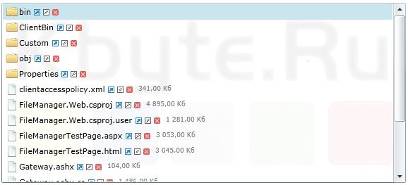

# Silverlight File Manager

This is a Silverlight implementation of a file management component.

The server side is implemented in ASP.NET WebForms and MVC (C#).

This project appeared thanks to [ReleaseBox.ru](../../2011/assets/releasebox.md).

**:page_facing_up: [Code project](https://www.codeproject.com/Articles/311938/Silverlight-File-Manager-2)**  
**:page_facing_up: [Работа с файлами в Silverlight](../articles/FileManager_Silverlight.md) :ru:  
**:floppy_disk: [Source code](FileManager.zip)

