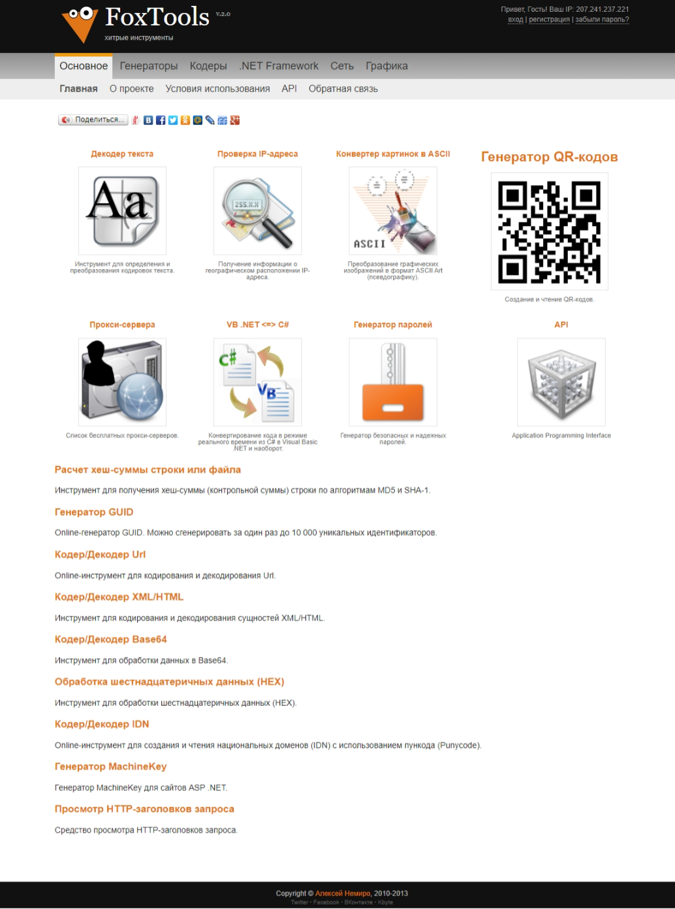

# FoxTools.ru

At the end of 2012, the second version of the [FoxTools.ru](../../2010/assets/foxtools.md) project was released, in which an API appeared.

The project was implemented in ASP.NET MVC (WebPages), C#, and SQL Server.

The client part of the project received a new design.

Access to the API was available using a token.

Any user could receive a token for free; this required registration on the FoxTools.ru website.

For ease of working with the API, there was a library for .NET projects.

All the tools that were present in [FoxTools.ru v1.0](../../2010/assets/foxtools.md) were available in the API.

And also new tools have been added:

* Countries - dictionary
* Encodings - dictionary
* AscArt - converter image to ASCII
* Proxy - list of proxy services
* IP - Geo IP service

**:earth_africa: [Open FoxTools.ru in WebArchive](https://web.archive.org/web/20130214010527/http://foxtools.ru/)**  
**:earth_africa: [Open API.FoxTools.ru in WebArchive](https://web.archive.org/web/20130223025449/api.foxtools.ru)**

