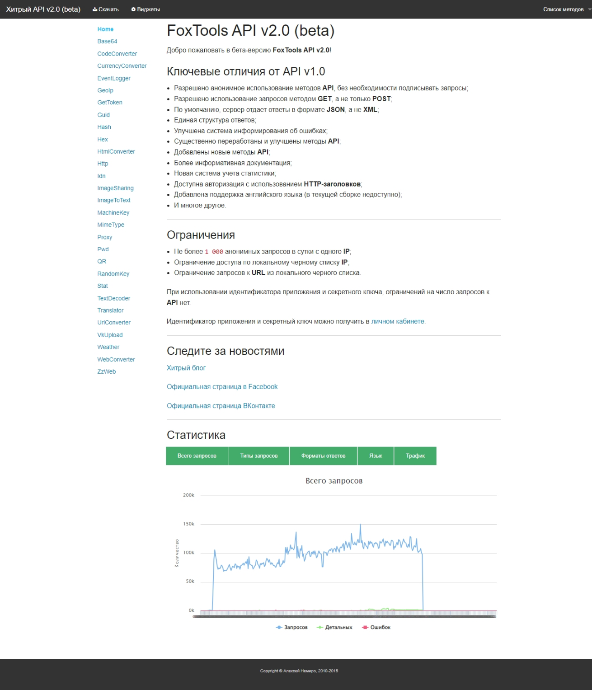

# FoxTools.ru

In 2015, I released FoxTools.ru API v.2.0.

It is noteworthy that in [2012](../../2012), the main site [FoxTools.ru](../../2012/assets/foxtools.md) was version 2.0, but the API was version 1.0.

The API was freely accessible and no registration was required to use it.
However, users were able to create an account and use an API access token to gain access to API usage information.

The API was very simple, anyone could use it simply in the browser.

To implement the project, I used ASP.NET MVC (Razor), C#, and SQL Server.

I created a system for automatically generating documentation and a web interface for testing APIs.
In fact, when the user opened the [api.foxtools.ru/v2](http://web.archive.org/web/20150529214720/http://api.foxtools.ru/v2) page, he was taken to this interface.

On average, there were `100 000` API requests per day.

Previously, for web projects, I often made accompanying console applications - robots.

FoxTools.ru API v2.0 was a completely autonomous and self-sufficient application. It was a smart application.

**:earth_africa: [Open in WebArchive](http://web.archive.org/web/20150529214720/http://api.foxtools.ru/v2)**

