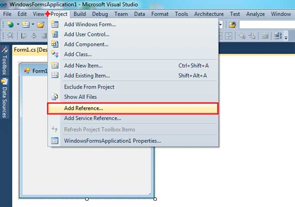

# Users Authorization through OAuth in .NET Framework

## Introduction

Large web projects can provide partial access to the resources of their own members for third-party sites and applications. For the most part, this is achieved by using the protocol **OAuth**.

**OAuth** is an open protocol to authorization. The protocol allows to keep secret an users credentials. Working with resources of users carried out by an access token.

I understand the idea is not new, but somewhere in a parallel universe I did own library for authorization through **OAuth** in **.NET Framework** projects.

The library provides mechanisms for implementing **OAuth** clients, and also contains a ready-to-use clients for popular websites.

The main goal - is simplicity and minimalism. At least it was when I started to write this article. Unfortunately (or fortunately), in the process I made two new releases of the library. Using the library is still simple, but the amount of source code significantly increased. But you do not need to look at the source code of the project. So everything is fine. :-)

The main feature - it is possible to obtain basic information from the user profile. Thus, you can get email address, phone number, name of the user, a link to the site and a photo. It is what it is first necessary for most sites, which support users authentication through OAuth protocol.

The library is focused on the web, but it may well be used in other types of projects.

The source code is open, written in **C#** and is licensed under the **Apache License Version 2.0**.

For the library requires the **.NET Framework 3.5** or later.
The source code of the project and examples created in **Visual Studio 2010 (SP1)** for **.NET Framework 4.0**.
For some examples requires **ASP.NET MVC 3.0**.

## Installation

Information in this section will be of interest only if you want to use the library in your own projects. The examples should work without any additional actions. If you do not plan to use the library to your projects, just skip this section.

Before you get started, you need add a reference to the library to your project. This can be done in two ways:

1. Automatic, through **Package Manager Console** (recommended)
2. Manually add a reference to the assembly

### Using the Package Manager Console

To open the **Package Manager Console**, select menu: **Tools** => **Library Package Manager** => **Package Manager Console**.


In the **Package source** list, select the **NuGet** package feed.

To install **Nemiro.OAuth**, run the following command in the **Package Manager Console**:

```
PM> Install-Package Nemiro.OAuth
```


Enjoy!

### Adding Reference Manually

If you do not have **Package Manager** or it does not work, you can download **Nemiro.OAuth** and add a reference to the assembly in your project.

Select menu **Project** and then click **Add Reference...**



Select **Browse** tab, locate and select the **Nemiro.OAuth.dll** and then click **Ok**.


### Remark on .NET Framework Version

In **Windows Forms** projects, you may need to change the target version of the **.NET Framework**.

You must use the full version of the **.NET Framework**.

If **Visual Studio** displays an error message: `The type or namespace name 'Nemiro' could not be found`, then you should change the target version of the **.NET Framework**.

To change the target version, select menu **Project** and then click **[Your application name] Properties...**

On the **Application** tab, select the target version of the **.NET Framework** WITHOUT **Client Profile**.


> [!NOTE]
> If you are using **Visual Basic .NET** and **Visual Studio 2010**, then change the target version of the **.NET Framework** performed on **Build** tab in section **Advanced build options**.

## Using the Library

First, you need to create an application on the site of provider **OAuth**. For each provider individually, which you require.

Provider will issue a unique identifier and a secret key for your application. These parameters should be used when initializing the client of provider in your project.

Proper configuration of the application on the provider's website - this is the hardest, with what you have to face.

For web projects, you need to specify the address of a callback. Note that some providers do not work with localhost and/or require the use of the protocol **HTTPS**. Incorrect configuration a callback address is the most common cause of problems.

You can find detailed instructions in the documentation for the library **Nemiro.OAuth**.

The following table presents the list of **OAuth** providers, their features and direct links to the documentation for each provider:

| Provider | Internal name | localhost supports | Multiple Url supports | HTTP supports |
| -------- | ------------- | ------------------ | --------------------- | ------------- |
| Amazon | amazon | + | + | - |
| CodeProject | codeproject | - | - | - |
| Dropbox | dropbox | + | + | - |
| Facebook | facebook | + | + | + |
| Foursquare | foursquare | + | + | + |
| GitHub | github | - | - | + |
| Google | google | + | + | + |
| Instagram | instagram | + | - | + |
| LinkedIn | linkedin | + | + | + |
| Microsoft Live | live | - | + | + |
| Mail.Ru | mail.ru | - | + | + |
| Odnoklassniki | odnoklassniki | + | + | + |
| SoundCloud | soundcloud | + | - | + |
| SourceForge | sourceforge | + | + | + |
| Tumblr | tumblr | + | - | + |
| Twitter | twitter | + | + | + |
| VKontakte | vk | + | + | + |
| Yahoo! | yahoo | - | - | + |
| Yandex | yandex | + | - | + |

> [!NOTE]
> The information in the table is current as of February 2015.

> [!NOTE]
> The internal name is case-insensitive.

> [!NOTE]
> If the provider supports the `localhost`, then allowed to use the **HTTP** protocol for `localhost`.
> **HTTP** supports field is only for external addresses.

After receiving the access settings for your application, you can register a client for a specific provider in your project.

For convenience, imports namespaces `Nemiro.OAuth` and `Nemiro.OAuth.Clients` in your code:

**C#:**
```c#
using Nemiro.OAuth;
using Nemiro.OAuth.Clients;
```

**VB.NET:**
```vb
Imports Nemiro.OAuth
Imports Nemiro.OAuth.Clients
```

**OAuth** client classes are located in the namespace `Nemiro.OAuth.Clients`.

You can create an instance of a client **OAuth**, but you will have to perform all the operations manually. This is not convenient.

> [!NOTE]
> As an initialization parameters, you must pass the **Application ID** and **Secret key**, which were obtained from the provider.

**C#:**
```c#
// creating an instance of the TwitterClient for twitter
var twitter = new TwitterClient
(
  "cXzSHLUy57C4gTBgMGRDuqQtr",
  "3SSldiSb5H4XeEMOIIF4osPWxOy19jrveDcPHaWtHDQqgDYP9P"
);
// redirect user to login page
// Response.Redirect(twitter.AuthorizationUrl);
// or for Windows Application open a login page in browser
// System.Diagnostics.Process.Start(twitter.AuthorizationUrl);
// wait an authorization code
// set authorization code
// twitter.AuthorizationCode = code;
// get user info
// var user = twitter.GetUserInfo();
```

**VB.NET:**
```vb
' creating an instance of the TwitterClient for twitter
Dim twitter As New TwitterClient _
(
  "cXzSHLUy57C4gTBgMGRDuqQtr",
  "3SSldiSb5H4XeEMOIIF4osPWxOy19jrveDcPHaWtHDQqgDYP9P"
)
' redirect user to login page
' Response.Redirect(twitter.AuthorizationUrl)
' or for Windows Application open a login page in browser
' System.Diagnostics.Process.Start(twitter.AuthorizationUrl)
' wait an authorization code
' set authorization code
' twitter.AuthorizationCode = code
' get user info
' Dim user As UserInfo = twitter.GetUserInfo()
```

It is best to use helper classes: `OAuthManager` and `OAuthWeb`.

For the registration of a client in your application must use method `RegisterClient` of the class `OAuthManager`.
You can create an instance of a client, or specify the internal name of a provider (the list is presented in the table above).

**C#:**
```c#
// creating an instance of the DropboxClient for Dropbox
OAuthManager.RegisterClient
(
  new DropboxClient
  (
    "0le6wsyp3y085wy", 
    "48afwq9yth83y7u"
  )
);

// registration client for LinkedIn by provider name
OAuthManager.RegisterClient
(
  "LinkedIn",
  "75vufylz829iim",
  "VOf14z4T1jie4ezS"
);
// etc
```

**VB.NET:**
```vb
' creating an instance of the DropboxClient for Dropbox
OAuthManager.RegisterClient _
(
  New DropboxClient _
  (
    "0le6wsyp3y085wy", 
    "48afwq9yth83y7u"
  )
)

' registration client for LinkedIn by provider name
OAuthManager.RegisterClient _
(
  "LinkedIn", 
  "75vufylz829iim", 
  "VOf14z4T1jie4ezS"
)
' etc
```

> [!NOTE]
> In the application, you can register only one OAuth client for one provider.

Now with the help of class `OAuthWeb`, you can get an address for user authorization on external site.
To do this, use the method `GetAuthorizationUrl`, which takes the internal name of the registered provider and also can take an address to which the user will be returned after authorization.

Specifying the callback address is not necessary if you are doing an application for **Windows** and the provider allows it to do. But in a web project, it is always necessary.

> [!NOTE]
> For some providers, the callback address can be specified in the application settings (on the provider site).

**C#:**
```c#
string url = OAuthWeb.GetAuthorizationUrl("dropbox");
```

**VB.NET:**
```vb
Dim url As String = OAuthWeb.GetAuthorizationUrl("dropbox")
```

After returning the user to the return address using the method `VerifyAuthorization` of the `OAuthWeb` class, you can check the authorization results.

The method `VerifyAuthorization` can take the address of the page callback. For web projects explicitly pass the address is not necessary. Default the method is handles current address (`Request.Url`).

The method returns an instance of the class `AuthorizationResult`, which, if successful, will contain an access token and information of user.

**C#:**
```c#
var result = OAuthWeb.VerifyAuthorization("http://the received address from an OAuth provider");

if (result.IsSuccessfully)
{
  // successfully
  var user = result.UserInfo;
  Console.Write(String.Format("User ID:  {0}", user.UserId));
  Console.Write(String.Format("Name:     {0}", user.DisplayName));
  Console.Write(String.Format("Email:    {0}", user.Email));
}
else
{
  // error
  Console.Write(result.ErrorInfo.Message);
}
```

**VB.NET:**
```vb
Dim result = OAuthWeb.VerifyAuthorization("http://the received address from an OAuth provider")

If result.IsSuccessfully Then
  ' successfully
  Dim user = result.UserInfo
  Console.Write(String.Format("User ID:  {0}", user.UserId))
  Console.Write(String.Format("Name:     {0}", user.DisplayName))
  Console.Write(String.Format("Email:    {0}", user.Email))
Else
  ' error
  Console.Write(result.ErrorInfo.Message)
End If
```

It's very simple.

Next will be considered in detail the process of implementing the authorization through protocol **OAuth** in projects **ASP.NET WebForms**, **MVC** and **Windows Forms**.

## OAuth Authorization in ASP.NET

Practical implementation of the authorization through **OAuth** protocol in projects **ASP.NET** takes just a few easy steps!

1. Add to your project the file `Global.asax`, if they do not exist. Open the `Global.asax` and add code for registration **OAuth** clients to the `Application_Start` handler. For example, if you want to implement authorization through **Yahoo!** and **Twitter**, you need to register clients: `YahooClient` and `TwitterClient`.

**C#:**
```c#
using System;
using System.Collections.Generic;
using System.Linq;
using System.Web;
using System.Web.Security;
using System.Web.SessionState;
using Nemiro.OAuth;
using Nemiro.OAuth.Clients;

namespace Test.CSharp.AspWebForms
{
  public class Global : System.Web.HttpApplication
  {
    protected void Application_Start(object sender, EventArgs e)
    {
      OAuthManager.RegisterClient
      (
        "yahoo",
        "dj0yJmk9Qm1vZ3p2TmtQUm4zJmQ9WVdrOU4wbGlkWGxJT" +
        "kc4bWNHbzlNQS0tJnM9Y29uc3VtZXJzZWNyZXQmeD0xZQ--",
        "a55738627652db0acfe464de2d9be13963b0ba1f"
      );
      
      OAuthManager.RegisterClient
      (
        "twitter",
        "cXzSHLUy57C4gTBgMGRDuqQtr",
        "3SSldiSb5H4XeEMOIIF4osPWxOy19jrveDcPHaWtHDQqgDYP9P"
      );
    }
  }
}
```

**VB.NET:**
```vb
Imports Nemiro.OAuth
Imports Nemiro.OAuth.Clients

Public Class Global_asax
  Inherits System.Web.HttpApplication
  
  Sub Application_Start(ByVal sender As Object, ByVal e As EventArgs)
    OAuthManager.RegisterClient _
    (
      "yahoo",
      "dj0yJmk9Qm1vZ3p2TmtQUm4zJmQ9WVdrOU4wbGlkWGxJT" &
      "kc4bWNHbzlNQS0tJnM9Y29uc3VtZXJzZWNyZXQmeD0xZQ--",
      "a55738627652db0acfe464de2d9be13963b0ba1f"
    )
    
    OAuthManager.RegisterClient _
    (
      "twitter",
      "cXzSHLUy57C4gTBgMGRDuqQtr",
      "3SSldiSb5H4XeEMOIIF4osPWxOy19jrveDcPHaWtHDQqgDYP9P"
    )
  End Sub
End Class
```

> [!NOTE]
> Please use your own **Application ID** and **Secret key** for your application, which you get from the provider **OAuth**.
> Operability of the access settings presented in this article cannot be guaranteed.

> [!NOTE]
> Presented in this article access settings for **Yahoo!** will not work because the application in **Yahoo!** linked to a specific hostname.
> Use your own access settings. And please note, **Yahoo!** does not support `localhost`.

### ASP.NET WebForms

2. On the pages of your site, place buttons that will redirect the user to an external site for authentication. For example, you can make a `UserControl`, or to place a buttons on a `MasterPage`.

> [!NOTE]
> It is recommended to use server buttons, because by obtaining authorization addresses in the server memory creates a unique session.

All buttons can have a single click event handler. To distinguish between the buttons, you can add the attribute data-provider, which will contains the provider name.

**ASP.NET:**
```asp
<asp:LinkButton ID="lnkFacebook" runat="server" data-provider="yahoo" 
Text="Login with Yahoo!" onclick="RedirectToLogin_Click" /><br />
<asp:LinkButton ID="lnkTwitter" runat="server" data-provider="twitter" 
Text="Login with Twitter" onclick="RedirectToLogin_Click" />
```

**C#:**
```c#
protected void RedirectToLogin_Click(object sender, EventArgs e)
{
  // gets a provider name from the data-provider
  string provider = ((LinkButton)sender).Attributes["data-provider"];
  // build the return address
  string returnUrl = new Uri(Request.Url, "ExternalLoginResult.aspx").AbsoluteUri;
  // redirect user into external site for authorization
  OAuthWeb.RedirectToAuthorization(provider, returnUrl);
}
```

**VB.NET**
```vb
Protected Sub RedirectToLogin_Click(sender As Object, e As System.EventArgs)
  ' gets a provider name from the data-provider
  Dim provider As String = CType(sender, LinkButton).Attributes("data-provider")
  ' build the return address
  Dim returnUrl As String = New Uri(Request.Url, "ExternalLoginResult.aspx").AbsoluteUri
  ' redirect user into external site for authorization
  OAuthWeb.RedirectToAuthorization(provider, returnUrl)
End Sub
```

3. Create a new page - `ExternalLoginResult.aspx`. This page will process the authorization result.

**C#:**
```c#
using System;
using System.Collections.Generic;
using System.Linq;
using System.Web;
using System.Web.UI;
using System.Web.UI.WebControls;
using Nemiro.OAuth;

namespace Test.CSharp.AspWebForms
{

  public partial class ExternalLoginResult : System.Web.UI.Page
  {

    protected void Page_Load(object sender, EventArgs e)
    {
      var result = OAuthWeb.VerifyAuthorization();

      Response.Write(String.Format("Provider: {0}<br />", result.ProviderName));

      if (result.IsSuccessfully)
      {
         // successfully
        var user = result.UserInfo;
        Response.Write(String.Format("User ID:  {0}<br />", user.UserId));
        Response.Write(String.Format("Name:     {0}<br />", user.DisplayName));
        Response.Write(String.Format("Email:    {0}", user.Email));
      }
      else
      {
        // error
        Response.Write(result.ErrorInfo.Message);
      }
    }

  }

}
```

**VB.NET:**
```vb
Imports Nemiro.OAuth

Public Class ExternalLoginResult
  Inherits System.Web.UI.Page

  Protected Sub Page_Load(ByVal sender As Object, ByVal e As System.EventArgs) Handles Me.Load
    Dim result As AuthorizationResult = OAuthWeb.VerifyAuthorization()

    Response.Write(String.Format("Provider: {0}<br />", result.ProviderName))

    If result.IsSuccessfully Then
      ' successfully
      Dim user As UserInfo = result.UserInfo
      Response.Write(String.Format("User ID:  {0}<br />", user.UserId))
      Response.Write(String.Format("Name:     {0}<br />", user.DisplayName))
      Response.Write(String.Format("Email:    {0}", user.Email))
    Else
      ' error
      Response.Write(result.ErrorInfo.Message)
    End If
  End Sub

End Class
```

Enjoy!

### ASP.NET MVC

2. Add a method `ExternalLogin` to the controller `HomeController`. This method will take the provider name and will redirect the user to an external site for authentication.

**C#:**
```c#
public ActionResult ExternalLogin(string provider)
{
  // build the return address
  string returnUrl = Url.Action("ExternalLoginResult", "Home", null, null, Request.Url.Host);
  // redirect user into external site for authorization
  return Redirect(OAuthWeb.GetAuthorizationUrl(provider, returnUrl));
}
```

**VB.NET:**
```vb
Public Function ExternalLogin(provider As String) As ActionResult
  ' build the return address
  Dim returnUrl As String = Url.Action("ExternalLoginResult", "Home", Nothing, Nothing, Request.Url.Host)
  ' redirect user into external site for authorization
  Return Redirect(OAuthWeb.GetAuthorizationUrl(provider, returnUrl))
End Function
```

3. Add another method, named `ExternalLoginResult`, which will process the authorization result.

**C#:**
```c#
public ActionResult ExternalLoginResult()
{
  string output = "";
  var result = OAuthWeb.VerifyAuthorization();
  
  output += String.Format("Provider: {0}\r\n", result.ProviderName);
  
  if (result.IsSuccessfully)
  {
    // successfully
    var user = result.UserInfo;
    output += String.Format("User ID:  {0}\r\n", user.UserId);
    output += String.Format("Name:     {0}\r\n", user.DisplayName);
    output += String.Format("Email:    {0}", user.Email);
  }
  else
  {
    // error
    output += result.ErrorInfo.Message;
  }
  
  return new ContentResult
  { 
    Content = output, 
    ContentType = "text/plain" 
  };
}
```

**VB.NET:**
```vb
Public Function ExternalLoginResult() As ActionResult
  Dim output As String = ""
  Dim result As AuthorizationResult = OAuthWeb.VerifyAuthorization()
  
  output &= String.Format("Provider: {0}", result.ProviderName)
  output &= vbCrLf
  
  If result.IsSuccessfully Then
    ' successfully
    Dim user As UserInfo = result.UserInfo
    output &= String.Format("User ID:  {0}", user.UserId)
    output &= vbCrLf
    output &= String.Format("Name:     {0}", user.DisplayName)
    output &= vbCrLf
    output &= String.Format("Email:    {0}", user.Email)
  Else
    ' error
    output &= result.ErrorInfo.Message
  End If
  
  Return New ContentResult() With _
  { 
    .Content = output, 
    .ContentType = "text/plain" 
  }
End Function
```

4. And now, just place a links on a page that will trigger the action `ExternalLogin`.

**ASP.NET:**
```asp
@{string url = Url.Action("ExternalLogin",new { provider="yahoo" });}
<a href="#" onclick="window.location.href='@(url);return false;'">Login with Yahoo!</a>
<br />
@{url = Url.Action("ExternalLogin", new { provider="twitter" });}
<a href="#" 
onclick="window.location.href='@(url);return false;'">Login with Twitter</a>
```

> [!NOTE]
> It is recommended to use JavaScript links, because by obtaining authorization addresses in the server memory creates a unique session.

Enjoy!

## OAuth Authorization in Windows Forms

In **Windows Forms** projects to implement authentication through **OAuth** protocol can be using the `WebBrowser` control.

### Ready-to-use forms

You can use ready-to-use forms. To this must be added to the project one more assembly - **Nemiro.OAuth.LoginForms**.

To install the library, run the following command in the **Package Manager Console**:

```
PM> Install-Package Nemiro.OAuth.LoginForms
```

Or download and add a reference to the assembly in your project.

The **Nemiro.OAuth.LoginForms** library contains classes **OAuth** providers as forms.

To start using these classes, import the Nemiro.OAuth.LoginForms in your code:

**C#:**
```c#
using Nemiro.OAuth.LoginForms;
```

**VB.NET:**
```vb
Imports Nemiro.OAuth.LoginForms
```

Using classes is very simple. To get an access token, you must complete all three steps.

1. Create a new instance of authorization form of a necessary provider. Use **Client ID** and **Client secret** for your application, which you gets from the provider **OAuth**. For example, login form for **Instagram**.

**C#:**
```c#
var login = new InstagramLogin
(
  "9fcad1f7740b4b66ba9a0357eb9b7dda", 
  "3f04cbf48f194739a10d4911c93dcece", 
  "http://oauthproxy.nemiro.net/"
);
```

**VB.NET:**
```vb
Dim login As New InstagramLogin _
(
  "9fcad1f7740b4b66ba9a0357eb9b7dda", 
  "3f04cbf48f194739a10d4911c93dcece", 
  "http://oauthproxy.nemiro.net/"
)
```

> [!NOTE]
> For Instagram requires to specify the callback address.
> I made an intermediate gateway for this. This address is specified in the application settings on the site **Instagram**.
> You can use this address for your projects, but there is no guarantee that it will always work.

2. Show the form in dialog mode.

**C#:**
```c#
login.ShowDialog();
```

**VB.NET:**
```vb
login.ShowDialog()
```

3. After closing the login form, you can check the result of the authorization.

**C#:**
```c#
if (login.IsSuccessfully)
{
  MessageBox.Show
  (
    String.Format("Access token: {0}", login.AccessTokenValue), 
    "Successfully", 
    MessageBoxButtons.OK, 
    MessageBoxIcon.Information
  );
}
```

**VB.NET:**
```vb
If login.IsSuccessfully Then
  MessageBox.Show _
  (
    String.Format("Access token: {0}", login.AccessTokenValue), 
    "Successfully", 
    MessageBoxButtons.OK, 
    MessageBoxIcon.Information
  )
End If
```

Use the access token to work with **API**.

### Custom forms

If desired, you can make your own authorization form.

1. In the load event handler of the main form, or application initialization, register the clients **OAuth**, which you need. For example, if you want to implement authorization through **Facebook** and **Yandex**, you need to register clients: `FacebookClient` and `YandexClient`.

**C#:**
```c#
private void Form1_Load(object sender, EventArgs e)
{
  OAuthManager.RegisterClient
  (
    new FacebookClient
    (
      "1435890426686808",
      "c6057dfae399beee9e8dc46a4182e8fd"
    ) 
    { 
      Parameters = new NameValueCollection { { "display", "popup" } }
    }
  );
  
  OAuthManager.RegisterClient
  (
    new YandexClient
    (
      "0ee5f0bf2cd141a1b194a2b71b0332ce",
      "59d76f7c09b54ad38e6b15f792da7a9a"
    )
  );
}
```

**VB.NET:**
```vb
Private Sub Form1_Load(sender As System.Object, e As System.EventArgs) Handles MyBase.Load
  OAuthManager.RegisterClient _
  (
    New FacebookClient _
    (
      "1435890426686808",
      "c6057dfae399beee9e8dc46a4182e8fd"
    ) _
    With
    {
      .Parameters = New NameValueCollection() From {{"display", "popup"}}
    }
  )
  
  OAuthManager.RegisterClient _
  (
    New YandexClient _
    (
      "0ee5f0bf2cd141a1b194a2b71b0332ce",
      "59d76f7c09b54ad38e6b15f792da7a9a"
    )
  )
End Sub
```

2. Place two buttons on the form and add a common click handler (`btn_Click`), which will open the login window. In the `Tag` property keys must specify the name of the provider **OAuth**.

**C#:**
```c#
private void btn_Click(object sender, EventArgs e)
{
  var frm = new frmLogin(((Button)sender).Tag.ToString());
  frm.ShowDialog();
}
```

**VB.NET:**
```vb
Private Sub btn_Click(sender As System.Object, e As System.EventArgs)
  Call New Form2(CType(sender, Button).Text).ShowDialog()
End Sub
```

3. Add a new form (named `frmLogin`) and place the `WebBrowser` control.

4. Create a constructor for the form `frmLogin`, which takes a single string argument. When initializing the form, will be formed address for user authentication, which will be set to the `WebBrowser`.

**C#:**
```c#
public frmLogin(string providerName)
{
  InitializeComponent();
  webBrowser1.Navigate(OAuthWeb.GetAuthorizationUrl(providerName));
}
```

**VB.NET:**
```vb
Public Sub New(providerName As String)
  InitializeComponent()
  WebBrowser1.Navigate(OAuthWeb.GetAuthorizationUrl(providerName))
End Sub
```

5. In the event handler `DocumentCompleted` of the `WebBrowser`, put code that will search and verify the results of authorization.

**C#:**
```c#
private void webBrowser1_DocumentCompleted(object sender, WebBrowserDocumentCompletedEventArgs e)
{
  // looking forward to the desired address
  if 
  (
    e.Url.Query.IndexOf("code=") != -1 || 
    e.Url.Fragment.IndexOf("code=") != -1 ||
    e.Url.Query.IndexOf("oauth_verifier=") != -1
  )
  {
    // verify
    var result = OAuthWeb.VerifyAuthorization(e.Url.ToString());
    
    if (result.IsSuccessfully)
    {
      // show user profile
      MessageBox.Show
      (
        String.Format
        (
          "User ID: {0}\r\nUsername: {1}\r\nDisplay Name: {2}\r\nE-Mail: {3}", 
          result.UserInfo.UserId,
          result.UserInfo.UserName,
          result.UserInfo.DisplayName ?? result.UserInfo.FullName,
          result.UserInfo.Email
        ), 
        "Successfully", 
        MessageBoxButtons.OK, 
        MessageBoxIcon.Information
      );
    }
    else
    {
      // error
      MessageBox.Show
      (
        result.ErrorInfo.Message, "Error",
        MessageBoxButtons.OK, MessageBoxIcon.Error
      );
    }
    
    this.Close();
  }
}
```

**VB.NET:**
```vb
Private Sub WebBrowser1_DocumentCompleted _
(
  sender As System.Object, 
  e As System.Windows.Forms.WebBrowserDocumentCompletedEventArgs
) Handles WebBrowser1.DocumentCompleted
  ' looking forward to the desired address
  If Not e.Url.Query.IndexOf("code=") = -1 OrElse _
    Not e.Url.Fragment.IndexOf("code=") = -1 OrElse _
    Not e.Url.Query.IndexOf("oauth_verifier=") = -1 Then
    ' verify
    Dim result = OAuthWeb.VerifyAuthorization(e.Url.ToString())
    If result.IsSuccessfully Then
      ' show user profile
      Dim displayName As String = result.UserInfo.DisplayName
      If String.IsNullOrEmpty(displayName) Then
        displayName = result.UserInfo.FullName
      End If
      MessageBox.Show _
      (
        String.Format _
        (
          "User ID: {0}{4}Username: {1}{4}Display Name: {2}{4}E-Mail: {3}",
          result.UserInfo.UserId,
          result.UserInfo.UserName,
          displayName, 
          result.UserInfo.Email, 
          vbNewLine
        ),
        "Successfully",
        MessageBoxButtons.OK,
        MessageBoxIcon.Information
      )
    Else
      ' error
      MessageBox.Show _
      (
        result.ErrorInfo.Message, "Error", 
        MessageBoxButtons.OK, MessageBoxIcon.Error
      )
    End If
    Me.Close()
  End If
End Sub
```

Enjoy!

## Using APIs

Each **OAuth** provider has its own unique **API**. Unfortunately, there are no uniform rules for work with **API**. But the library receives information about users via the **API**, and you can use these methods to implement other requests.

All requests to server are performed using the method `ExecuteRequest` of the class `OAuthUtility`. This method returns an instance of `RequestResult` class.

The `RequestResult` class is capable of handling various formats of server responses. No matter what format of response, structured data will be presented as collection. This should simplify the work with a variety of **API**.

Next will be shown simple examples of working with the **API** of various sites with using the access token.

### Access Token

The **access token** is required to work with **API** and is issued at the user's authorization.

The **access token** can be found in the `AccessTokenValue` property of the `AuthorizationResult` or the `LoginForm` class.

**C#:**
```c#
var result = OAuthWeb.VerifyAuthorization();

if (result.IsSuccessfully)
{
  Console.WriteLine("Access token: {0}",  result.AccessTokenValue);
}
```

**VB.NET:**
```vb
Dim result = OAuthWeb.VerifyAuthorization()

If result.IsSuccessfully Then
  Console.WriteLine("Access token: {0}",  result.AccessTokenValue)
End If
```

You can store the **access token** in file or database.

### CodeProject

**CodeProject** has a good **API**. As an example, to make a program to view the forums.

This will be an application **Windows Forms**.

Open the project properties and go to **Settings** section. Add the `AccessTokent` item. In this parameter will be stored the **access token**.


Next, create and show the authorization form.

**C#:**
```c#
// create login form
var login = new CodeProjectLogin
(
  "92mWWELc2DjcL-6tu7L1Py6yllleqSCt", 
  "YJXrk_Vzz4Ps02GqmaUY-aSLucxh4kfLq6oq0CtiukPfvbzb9yQG69NeDr2yiV9M", 
  "https://oauthproxy.nemiro.net/"
);

// set owner
login.Owner = this;

// show login form
login.ShowDialog();
```

**VB.NET:**
```vb
' create login form
Dim login As New CodeProjectLogin _
(
  "92mWWELc2DjcL-6tu7L1Py6yllleqSCt", 
  "YJXrk_Vzz4Ps02GqmaUY-aSLucxh4kfLq6oq0CtiukPfvbzb9yQG69NeDr2yiV9M", 
  "https://oauthproxy.nemiro.net/"
)

' set owner
login.Owner = Me

' show login form
login.ShowDialog()
```

After a successful login, you must save the access token.

**C#:**
```c#
// authorization is success
if (login.IsSuccessfully)
{
  // save the access token to the application settings
  Properties.Settings.Default.AccessToken = login.AccessTokenValue;
  Properties.Settings.Default.Save();
}
```

**VB.NET:**
```vb
' authorization is success
If login.IsSuccessfully Then
  ' save the access token to the application settings
  My.Settings.AccessToken = login.AccessTokenValue
  My.Settings.Save()
End If
```

Then, using the access token can obtain a list of messages. That the program does not freeze, it is best to use asynchronous requests.

**C#:**
```c#
int forumId = 1650; // General .NET Framework board

OAuthUtility.GetAsync
(
  String.Format("https://api.codeproject.com/v1/Forum/{0}/Threads", forumId),
  new HttpParameterCollection 
  { 
    { "page", 1 }
  },
  authorization: new HttpAuthorization(AuthorizationType.Bearer, Properties.Settings.Default.AccessToken),
  callback: UpdateList_Result
);
```

**VB.NET:**
```vb
Dim forumId As Integer = 1650 ' General .NET Framework board

OAuthUtility.GetAsync _
(
  String.Format("https://api.codeproject.com/v1/Forum/{0}/Threads", forumId),
  New HttpParameterCollection From _
  { 
    New HttpUrlParameter("page", 1)
  },
  authorization:=New HttpAuthorization(AuthorizationType.Bearer, My.Settings.AccessToken),
  callback:=AddressOf UpdateList_Result
)
```

The server response will be passed to the method `UpdateList_Result`. The list of messages can be displayed in the `DataGridView`.

The `DataGridView` has three columns. Each column contains data binding parameters.

**C#:**
```c#
private void UpdateList_Result(RequestResult result)
{
  if (this.InvokeRequired)
  {
    this.Invoke(new Action<RequestResult>(UpdateList_Result), result);
    return;
  }

  dataGridView1.DataSource = result["items"].Select
  (
    item => new 
    {
      title = item["title"].ToString(),
      author = item["authors"].First()["name"].ToString(),
      createdDate = Convert.ToDateTime(item["createdDate"])
    }
  ).ToArray();
}
```

**VB.NET:**
```vb
Private Sub UpdateList_Result(result As RequestResult)
  If Me.InvokeRequired Then
    Me.Invoke(New Action(Of RequestResult)(AddressOf UpdateList_Result), result)
    Return
  End If

  DataGridView1.DataSource = result("items").Select _
  (
    Function(item)
      Return New With _
      {
        .title = item("title").ToString(),
        .author = item("authors").First()("name").ToString(),
        .createdDate = Convert.ToDateTime(item("createdDate"))
      }
    End Function
  ).ToArray()
End Sub
```

Of course, in this article, I gave an incomplete description. Nevertheless, working with the **API** is quite simple and you can make the application shown in the picture below.


You can find the project in the source file. Project is named **CodeProjectForumViewer**. Unfortunately, it is only for **C#**.

### Dropbox

Make a file manager for **Dropbox** is also very simple.

The basic principles are the same for all projects **Windows Forms**.

1. Create and show the authorization form.

**C#:**
```c#
var login = new DropboxLogin("4mlpoeq657vuif8", "1whj6c5mxtkns7m");
login.Owner = this;
login.ShowDialog();
```

**VB.NET:**
```vb
Dim login As New DropboxLogin("4mlpoeq657vuif8", "1whj6c5mxtkns7m")
login.Owner = Me
login.ShowDialog()
```

2. Save the access token in the application settings.

**C#:**
```c#
if (login.IsSuccessfully)
{
  Properties.Settings.Default.AccessToken = login.AccessTokenValue;
  Properties.Settings.Default.Save();
}
```

**VB.NET:**
```vb
If login.IsSuccessfully Then
  My.Settings.AccessToken = login.AccessTokenValue
  My.Settings.Save()
End If
```

Having access token, you can get a list of files...

**C#:**
```c#
OAuthUtility.GetAsync
(
  "https://api.dropbox.com/1/metadata/auto/",
  new HttpParameterCollection
  {
    { "path", "/" },
    { "access_token", Properties.Settings.Default.AccessToken }
  },
  callback: GetFiles_Result
);
```

**VB.NET:**
```vb
OAuthUtility.GetAsync _
(
  "https://api.dropbox.com/1/metadata/auto/",
  new HttpParameterCollection From _
  {
    New HttpUrlParameter("path", "/"),
    New HttpUrlParameter("access_token", My.Settings.AccessToken)
  },
  callback:=AddressOf GetFiles_Result
);
```

...and display in the `ListBox`

**C#:**
```c#
private void GetFiles_Result(RequestResult result)
{
  if (this.InvokeRequired)
  {
    this.Invoke(new Action<RequestResult>(GetFiles_Result), result);
    return;
  }

  if (result.StatusCode == 200)
  {
    // show a list of files 
    listBox1.Items.Clear();
    listBox1.DisplayMember = "path";
    foreach (UniValue file in result["contents"])
    {
      listBox1.Items.Add(file);
    }
  }
  else
  {
    // show an error message
    if (result["error"].HasValue)
    {
      MessageBox.Show
      (
        result["error"].ToString(), 
        "Error", 
        MessageBoxButtons.OK, 
        MessageBoxIcon.Error
      );
    }
    else
    {
      MessageBox.Show(result.ToString(), "Error", MessageBoxButtons.OK, MessageBoxIcon.Error);
    }
  }
}
```

**VB.NET:**
```vb
Private Sub GetFiles_Result(result As RequestResult)
  If Me.InvokeRequired Then
    Me.Invoke(New Action(Of RequestResult)(AddressOf GetFiles_Result), result)
    Return
  End If

  If result.StatusCode = 200 Then
    ' show a list of files 
    ListBox1.Items.Clear()
    ListBox1.DisplayMember = "path"
    For Each file As UniValue In result("contents")
      ListBox1.Items.Add(file)
    Next
  Else
    ' show an error message
    If result["error"].HasValue Then
      MessageBox.Show _
      (
        result("error").ToString(), 
        "Error", 
        MessageBoxButtons.OK, 
        MessageBoxIcon.Error
      )
    Else
      MessageBox.Show(result.ToString(), "Error", MessageBoxButtons.OK, MessageBoxIcon.Error)
    End If
  End If
End Sub
```

Upload file to **Dropbox**, you can by the PUT method, directly from `Stream`.

**C#:**
```c#
if (openFileDialog1.ShowDialog() != System.Windows.Forms.DialogResult.OK) { return; }

OAuthUtility.PutAsync
(
  "https://api-content.dropbox.com/1/files_put/auto/",
  new HttpParameterCollection
  {
    {"access_token", Properties.Settings.Default.AccessToken},
    {"path", Path.Combine("/", Path.GetFileName(openFileDialog1.FileName)).Replace("\\", "/")},
    {"overwrite", "true"},
    {"autorename","true"},
    {openFileDialog1.OpenFile()}
  },
  callback: Upload_Result
);
```

**VB.NET:**
```vb
If Not OpenFileDialog1.ShowDialog() = System.Windows.Forms.DialogResult.OK Then Return

OAuthUtility.PutAsync _
(
  "https://api-content.dropbox.com/1/files_put/auto/",
  New HttpParameterCollection From _
  {
    New HttpUrlParameter("access_token", My.Settings.AccessToken),
    New HttpUrlParameter _
    (
      "path", Path.Combine("/", Path.GetFileName(OpenFileDialog1.FileName)).Replace("\\", "/")
    ),
    New HttpUrlParameter("overwrite", "true"),
    New HttpUrlParameter("autorename","true"),
    New HttpRequestBody(OpenFileDialog1.OpenFile())
  },
  callback:=AddressOf Upload_Result
) 
```

To view the entire cycle of the development of the file manager, you can do so in the next video.

[](https://www.youtube.com/embed/fcT-Jt8rcdY)

The source code of the project, which is shown in the video, you can find in the folder **MyDropBox**.

In the folder **DropboxExample** shows a more complex example.

Unfortunately, it is only for **C#**.


### Twitter

**Twitter** is using an obsolete version of the protocol **OAuth**.

For each request, in addition to the access token required the token secret and sign the request. This is not as simple as one would like.

You can use the class `OAuthAuthorization`. The class will automatically sign every request to the **API**.

You can make a helper method that will return the authorization header for a request.

**C#:**
```c#
private string _ConsumerKey = "cXzSHLUy57C4gTBgMGRDuqQtr";
private string _ConsumerSecret = "3SSldiSb5H4XeEMOIIF4osPWxOy19jrveDcPHaWtHDQqgDYP9P";

private OAuthAuthorization GetAuth()
{
  var auth = new OAuthAuthorization();
  auth.ConsumerKey = _ConsumerKey; 
  auth.ConsumerSecret = _ConsumerSecret;
  auth.SignatureMethod = SignatureMethods.HMACSHA1;
  auth.Token = Properties.Settings.Default.AccessToken;
  auth.TokenSecret = Properties.Settings.Default.TokenSecret;
  return auth;
}
```

**VB.NET:**
```vb
Private _ConsumerKey As String = "cXzSHLUy57C4gTBgMGRDuqQtr"
Private _ConsumerSecret As String = "3SSldiSb5H4XeEMOIIF4osPWxOy19jrveDcPHaWtHDQqgDYP9P"

Private Function GetAuth() As OAuthAuthorization
  Dim auth As New OAuthAuthorization()
  auth.ConsumerKey = _ConsumerKey
  auth.ConsumerSecret = _ConsumerSecret
  auth.SignatureMethod = SignatureMethods.HMACSHA1
  auth.Token = My.Settings.AccessToken
  auth.TokenSecret = My.Settings.TokenSecret
  Return auth
End Function
```

Now you can use this method to send requests to **Twitter**. For example, you can get a list of tweets.

**C#:**
```c#
OAuthUtility.GetAsync
(
  "https://api.twitter.com/1.1/statuses/user_timeline.json",
  authorization: GetAuth(),
  callback: GetTweets_Result
);
```

**VB.NET:**
```vb
OAuthUtility.GetAsync _
(
  "https://api.twitter.com/1.1/statuses/user_timeline.json",
  authorization:=GetAuth(),
  callback:=AddressOf GetTweets_Result
)
```

If a successful response, the result will be an array of tweets.

**C#:**
```c#
private void GetTweets_Result(RequestResult result)
  if (this.InvokeRequired)
  {
    this.Invoke(new Action<RequestResult>(GetTweets_Result), result);
    return;
  }

  if (result.IsSuccessfully)
  {
    for(int i = 0; i <= result.Count - 1; i++)
    {
      UniValue item = result[i];
      string username = item["user"]["screen_name"].ToString();
      DateTime dateCreated = DateTime.ParseExact 
      (
        item["created_at"].ToString(), 
        "ddd MMM dd HH:mm:ss zzzz yyyy", 
        CultureInfo.InvariantCulture
      );
      Console.WriteLine("@{0} / {1}", username, dateCreated);
      Console.WriteLine(item["text"]);
      Console.WriteLine("------------------------------------------------------");
    }
  }
  else
  {
    Console.WriteLine(result);
  }
}
```

**VB.NET:**
```vb
Private Sub GetTweets_Result(result As RequestResult)
  If Me.InvokeRequired Then
    Me.Invoke(New Action(Of RequestResult)(AddressOf GetTweets_Result), result)
    Return
  End If

  If result.IsSuccessfully Then
    For i As Integer = 0 To result.Count - 1
      Dim item As UniValue = result(i)
      Dim username As String = item("user")("screen_name")
      Dim dateFormat As String = "ddd MMM dd HH:mm:ss zzzz yyyy"
      Dim dateCreated As Date 
      dateCreated = Date.ParseExact(item("created_at"), dateFormat, CultureInfo.InvariantCulture)
      Console.WriteLine("@{0} / {1}", username, dateCreated)
      Console.WriteLine(item("text"))
      Console.WriteLine("------------------------------------------------------")
    Next
  Else
    Console.WriteLine(result)
  End If
End Sub
```

When you publish a new tweet, you may have problems with encodings. To avoid problems, you can specify the content type of `multipart/form-data`.

**C#:**
```c#
var parameters = new HttpParameterCollection();

parameters.AddFormParameter
(
  "status", 
  "Hello, world! Привет, человеки! Hallo Welt! " +
  "Hola mundo! Hola, món! Bonjour le monde! Ciao, mondo!" + 
  "Բարև, աշխարհ! ハロー・ワールド! 你好，世界"
);

OAuthUtility.PostAsync 
(
  "https://api.twitter.com/1.1/statuses/update.json",
  parameters: parameters,
  authorization: GetAuth(),
  contentType: "multipart/form-data"
);
```

**VB.NET:**
```vb
Dim parameters As New HttpParameterCollection()

parameters.AddFormParameter _
(
  "status", 
  "Hello, world! Привет, человеки! Hallo Welt! " & 
  "Hola mundo! Hola, món! Bonjour le monde! Ciao, mondo!" & 
  "Բարև, աշխարհ! ハロー・ワールド! 你好，世界"
)

OAuthUtility.PostAsync _
(
  "https://api.twitter.com/1.1/statuses/update.json",
  parameters:=parameters,
  authorization:=GetAuth(),
  contentType:="multipart/form-data"
)
```

The source code of the project you can find in the folder **TwitterExample.VB**. Unfortunately, only for **Visual Basic .NET**.


### And More...

Even more simple examples of interaction with different **API**, you can find in the source code of the demo site, which is located at **Test.OAuthWeb** folder.

## Creating a New OAuth Client

If you need to create a custom client, you can use the base classes: `OAuthClient` for **OAuth v1.0** and `OAuth2Client` for **OAuth v2.0**.

Recommended to use **OAuth v2.0**, as it is easier (if the provider supports this version of the protocol).

Create a new class and inherit from the base class.

**C#:**
```c#
public class MyClient : OAuth2Client
{
}
```

**VB.NET:**
```vb
Public Class MyClient
  Inherits OAuth2Client

End Class
```

Override the `ProviderName` property and specify a unique name for your client.

**C#:**
```c#
public override string ProviderName
{
  get
  {
    return "MyClient";
  }
}
```

**VB.NET:**
```vb
Public Overrides ReadOnly Property ProviderName As String
  Get
    Return "MyClient"
  End Get
End Property
```

In the class constructor, specify the base address for authorization and the address for obtaining the access token.

**C#:**
```c#
public MyClient(string clientId, string clientSecret) : base
(
  "https://example.org/oauth",
  "https://example.org/oauth/access_token", 
  clientId,
  clientSecret
) { }
```

**VB.NET:**
```vb
Public Sub New(clientId As String, clientSecret As String)
  MyBase.New _
  (
    "https://example.org/oauth",
    "https://example.org/oauth/access_token", 
    clientId, clientSecret
  )
End Sub
```

And hardest - overriding the `GetUserInfo` method.

You need to read the documentation of the provider and find out how you can get information about user.

With the help of class `ApiDataMapping`, you can create a new instance of the class `UserInfo` and fill it with data obtained from the **API** provider.

For example, **CodeProject** returns information about the user in the format **JSON**.

**JSON:**
```json
{
  "id": 1,
  "userName": "sample string 2",
  "displayName": "sample string 3",
  "avatar": "sample string 4",
  "email": "sample string 5",
}
```

You can specify which of obtained parameters must be set in the properties of the class `UserInfo`.

For example: `id` put to the property `UserId`, `displayName` to the `DisplayName`, `avatar` to the `Userpic`, etc.

**C#:**
```c#
var map = new ApiDataMapping();
map.Add("id", "UserId", typeof(string));
map.Add("userName", "UserName");
map.Add("displayName", "DisplayName");
map.Add("email", "Email");
map.Add("avatar", "Userpic");
```

**VB.NET:**
```vb
Dim map As New ApiDataMapping()
map.Add("id", "UserId", GetType(String))
map.Add("userName", "UserName")
map.Add("displayName", "DisplayName")
map.Add("email", "Email")
map.Add("avatar", "Userpic")
```

If necessary, you can make custom handler of data.

**C#:**
```c#
map.Add
(
  "displayName", "DisplayName",
  delegate(UniValue value)
  {
    return value.ToString().ToUpper();
  }
);
```

**VB.NET:**
```vb
map.Add _
(
  "displayName", "DisplayName",
  Function(value As UniValue)
    Return value.ToString().ToUpper()
  End Function
)
```

If you cannot get information about the user, the `GetUserInfo` method may return an empty instance of the class `UserInfo`.

**C#:**
```c#
return new UserInfo(UniValue.Empty, null);
```

**VB.NET:**
```vb
Return New UserInfo(UniValue.Empty, Nothing)
```

Using the client exactly as any other.

## Epilog

Using authorization through external resources is an important element in the promotion of websites and usability for users.

You can significantly increase user engagement and loyalty, and increase the number of users.

Using an **API**, you can significantly extend the functionality of your applications.

I hope the **Nemiro.OAuth** library will be useful for you and will help ease the integration with a various projects.

The source code of the project is open and you can use it at their own discretion. If you have an account on **GitHub**, you can to [fork the project repository](https://github.com/alekseynemiro/nemiro.oauth.dll/fork).

**:floppy_disk: [Download source (1.5 MB)](assets/OAuth_Source.zip)**  
**:floppy_disk: [Download demo (1.1 MB)](assets/OAuth_Demo.zip)**  
**:floppy_disk: [Download binary (9 MB)](assets/OAuth_Binary.zip)**

---
Aleksey Nemiro  
2015-02-10

https://www.codeproject.com/Articles/875991/Users-Authorization-through-OAuth-in-NET-Framework
